# Lunch Robotics: Universal Brain for Any Robot

## The Vision

We propose an end-to-end engine that turns a useless robot into a useful and self-improving robot, requiring only:

- **Tactile Environment Probing Dataset**: Video and synchronized contact data from a human operating a handheld gripper to interact with, tap, deform, push, and manipulate environment objects and surfaces.
- **Environment Walkthrough Video**: A short (30–90 second) handheld video where the user simply walks through the environment, giving a quick tour of the workspace. This provides the initial coarse geometry and layout used to bootstrap the digital twin before iterative refinement.
- **Task Demonstration & Tutorial Datasets**: Two distinct videos per task:
  1. **Task Execution Video**: An uninterrupted recording of a human performing the task. This is not used for learning, it is used for evaluation.
  2. **Task Tutorial Video**: A video and audio recording of a human explaining the task before and while performing it like a tutorial. These tutorial videos serve as modular **skills** that are dynamically loaded into the context of the action model when a task is invoked.
- **Robot Specifications + Random Policy Calibration Clip**: The robot vendor provides the SDK, hardware specification (kinematics, joint limits, end-effector dynamics, etc.), and an approximately **1-minute recording** of the robot executing actions under a random policy. Supplying this to the SDK should require a single line of code. This clip is used together with the hardware specification to initialize the robot's dynamics inside the digital twin.

The user should not need to manually build a simulator, design an RL environment, engineer a training curriculum, or train the robot policy.

### Required Setup

- Interactive Environment Probing Data collected via the tactile-sensing handheld gripper.
- Short Environment Walkthrough Video (30–90 seconds).
- Two Task Videos per task (Execution Video + Tutorial & Explanation Video).
- Robot SDK installed on the robot.
- Robot Hardware Specification exposed through the SDK.
- Vendor-provided ~1 Minute Random Policy Calibration Recording.
- Optional environment metadata and hints.

The engine automatically constructs the simulation environment, calibrates its physics, trains the robot policy, and adapts it to the physical hardware.

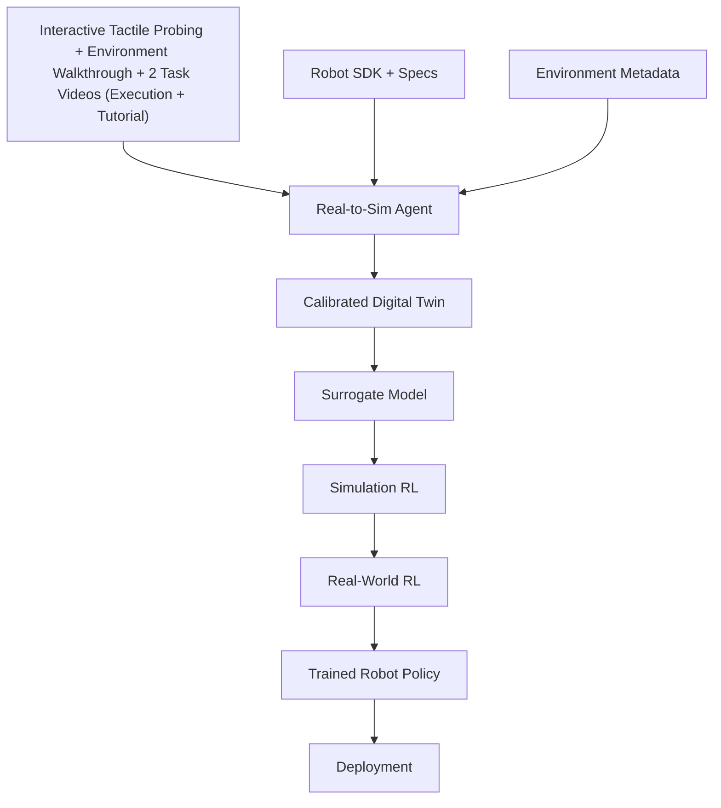

At deployment time, the user simply gives the robot a task via natural language.

**Example:**  
*"Clean the table."*

The task is captured through the robot's audio sensor, converted to text using speech recognition, matched with its corresponding task tutorial video skill, and passed alongside the skill context to the robot policy through the SDK.

*(Note: To safeguard initial operations, homes are provided with non-breaking cups and dishes to use during the first month of robot usage.)*

### The Goal


```math
\text{Robot} + \text{Tactile Video/Contact Data} + \text{2 Task Videos (Execution + Tutorial)} + \text{SDK} + \text{Task} \rightarrow \text{Autonomous Robot}
```


---

## 0. Foundation: Pre-Existing Base Models and General SFT Phase

Before initiating any environment-specific procedures, calibration, or deployment workflows, the entire engine is built upon a robust foundational training phase. This phase establishes broad, cross-domain capabilities across diverse scenarios before any targeted adaptation takes place.

### 0.1 Pre-Existing Base Models
The architecture rests upon a suite of powerful pre-existing foundational models that provide core priors across modalities:
- **Base Robot Action Model**: Supplies foundational motor primitives and generalized manipulation skills.
- **Base 3D Editing Model**: Powers spatial reasoning, scene manipulation, and generative latent state modifications.
- **Base 2D World Model**: Captures visual dynamics, temporal transitions, and environmental continuity.
- **Base Agent Coding LLM**: Drives tool use, reasoning, simulation code generation, and error diagnosis.

### 0.2 General SFT Phase
On top of these pre-existing base models, the system undergoes an extensive **Supervised Fine-Tuning (SFT) training phase**. This phase exposes the models to vast collections of:
- **General Environments**: Diverse synthetic and recorded spatial layouts, material types, and physics profiles.
- **Task Variations**: A comprehensive spectrum of manipulation, locomotion, and interaction primitives.
- **Scenario Variations**: Edge cases, dynamic obstacles, multi-agent interactions, and varying lighting or spatial geometries.

This general SFT phase ensures that the models possess deep semantic understanding, robust tool-use proficiency, and broad spatial-temporal reasoning. Consequently, when a user provides specific tactile probing data and robot specifications for a deployment environment, the system does not learn from scratch; instead, it leverages these generalized priors to rapidly specialize into a high-fidelity digital twin and policy.

---

## 1. The Real-to-Sim Agent

The digital twin is constructed by an autonomous agent rather than a fixed reconstruction pipeline.

The agent is a purposefully RL-trained LLM agent whose task is to convert real-world multimodal interaction data into a sensible, executable, and calibrated simulation.

The agent is equipped with a toolbox for:

- Multimodal video and tactile/contact signal parsing
- 3D scene and object reconstruction
- Simulator construction
- Physics simulation and contact modeling
- Trajectory and wrench/force extraction
- System identification and material property estimation
- Parameter optimization
- Simulation evaluation
- Experiment design
- World-model integration
- Code generation and execution

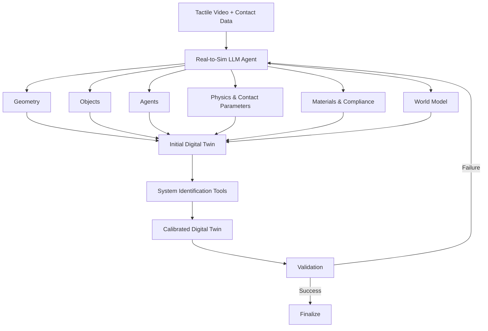

The agent is responsible for constructing and validating the entire digital twin. Integrating concepts from generative simulation (e.g., RoboGen), the agent utilizes a self-guided propose-generate-learn cycle to automatically scale diverse task creation and scene generation. However, unlike pure LLM-based generators that lack physical accuracy, our agent grounds this generation in multimodal tactile data. It can:

- Inspect the multi-view video and synchronized contact feedback.
- Autonomously propose new sub-tasks and populate pertinent assets to create diversified training environments.
- Identify objects, geometry, and surface contact dynamics to anchor the generative simulation.
- Select simulation primitives and contact models, such as rigid, soft-body, or elastoplastic models.
- Determine which components require learned world-model dynamics.
- Create simulator code and physical property configurations.
- Identify uncertain physical parameters, such as mass, friction, compliance, and damping.
- Invoke specialized system-identification tools against contact trajectories.
- Compare simulated contact forces and kinematics with physical data.
- Modify and tune the simulator until the twin reaches the required fidelity.

The agent acts as an AI simulation engineer and system-identification engineer, yielding infinite, yet physically grounded, training data.

---

## 2. Agentic System Identification

Passive video alone leaves physical properties fundamentally under-constrained. Synchronized tactile and force data collected during human exploration removes these ambiguities.

The Real-to-Sim Agent uses specialized system-identification tools to optimize the simulator against multimodal real-world trajectories.

The agent first infers approximate physical bounds:  
*"This object appears to be a wooden block."*

It then estimates the numerical parameter vector:


```math
\theta = \begin{bmatrix} m \\ \mu_s \\ \mu_d \\ e \\ k \\ c \\ \vdots \end{bmatrix}
```


where the parameters include:

- $m$: mass  
- $\mu_s$: static friction coefficient  
- $\mu_d$: dynamic friction coefficient  
- $e$: coefficient of restitution  
- $k$: contact stiffness / compliance  
- $c$: damping factor  

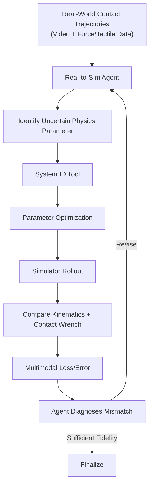

The optimization objective minimizes both state kinematic trajectories $\tau$ and contact wrench trajectories $W$:


```math
\theta^* = \arg\min_{\theta} \left( D_{\text{kin}}\left(\tau_{\mathrm{real}}, \tau_{\mathrm{sim}}(\theta)\right) + \lambda D_{\text{force}}\left(W_{\mathrm{real}}, W_{\mathrm{sim}}(\theta)\right) \right)
```


The LLM agent reasons about physical discrepancies at a high level, selects parameters to unfreeze, and uses optimization tools to solve for physical parameters.

---

## 3. Agentic Entities Are Simulated by a General World Model

Entities that exhibit complex, non-scripted behaviors, such as humans, pets, or other dynamic agents, are simulated using a general world model.

Rather than requiring internal state access, the model predicts future states directly from observation histories:


```math
S^{\mathrm{agent}}_{t+1:t+H} \sim P_{\phi}\left(S^{\mathrm{agent}}_{t+1:t+H} \mid S_{\leq t}, E\right)
```


The simulator composes deterministic physics with learned behavioral dynamics:


```math
\text{Digital Twin} = \text{Explicit Physics (Calibrated via Tactile Data)} + \text{General World Model}
```


This allows the digital twin to combine highly calibrated physical interactions with learned dynamics for entities whose behavior cannot be efficiently described through explicit physics alone.

---

## 4. Surrogate Models Accelerate Simulation

Once the digital twin has been calibrated using physical interaction data, it serves as the teacher for a learned neural surrogate simulator.


```math
f_{\mathrm{sim}}(s_t, a_t) \approx f_{\mathrm{surrogate}}(s_t, a_t)
```


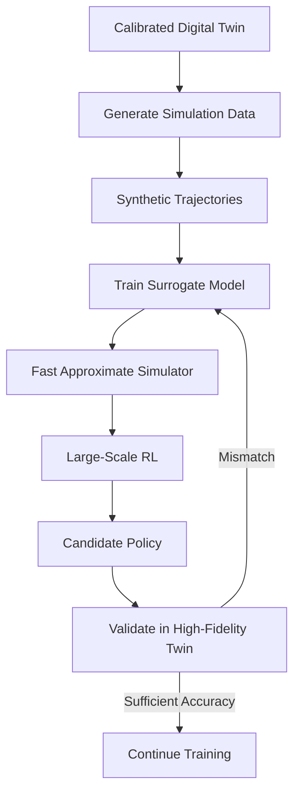

The surrogate is not intended to replace the high-fidelity simulator completely.  
Instead, it provides a much faster approximation that allows orders of magnitude more policy rollouts during RL.

The hierarchy operates as:


```math
\text{Real World (Tactile + Video)} \rightarrow \text{Calibrated Digital Twin} \rightarrow \text{Surrogate Model} \rightarrow \text{Fast Simulation RL}
```


---

## 5. Multimodal Data Collection Protocol

To eliminate system-identification ambiguities while keeping setup overhead minimal, data collection uses a specialized, sensor-equipped handheld gripper alongside a two-part video collection protocol per task.

The human operator manually interacts with the environment and records the two required task videos.

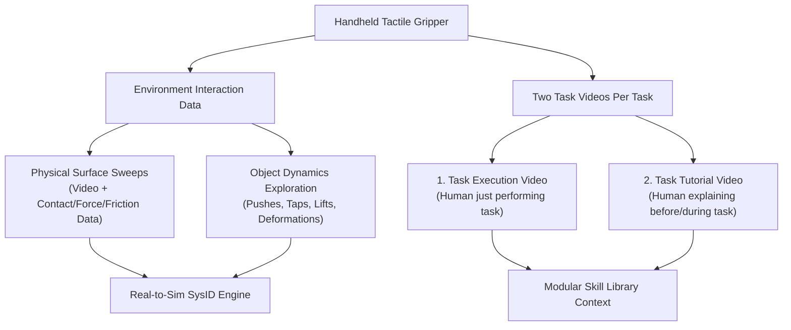

### Data Streams Collected

#### 1. Interactive Environment Probing

A human holds a sensorized gripper and systematically "plays" with the target workspace.

The operator:

- Taps surfaces
- Slides across tables
- Lifts objects
- Pushes objects
- Squeezes objects
- Deforms compliant materials
- Manipulates objects under different contact conditions

Collected signals include:

- RGB-D video streams
- High-frequency contact forces
- Tactile pressure maps
- Slipping indicators
- End-effector pose
- Interaction forces and torques

#### 2. Environment Walkthrough Video

Before any tactile probing or task demonstrations, the user records a short **30–90 second walkthrough video** of the environment by simply pointing the camera around the workspace (e.g. kitchen, living room, workshop).

This video is intentionally lightweight and is used only to bootstrap the digital twin.

Its purposes are:

- Recover the coarse room geometry and layout.
- Identify large furniture and static structures.
- Estimate camera scale and spatial relationships.
- Produce the **initial approximate digital twin** before the Real-to-Sim agent refines geometry and physics using tactile interaction data.

The reconstruction pipeline therefore operates in two stages:

1. **Stage 1 — Coarse Initialization:** Environment walkthrough video produces an approximate digital twin.
2. **Stage 2 — Physical Refinement:** Interactive tactile probing calibrates geometry, contact properties, materials, and object dynamics.

#### 2. Two Task Videos Per Task

For every task, the human records two distinct videos:
1. **Task Execution Video**: An uninterrupted recording of the human performing the task.
2. **Task Tutorial Video**: A video where the human explains the task before and while doing it, acting as a verbal and visual tutorial. 
   - **Modular Skill Representation**: These tutorial videos are stored as modular skills and dynamically loaded into the context window of the robot's action model when the task is executed.

#### 3. Vendor Random Policy Calibration Recording

Every supported robot ships with a short **approximately 1-minute calibration recording** captured by the robot vendor before deployment.

The recording contains:

- Robot observations.
- Joint states and end-effector states.
- Executed actions from a random policy.
- Synchronized timestamps.

The user never records this clip manually. It is distributed alongside the robot SDK and hardware specification and is passed into the SDK through a single configuration line.

This trajectory allows the Real-to-Sim agent to estimate the robot's native dynamics, actuator characteristics, latency, and low-level control behavior before any task-specific training begins.

This structured exploration grounds object mass, friction profiles, joint resistance, surface stiffness, and compliance directly from real-world contact events before policy training begins.

---

## 6. On-the-Fly Learning from Human Feedback

Deployment is continuous and adaptive.

When the robot makes an error in the physical world, the human operator provides on-the-fly corrections via natural language, voice, or spatial gestures.

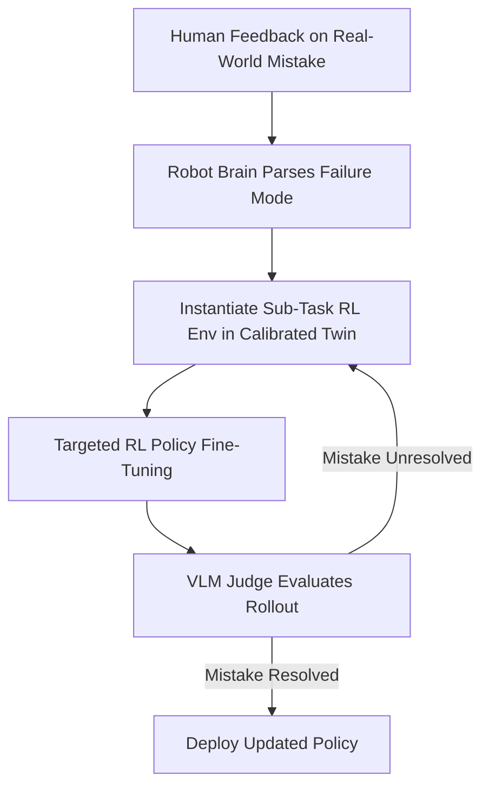

### Self-Correction Loop

1. **Feedback Parsing**: The robot's central reasoning engine translates natural-language critique, such as *"You're squeezing the paper cup too hard and crushing it,"* into concrete physical parameter bounds and failure predicates.
2. **Automated RL Sub-Environment Generation**: The digital twin instantiates a specialized micro-simulation environment replicating the precise spatial state, contact properties, and dynamic parameters where the failure occurred.
3. **Simulated Policy Refinement**: The policy undergoes focused RL updates inside the sub-environment to learn corrected wrench and trajectory profiles.
4. **VLM Evaluation**: A Vision-Language Model (VLM) evaluates simulated execution videos to verify that the robot successfully achieves the objective without triggering the identified failure mode.
5. **Redeployment**: The updated policy parameters are hot-swapped onto the physical robot.

## 7. Training the Robot Policy

Whether the system is learning a pre-known task from initial demonstrations or fine-tuning to correct mistakes on-the-fly, policy optimization proceeds using a unified, large-scale RL approach.

The robot policy is conditioned on observation, task specification, and the dynamically loaded task tutorial skill:


```math
\pi_{\theta}(a_t \mid o_t, T, S_{\text{tutorial}})
```


where:

- $a_t$ is the action at time $t$
- $o_t$ is the robot's observation
- $T$ is the task specification (or natural language correction)
- $S_{\text{tutorial}}$ is the retrieved task tutorial video skill loaded into context
- $\theta$ represents the policy parameters

The surrogate handles massive rollout volume, while the calibrated digital twin verifies contact-heavy manipulation steps to ensure physical grounding.

### 7.1 Unified Reward Generation via Imagined Motions

Strict kinematic reference trajectories heavily overfit to specific initial scenario settings and are far too brittle for generalized learning. Instead, for robust learning across both new and pre-known tasks, the reward is formulated based on achieving specific **imagined target motions** (representing latent state trajectories over a very small temporal delta $\Delta t$), rather than static snapshots. 

Crucially, generating these latent motion trajectories is not a novel paradigm; latent motions are already the native output of most modern video generation models out-of-the-box.

The pipeline is as follows:

1. **Imagined Motion Generation:** A 3D Vision-Language Model (VLM) diffusion model acts as an editing model. It processes the initial state and the task description (or language correction) to output a target **embedded latent motion trajectory** ($z_{\text{target}(t:t+\delta)}$) representing the successful temporal sequence, leveraging off-the-shelf video generation model outputs.
2. **Latent Space Embedding:** During simulated rollouts, the current state trajectory segment $s_{t:t+\delta}$ is continuously embedded into the same latent space to produce $z_{t:t+\delta}$.
3. **Latent Similarity Reward:** The system issues a reward based on the similarity between the current embedded motion trajectory $z_{t:t+\delta}$ and the imagined target latent motion $z_{\text{target}(t:t+\delta)}$.
4. **Temporal Maintenance (Delta Time):** For tasks requiring sustained action (e.g., holding or carrying), the reward requires the latent similarity to remain above a threshold across the window $\Delta t$.
5. **Destruction Penalty:** A VLM judge continuously observes the simulated rollouts to detect severe or destructive results—such as knocking a glass over or crushing a paper cup. If an unsafe event occurs, a massive penalty is applied to strictly forbid that behavior.

The step reward $r_t$ is formulated in the latent space as:


```math
r_t = w_{\text{goal}} \cdot \text{sim}(z_{t:t+\delta}, z_{\text{target}(t:t+\delta)}) - w_{\text{penalty}} \mathbb{I}_{\text{fail}}(s_t)
```


where:
* $z_{t:t+\delta} = \text{Encoder}(s_{t:t+\delta})$ is the latent embedding of the current simulator state trajectory.
* $z_{\text{target}(t:t+\delta)}$ is the target latent motion generated by the 3D VLM diffusion editing model.
* $\text{sim}(\cdot, \cdot)$ is a similarity metric (such as cosine similarity) in the embedded latent space.
* $\mathbb{I}_{\text{fail}}(s_t) \in \{0, 1\}$ is a Boolean indicator evaluated by the VLM for destructive/catastrophic failures.
* $w_{\text{goal}}$ and $w_{\text{penalty}}$ are weighting constants.

---

## 8. Curriculum Learning

Training scales from basic object manipulation to complex tasks across increasingly difficult environmental variables.

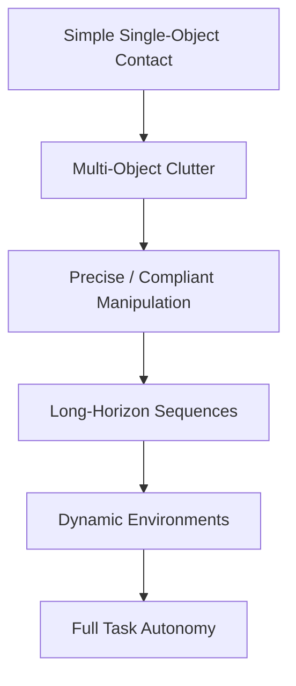

The curriculum progressively increases:

- Number of interacting objects
- Contact complexity
- Precision requirements
- Material variability
- Environmental dynamics
- Task horizon
- Degree of uncertainty

---

## 9. Real-World RL Closes the Sim-to-Real Gap

A final adaptation stage grounds the policy directly on physical hardware.

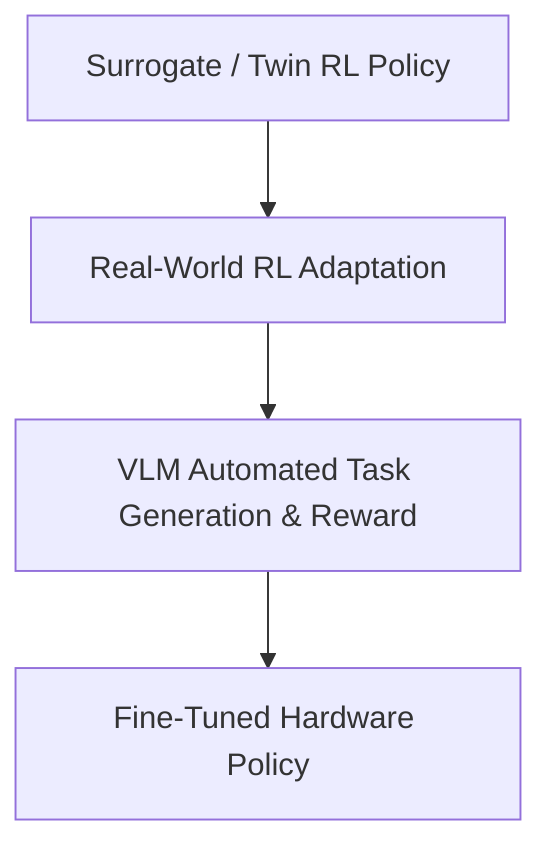

Real-world RL adaptation to close the sim-to-real gap is executed **just once every 3 months (or earlier if the user deems it necessary)**. 

To perform this update, the user records a new tactile-aware video of themselves manipulating items in the house using the handheld tactile gripper. During this periodic or on-demand phase, the human asks the robot to perform a task and provides natural language feedback explaining what it did wrong, driving the adaptation loop:


```math
\text{Task Generation} \rightarrow \text{Real Interaction} \rightarrow \text{VLM Evaluation} \rightarrow \text{Reward} \rightarrow \text{RL Update}
```


This infrequent stage addresses residual discrepancies between the calibrated simulation and the deployed hardware.

---

## 10. Safety Guardrails and Adversarial Risk Mitigation

To ensure that the robot never performs catastrophic or strictly forbidden behaviors—such as attempting to retrieve items from a cabinet full of delicate glassware—the system implements a rigorous safety alignment pipeline combining Supervised Fine-Tuning (SFT) and specialized Reinforcement Learning.

### 10.1 Safety SFT and Adversarial Twin RL
Before deployment, the system undergoes extensive safety Supervised Fine-Tuning followed by targeted Reinforcement Learning inside the specific digital twin:
- **Adversarial Training**: The robot is intentionally placed in simulation environments where it is adversarially instructed to perform unsafe or destructive tasks.
- **Penalty Optimization**: Similar to how it learns desirable behaviors, the policy receives massive penalties for hazardous actions. Its explicit optimization objective is to achieve zero penalties even when coaxed or instructed to execute risky routines.
- **Resulting Behavioral Bounds**: This conditioning ensures the robot develops robust behavioral boundaries against executing hazardous or forbidden actions in real homes.

### 10.2 Planner (3D VLM) Rejection of Risky Tasks
Beyond low-level policy safeguards, high-level task execution relies on a central planner 3D VLM:
- **Intent Screening**: The high-level planner 3D VLM responsible for parsing user intent and defining sub-tasks is explicitly trained and fine-tuned to recognize and **reject** dangerous or risky tasks.
- **Safe Fallback**: When presented with a harmful or unsafe request (e.g., handling delicate items in unstable storage zones), the planner 3D VLM refuses the instruction and prompts the user for clarification or a safe alternative, preventing the downstream policy from ever generating execution trajectories.

---

## 11. Robot SDK

The deployed policy maps high-level human speech to robot control through the SDK. The user interacts with the robot at the level of tasks rather than low-level robot commands, letting the SDK bridge the gap between intention and physical actuation.

### 11.1 SDK Motion Smoothing

Raw neural network policies often produce high-frequency, noisy, or abrupt action sequences. If sent directly to the hardware, these commands can cause jittery movement or damage the physical joints. To ensure safe execution, the Robot SDK acts as a protective translation layer incorporating a real-time Motion Smoother.

To ensure low-latency decision-making on resource-constrained physical hardware, the deployed diffusion policy undergoes **Consistency Distillation**. By enforcing self-consistency along the diffusion policy's learned trajectories, the system creates a *Consistency Policy* that can generate an action sequence in a single inference step. This speeds up action generation by an order of magnitude compared to standard iterative denoising.

Furthermore, every deployed policy automatically benefits from motion smoothing.

The smoother takes the high-speed intended action input ($a_t$) and context from the action history ($a_{<t}$) to perform online interpolation and jerk-limited trajectory generation.


```math
\left(
q_{t+1},
\dot{q}_{t+1},
\ddot{q}_{t+1}
\right)
=
f_{\mathrm{smooth}}
\left(
a_t,
a_{\lt t},
q_t,
\dot{q}_t,
\ddot{q}_t
\right)
```

To maintain a completely hardware-agnostic implementation, the motion smoother queries the robot's specific physical limits directly from the SDK. It then enforces these constraints continuously, bounding the output trajectory by maximum velocity, acceleration, and jerk:


```math
\begin{align*}
|\dot{q}(t)| &\leq v_{\max} \\
|\ddot{q}(t)| &\leq a_{\max} \\
|\dddot{q}(t)| &\leq j_{\max}
\end{align*}
```


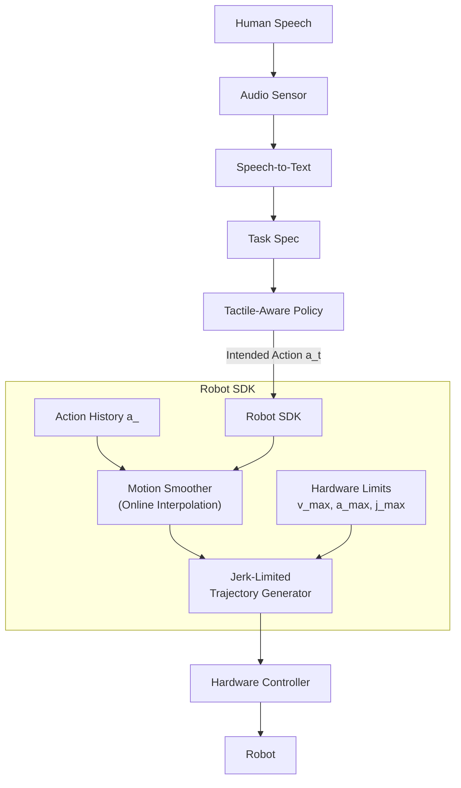

---

## 12. Inference-Time Search

The digital twin and surrogate remain active during runtime for counterfactual safety checks before executing high-uncertainty trajectories.

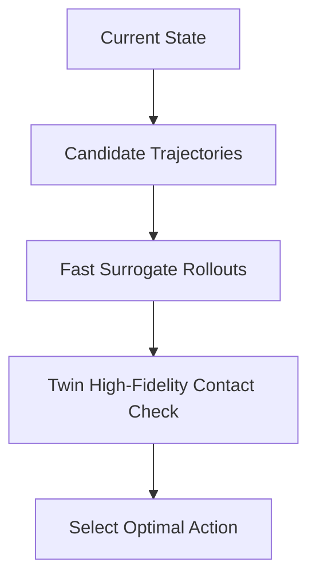

The surrogate provides cheap evaluation of many candidate trajectories.  
Promising or high-risk trajectories can then be evaluated using the higher-fidelity calibrated twin before execution on the physical robot.

---

## 13. End-to-End System

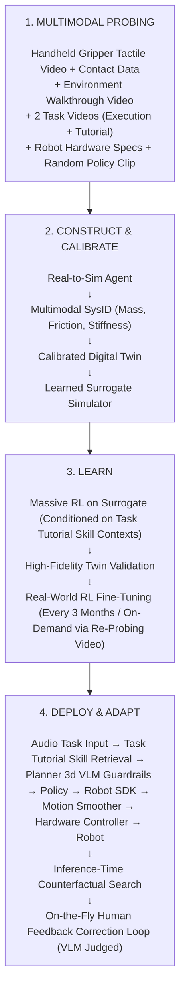

The complete system therefore forms a continuous loop:


```math
\text{Probe} \rightarrow \text{Construct} \rightarrow \text{Calibrate} \rightarrow \text{Learn} \rightarrow \text{Deploy} \rightarrow \text{Observe} \rightarrow \text{Correct} \rightarrow \text{Learn Again}
```


> **Note**: Every deployed policy automatically benefits from motion smoothing via the Robot SDK, ensuring fluid and hardware-safe operations out-of-the-box. Additionally, homes are supplied with non-breaking cups and dishes for the first month of usage.

---

## The Core Research Thesis

The central hypothesis is:

> Providing a Real-to-Sim agent with synchronized video and contact data from human environment probing allows it to build fully calibrated, contact-accurate digital twins. These twins generate fast surrogate models that make large-scale RL, real-world adaptation, and live human-feedback self-correction practical.

Instead of relying on pure video estimation or uncalibrated physics:


```math
\text{Interactive Tactile/Video Data} \rightarrow \text{Agentic Multimodal SysID} \rightarrow \text{Calibrated Twin} \rightarrow \text{Fast Surrogate RL} \rightarrow \text{Real Adaptation} \rightarrow \text{VLM-Guided Self-Correction}
```


### The Product Vision

Delivers zero-to-hero autonomy:

> Provide the tactile probing data, the two task videos (execution and explanatory tutorial), and the robot SDK. The AI engine constructs the calibrated physics twin, trains the surrogate and policy using dynamic skill context, fine-tunes on hardware, and delivers a self-correcting autonomous robot.
