# Lunch Robotics: Universal Brain for Any Robot

## The Vision

We are building a **universal robot brain** that can turn a general-purpose robot into an autonomous worker inside an arbitrary physical environment. The fundamental problem in robotics is not simply making robots capable of moving or manipulating objects; it is giving them enough general intelligence to understand an unfamiliar world, perform useful tasks, adapt to the specific physics of that world, and improve as they encounter situations that were not represented in their original training data.

Lunch Robotics separates this problem into **general intelligence, environment-specific intelligence, and continual fleet learning**. General robot intelligence is learned offline through a **Foundation Model Data Funnel** that combines massive amounts of human video with progressively more robot-relevant forms of supervision. Massive human video provides broad knowledge about the physical world, human action supervision connects that knowledge to purposeful behavior, manipulation data collected with a data-collecting gripper introduces contact and embodiment information, and a smaller amount of teleoperation data provides direct grounding in robot control. These datasets are not treated as isolated sequential stages. They jointly train a shared **World Model + VLA foundation brain**, with the training distribution becoming increasingly robot-relevant while retaining the broad coverage of the lower-fidelity datasets.

The resulting foundation brain is then adapted to a specific robot and physical environment by an autonomous **Real-to-Sim Agent**. Given a walkthrough of the environment, tactile probing data, task context, demonstrations, and the robot's hardware specification, the agent constructs and calibrates a digital twin, performs system identification, determines which aspects of the environment should be represented through explicit physics and which should be handled by learned dynamics, and trains a fast surrogate simulator. The foundation VLA can then undergo massive simulation RL inside this environment-specific model, producing an **environment-specific VLA** specialized to the particular robot and world.

The system does not stop learning after deployment. Each deployed robot continuously improves locally through simulation, while the platform monitors real-world execution for mistakes. A failure may be identified explicitly by the human user or automatically by a VLM observing the robot through cameras installed in the environment. Every detected mistake is captured as a rich episode containing the task and subtask being executed, the robot state and action trajectories, the World Model's imagined latent trajectory, the corresponding decoded imagined video, the actual video of the robot making the mistake, and the relevant simulator state and environment parameters.

These failures are **not automatically used to update the global model**. Instead, they are sent back to the Lunch Robotics team, where we analyze error modes across deployments and determine which failures are genuinely generalizable. Environment-specific quirks remain local. Problems that reveal broader capability gaps become the basis for carefully curated training datasets. Those curated datasets are then used to fine-tune a new version of the **global lab VLA**. The updated lab model is combined with knowledge accumulated in the environment-specific VLAs through continual weight mixing, producing a new mixed VLA that is redistributed to every deployment. Each environment then performs its own local RL again starting from this stronger initialization.

This creates a compounding global-local learning system:

```math
\boxed{
\text{Foundation Data}
\rightarrow
\text{Global VLA}
\rightarrow
\text{Environment Adaptation}
\rightarrow
\text{Deployment}
\rightarrow
\text{Failure Discovery}
\rightarrow
\text{Error-Mode Analysis}
\rightarrow
\text{Curated Data}
\rightarrow
\text{New Lab VLA}
\rightarrow
\text{Weight Mixing}
\rightarrow
\text{All Deployments}
}
```

The key product idea is therefore simple: **the robots specialize locally, while Lunch Robotics learns globally**.

The user provides:

* **Tactile Environment Probing Data** collected with a sensorized handheld gripper.
* **Environment Walkthrough Video** showing the physical workspace.
* **Environment & Task Context Description** explaining the environment, tasks, constraints, and other agents.
* **Two Videos per Task**: an execution demonstration for evaluation and a tutorial/explanation video that becomes a reusable skill.
* **Robot SDK + Hardware Specification** exposing the robot's embodiment and physical limits.
* **Vendor Random-Policy Calibration Recording**, approximately one minute of the robot executing random actions.

The system automatically constructs the digital twin, identifies its physical parameters, generates massive simulation experience, trains the environment-specific policy, adapts it to hardware, monitors deployment, learns locally from mistakes, and continuously improves the shared global brain. The user should not need to manually build a simulator, write reinforcement-learning environments, engineer the training curriculum, perform system identification, generate synthetic data, or train the robot policy.

---

# 1. The Architecture

The Lunch Robotics architecture is built around three nested learning systems. The first is the **global foundation model**, which learns general physical and manipulation intelligence. The second is the **environment-specific adaptation system**, which takes the shared model and specializes it to a particular robot and physical environment. The third is the **fleet learning system**, which turns deployment failures into curated global training data and feeds the resulting improvements back to the entire fleet.

### Layer 1 — Global Foundation Intelligence

A universal World Model + VLA is trained offline using the Foundation Model Data Funnel:

```math
\text{Massive Human Video}
+
\text{Human Action Supervision}
+
\text{Robot-Relevant Manipulation Data}
+
\text{Teleoperation Data}
\rightarrow
\boxed{\text{Global World Model + VLA}}
```

This model learns the broad capabilities that should transfer across environments and embodiments, including visual understanding, physical prediction, object interaction, manipulation structure, task understanding, action reasoning, and general robot-control priors.

### Layer 2 — Environment-Specific Intelligence

The global model is adapted to a particular robot and environment:

```math
\text{Global VLA}
\rightarrow
\text{Real-to-Sim Agent}
\rightarrow
\text{Calibrated Digital Twin}
\rightarrow
\text{Surrogate Simulator}
\rightarrow
\text{Environment RL}
\rightarrow
\text{Environment-Specific VLA}
```

This model learns everything that is specific to the deployment: local geometry, object configurations, physical properties, contact dynamics, robot embodiment, task conventions, and behaviors required by that environment.

### Layer 3 — Fleet Learning

Once deployed, the robot generates new experience:

```math
\text{Environment-Specific VLA}
\rightarrow
\text{Real Deployment}
\rightarrow
\text{Failure Detection}
\rightarrow
\text{Failure Data}
\rightarrow
\text{Team Analysis}
\rightarrow
\text{Curated Global Data}
\rightarrow
\text{Lab VLA}
```

The updated global model is then mixed with the environment-specific models and redistributed:

```math
\text{Lab VLA}
+
\text{Environment-Specific Knowledge}
\rightarrow
\text{Mixed VLA}
\rightarrow
\text{All Deployments}
```

The system therefore maintains a clear separation between **what should be general**, **what should remain local**, and **what the fleet has discovered should become general**.

---

# 2. Foundation Model Data Funnel

The foundation model is trained through a deliberate **data funnel** in which the amount of available data decreases as the fidelity and robot relevance increase. Massive datasets provide broad coverage of the world, while smaller datasets provide increasingly direct supervision about manipulation, contact, embodiment, and robot actions.

The critical point is that these datasets are not treated as independent training stages. They form a shared training distribution and jointly contribute to the same foundation-model optimization process. Low-fidelity data continues to provide scale and diversity while high-fidelity data continuously anchors the model to the final robot-control distribution.

```math
P_{\mathrm{train}}(x)
=
\sum_{i=1}^{N}
\alpha_i(t)
P_i(x)
```

where $P_i$ represents a layer of the data pyramid and $\alpha_i(t)$ controls how heavily that layer contributes at a given point in training. The mixture can change as the model develops, but the lower levels remain present so that increasing robot relevance does not come at the cost of losing broad world knowledge.

The funnel can be summarized as:

```text
                         ┌───────────────────────┐
                         │   TELEOPERATION       │
                         │   Smallest volume     │
                         │   Highest fidelity    │
                         └───────────┬───────────┘
                                     │
                         ┌───────────┴───────────┐
                         │ HUMAN + GRIPPER DATA  │
                         │ Manipulation-relevant │
                         └───────────┬───────────┘
                                     │
                         ┌───────────┴───────────┐
                         │ HUMAN VIDEO + ACTION  │
                         │ Approximate actions   │
                         └───────────┬───────────┘
                                     │
              ┌──────────────────────┴──────────────────────┐
              │        MASSIVE HUMAN EGOCENTRIC VIDEO      │
              │        Broadest world coverage              │
              └─────────────────────────────────────────────┘

                            ↓   ↓   ↓   ↓

                       SHARED CO-TRAINING

                            ↓   ↓   ↓   ↓

                    GLOBAL WORLD MODEL + VLA
```

The lower levels primarily answer **what the physical world is and how it evolves**. The middle levels add information about **how humans act within that world**. The upper levels teach **how useful manipulation translates into robot-relevant action and control**. The funnel is therefore not a staircase in which one form of data replaces another; it is a hierarchy of complementary supervision.

---

## 2.1 The Data Pyramid

| Layer | Data                                         | Scale   | Supervision                       | Robot Relevance |
| ----- | -------------------------------------------- | ------- | --------------------------------- | --------------- |
| **1** | Massive human egocentric video               | Massive | Self-supervised                   | Low             |
| **2** | Human video + VLM pose waypoints             | Large   | Approximate action supervision    | Medium          |
| **3** | Human manipulation + data-collecting gripper | Medium  | Robot-relevant action supervision | High            |
| **4** | Teleoperation data                           | Small   | Direct robot action supervision   | Highest         |

These four layers are sampled together. Early in training, the model can place more weight on massive datasets because broad visual and physical representations need to emerge first. As training progresses, increasingly more weight can be placed on manipulation and robot-specific datasets, while the lower layers remain active to preserve generalization.

---

## 2.2 Stage 1 — Massive Human Egocentric Video

Massive human egocentric video provides the broadest source of physical-world information. The starting point is the best available **JEPA-like World Model**, which is trained or fine-tuned to predict future observations while also learning to predict spatially masked regions of the environment in latent space. The goal is not simply to reproduce pixels; it is to learn a useful internal representation of objects, spatial relationships, motion, interactions, contact-relevant structure, and temporal evolution.

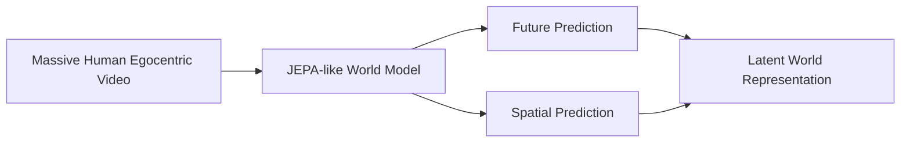

The World Model remains part of the shared training process as more robot-relevant datasets are introduced. It is therefore continuously grounded by action data while continuing to benefit from the much larger human-video distribution.

---

## 2.3 Stage 2 — Human Video + VLM Pose Waypoints

The second layer connects broad world understanding to purposeful action. A VLM processes large-scale human egocentric videos and extracts approximate pose and action waypoints. These trajectories provide weak but scalable action supervision without requiring robot data.

At the same time, the World Model produces latent future imagination from the observed video. The VLA can therefore learn from both the observed action trajectory and the predicted evolution of the environment:

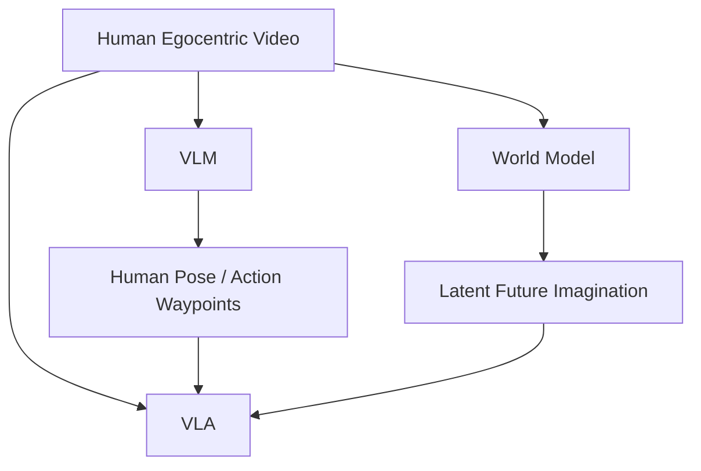

The model begins learning a relationship of the form:

```math
\text{Observation}
+
\text{Task}
+
\text{Predicted Future}
\rightarrow
\text{Action}
```

This provides a bridge between passive physical-world understanding and purposeful interaction.

---

## 2.4 Stage 3 — Human Manipulation + Data-Collecting Gripper

The third layer introduces substantially more direct information about manipulation and contact. Humans perform manipulation tasks using a **data-collecting gripper** that records end-effector motion and interaction signals. This gives the model access to information that is difficult to recover from ordinary video alone, including grasping, pushing, pulling, contact transitions, deformation, and other manipulation dynamics.

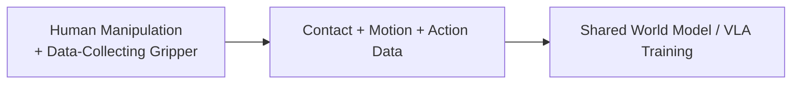

The dataset is smaller than the human-video datasets, but each example contains substantially more embodiment-relevant information. It provides an intermediate representation between human activity and direct robot control.

---

## 2.5 Stage 4 — Teleoperation

Teleoperation provides the highest-fidelity foundation-model supervision because demonstrations are generated directly by real robots. It provides true robot action distributions, embodiment-specific kinematics, actuator constraints, interaction dynamics, temporal structure, and realistic observation-action correlations.

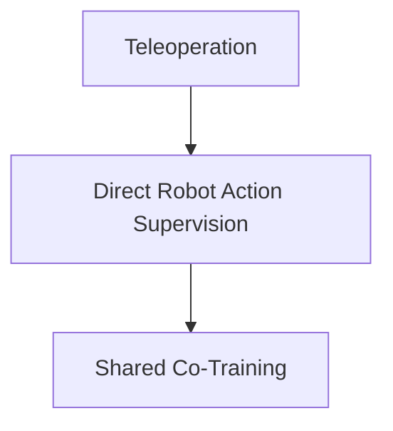

Because teleoperation is expensive, its value comes from fidelity rather than scale. The teleoperation dataset is split between zero-shot and one-shot regimes so that the foundation model is trained both to generalize without a robot demonstration and to exploit a single demonstration when one is available.

---

## 2.6 Why Co-Training Instead of Sequential Fine-Tuning?

The different data layers contain complementary information, and sequential fine-tuning risks allowing the final, smallest dataset to dominate the model. Massive human video provides diversity and broad physical knowledge, while teleoperation provides highly accurate grounding in robot embodiment. Co-training keeps both forms of information active.

A simplified objective is:

```math
\mathcal{L}
=
\lambda_{\mathrm{WM}}
\mathcal{L}_{\mathrm{WM}}
+
\lambda_{\mathrm{human}}
\mathcal{L}_{\mathrm{human}}
+
\lambda_{\mathrm{gripper}}
\mathcal{L}_{\mathrm{gripper}}
+
\lambda_{\mathrm{teleop}}
\mathcal{L}_{\mathrm{teleop}}
```

The fundamental principle is:

> **Low-fidelity data provides scale and broad world knowledge; high-fidelity data provides grounding in manipulation and robot control.**

The same foundation brain should benefit from both.

---

# 3. Deployment Inputs

Once the global foundation model exists, a new deployment requires only a relatively small amount of environment-specific information.

The user records a **30–90 second walkthrough video** of the workspace. This provides coarse geometry, furniture, large objects, spatial layout, camera scale, and an initial scene representation from which the Real-to-Sim Agent can construct the initial digital twin.

The user also provides an **Environment & Task Context Description** explaining what the environment is used for, which objects matter, what tasks the robot is expected to perform, what constitutes success, unusual or non-obvious procedures, environmental constraints, and the behavior of other agents such as humans or autonomous systems. This description serves as the semantic specification that complements the visual reconstruction.

The user additionally performs **tactile environment probing** with a sensorized handheld gripper. The gripper can tap, slide, push, lift, squeeze, deform compliant materials, and probe contact conditions while recording RGB-D video, pose, forces, tactile signals, slip information, and interaction trajectories. This information is primarily used for physical system identification rather than simply visual reconstruction.

Each task has two videos. The first is an **execution demonstration**, where the human performs the task naturally without explaining it and which is primarily used for evaluation. The second is a **tutorial video**, where the human explains the task and its important details while performing it. The tutorial is transformed into a modular skill representation that can later be dynamically retrieved by the robot.

```math
\text{Execution Demonstration}
\rightarrow
\text{Evaluation}
```

```math
\text{Tutorial Demonstration}
\rightarrow
\text{Reusable Skill Context}
```

Finally, the robot vendor provides the **robot SDK and hardware specification**, including kinematics, joint limits, actuator information, end-effector specifications, and hardware control constraints. The vendor also provides approximately one minute of random-policy execution containing synchronized observations and actions. This recording helps the system identify robot dynamics, actuator behavior, latency, joint response, and low-level control characteristics.

---

# 4. The Real-to-Sim Agent

The system does not rely on a fixed, hand-engineered simulator-generation pipeline. Instead, an **RL-trained LLM agent acts as an autonomous simulation engineer and system-identification engineer**. It reasons over the environment videos, tactile measurements, task descriptions, robot specifications, and World Model predictions, then uses specialized tools to construct the digital twin.

The agent has access to tools for multimodal video analysis, tactile and force analysis, 3D reconstruction, simulator generation, physics simulation, system identification, trajectory optimization, parameter estimation, experiment design, World Model integration, code generation, and simulation evaluation.

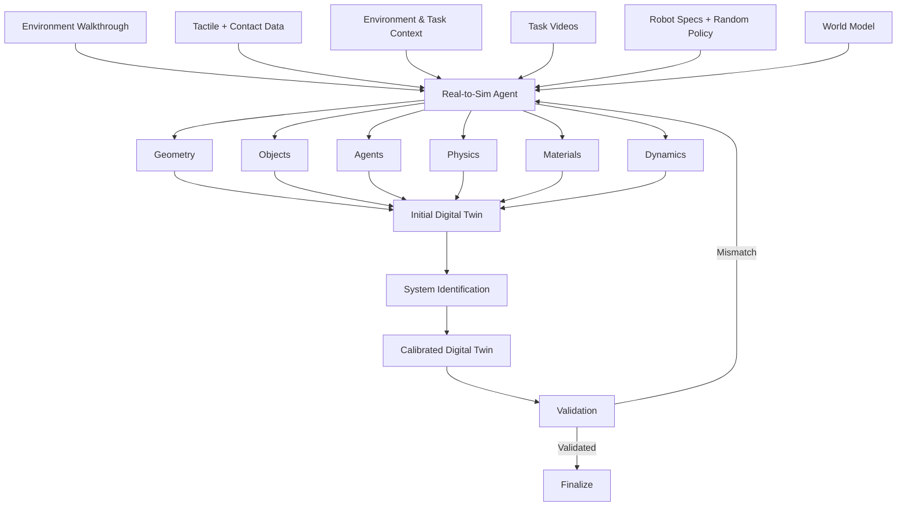

The goal is not to create a visually perfect replica of the environment. It is to create a **useful executable model of the world** that is sufficiently accurate for policy training and counterfactual reasoning.

The agent determines which aspects should be explicitly simulated and which should instead be represented through learned dynamics.

---

# 5. Agentic System Identification

Visual reconstruction alone cannot reveal many of the physical quantities that matter for manipulation. The system may need to estimate object mass, friction, compliance, damping, restitution, actuator response, and other parameters.

```math
\theta =
\begin{bmatrix}
m \\
\mu_s \\
\mu_d \\
e \\
k \\
c \\
\vdots
\end{bmatrix}
```

The Real-to-Sim Agent combines visual trajectories, tactile interactions, force measurements, and robot observations to estimate these parameters.

```math
\theta^*
=
\arg\min_{\theta}
\left(
D_{\mathrm{kin}}
\left(
\tau_{\mathrm{real}},
\tau_{\mathrm{sim}}(\theta)
\right)
+
\lambda
D_{\mathrm{force}}
\left(
W_{\mathrm{real}},
W_{\mathrm{sim}}(\theta)
\right)
\right)
```

The important distinction is that the **agent reasons about what must be identified and which experiment will be informative**, while specialized numerical tools perform the parameter estimation itself.

```text
Real Interaction
      ↓
What does not match?
      ↓
Which physical parameter explains it?
      ↓
Run System Identification
      ↓
Update Digital Twin
      ↓
Validate Again
```

The result is a calibrated environment model rather than a purely visual reconstruction.

---

# 6. Explicit Physics + General World Model

Not every entity in the environment should be represented with hand-designed physics. Rigid objects and contact interactions can often be modeled explicitly, while humans, pets, and other complex non-scripted entities are better represented through the general World Model.

```math
S^{\mathrm{agent}}_{t+1:t+H}
\sim
P_{\phi}
\left(
S_{\leq t}, E
\right)
```

The digital twin therefore becomes a hybrid system:

```math
\text{Digital Twin}
=
\text{Explicit Calibrated Physics}
+
\text{Learned World Dynamics}
```

The Environment & Task Context Description is especially useful here because it tells the Real-to-Sim Agent which entities matter, what they are expected to do, and which aspects of their behavior are relevant to the robot's tasks.

---

# 7. Learned Surrogate Simulator

High-fidelity simulation is necessary for calibration and validation but is too expensive to run at the scale required for large-scale RL. The calibrated digital twin is therefore used to generate experience from which the system trains a learned **surrogate simulator**.

```math
f_{\mathrm{sim}}(s_t,a_t)
\approx
f_{\mathrm{surrogate}}(s_t,a_t)
```

The surrogate trades some physical fidelity for enormous speed and becomes the main engine for large-scale policy optimization.

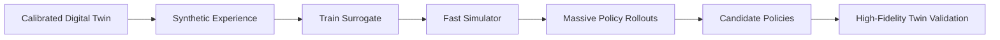

The resulting hierarchy is:

```math
\text{Real World}
\rightarrow
\text{Calibrated Twin}
\rightarrow
\text{Surrogate}
\rightarrow
\text{Massive Simulation}
```

This allows the policy to experience millions of possible trajectories without requiring millions of physical experiments.

---

# 8. Training the Environment-Specific VLA

The environment-specific VLA begins from the current **global or mixed VLA**, rather than being trained from scratch. It is conditioned on the current observation, the task specification, World Model latent imagination, and retrieved tutorial context.

```math
\pi_{\theta}
\left(
a_t
\mid
o_t,
T,
z_{\mathrm{WM}},
S_{\mathrm{tutorial}}
\right)
```

where $o_t$ is the current observation, $T$ is the task specification, $z_{\mathrm{WM}}$ is the World Model latent imagination, $S_{\mathrm{tutorial}}$ is the retrieved skill context, and $a_t$ is the robot action.

The shared model provides general physical and manipulation intelligence, while the environment-specific training process teaches it the particular robot embodiment and physical world. The result is an **environment-specific VLA** that knows how to operate in that deployment.

---

# 9. Imagined Goal States and Motion-Based Rewards

Exact trajectory matching is brittle because many different trajectories can successfully solve the same task. Instead, the training system uses the World Model and generative models to construct latent representations of successful future states and short-horizon motions.

```math
z_{\mathrm{target}(t:t+\delta)}
```

The current simulated trajectory is encoded into the same latent space:

```math
z_{t:t+\delta}
=
\mathrm{Encoder}(s_{t:t+\delta})
```

The policy can then be rewarded for moving toward the imagined successful future rather than reproducing an exact human trajectory:

```math
r_t
=
w_{\mathrm{goal}}
\cdot
\mathrm{sim}
\left(
z_{t:t+\delta},
z_{\mathrm{target}(t:t+\delta)}
\right)
-
w_{\mathrm{penalty}}
\mathbb{I}_{\mathrm{fail}}(s_t)
```

This creates dense information about successful progress while preserving flexibility in how the task is solved. A VLM judge can additionally detect catastrophic outcomes such as dropping a payload, damaging a fragile object, crushing a compliant object, entering a restricted area, or performing clearly destructive behavior.

---

# 10. Environment-Specific Simulation RL

The calibrated twin and surrogate allow the environment-specific VLA to experience an enormous variety of scenarios. The system can vary object positions, physical properties, robot configurations, clutter, lighting, dynamics, task parameters, and the behavior of other agents.

The curriculum can progress automatically from simple interactions to increasingly complex tasks:


The Real-to-Sim Agent can identify weaknesses in the policy and generate additional simulations around them. This local simulation loop does not end when the robot is deployed; it remains active throughout the robot's lifetime.

---

# 11. Real Deployment and Local Continual Learning

Simulation will inevitably differ from reality, so deployment creates a continual local learning loop. The environment-specific VLA operates on the real robot while its calibrated simulator continues to generate additional training scenarios and perform online RL.

```math
\text{Real Deployment}
\rightarrow
\text{Observed Outcome}
\rightarrow
\text{Failure Identification}
\rightarrow
\text{Targeted Simulation}
\rightarrow
\text{Online Simulation RL}
\rightarrow
\text{Updated Environment-Specific VLA}
```

The real robot therefore provides the evidence about where the current model is wrong, while the simulator provides the scale needed to explore and optimize the correction. This keeps the expensive physical interaction loop focused on discovering reality gaps rather than brute-force policy search.

---

# 12. Post-Deployment Failure Data

Every deployed robot is a source of valuable real-world experience. The system monitors execution continuously and identifies situations in which the robot makes a mistake. These mistakes can be explicitly reported by the human user or automatically detected by a VLM observing the robot through cameras installed in the environment.

The system does not merely record a sentence describing the mistake. It captures the complete context surrounding the failure:

```text
Failure Episode
├── Task being executed
├── Subtask being executed
├── Environment and task context
├── Robot state trajectory
├── Action trajectory
├── World Model imagined latent trajectory
├── Decoded imagined video trajectory
├── Real video of the robot execution
├── Failure timestamp / event
├── Human feedback or VLM failure judgment
└── Relevant simulator state + environment parameters
```

This is particularly valuable because the system can compare what the robot **imagined**, what it **executed**, and what **actually happened**.

```math
\text{Imagined Future}
\leftrightarrow
\text{Executed Trajectory}
\leftrightarrow
\text{Observed Outcome}
```

The resulting dataset is much richer than standard failure logs because it captures both the external behavior and the internal predictive context available to the learning system.

---

# 13. Failure-Conditioned Data Generation

A single failure should not remain a single training example. Once a failure is identified, the system reconstructs the relevant state inside the calibrated digital twin and generates a large distribution of nearby scenarios.

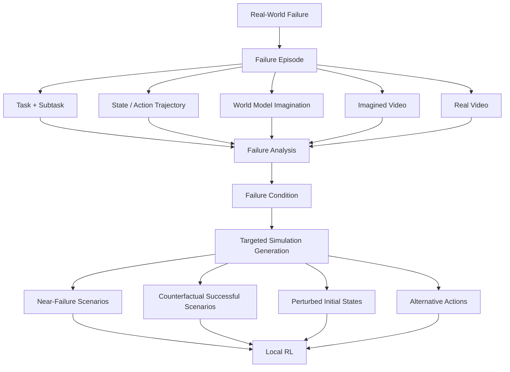

For example, if a robot squeezes a paper cup too hard, the system can generate scenarios with different cup positions, masses, compliance, approach directions, grasp forces, timings, and robot configurations. The goal is not to memorize the original mistake but to learn the boundary between successful and unsuccessful behavior.

```math
\text{One Real Failure}
\rightarrow
\text{Failure Understanding}
\rightarrow
\text{Targeted Scenarios}
\rightarrow
\text{Policy Improvement}
```

This process powers the local environment-specific learning loop.

---

# 14. Sending Deployment Failures Back to the Lunch Robotics Lab

The raw failure stream is also sent back to the Lunch Robotics lab, but **raw deployment failures are not directly used to fine-tune the global VLA**. The central dataset pipeline begins with human-led error-mode analysis.

Different deployments will produce different kinds of mistakes. Some are caused by local geometry, local objects, local task conventions, or environment-specific calibration. Others reveal a genuine limitation in the general robot intelligence.

The Lunch Robotics team analyzes failure episodes across deployments to distinguish these cases and identify **systematic, recurring, and generalizable error modes**.

For example:

```text
Environment A:
Robot crushes a paper cup.

Environment B:
Robot squeezes a plastic container too hard.

Environment C:
Robot damages a thin package while grasping it.

                    ↓

          Cross-Deployment Analysis

                    ↓

Generalizable Error Mode:
Poor force regulation for compliant objects.
```

This step is critical because the global model should learn reusable capabilities, not absorb every local quirk from every deployment.

The result of the analysis is a set of prioritized global capability gaps. Only those failure modes that the team believes represent meaningful, transferable shortcomings are promoted into global training.

---

# 15. Curating the Global Training Dataset

Once a generalizable error mode has been identified, the Lunch Robotics team creates a **curated training dataset** around that capability gap.

The curated dataset can combine selected real-world failure episodes with successful examples, counterfactual successful trajectories, targeted simulation rollouts, adversarial near-failure scenarios, World Model imagined trajectories, decoded imagined videos, and relevant examples from the original foundation datasets.

```math
\mathcal{D}_{\mathrm{curated}}
=
\mathrm{Curate}
\left(
\mathcal{D}_{\mathrm{deployment}},
\mathcal{D}_{\mathrm{simulation}},
\mathcal{D}_{\mathrm{foundation}}
\right)
```

This is a deliberate dataset-engineering step rather than an automatic ingestion pipeline. The team is effectively asking:

> **What capability is actually missing, and what data will teach the global model that capability in a way that transfers beyond the environment where the failure was observed?**

For example, three different environments may expose what appears to be three distinct failures, but careful analysis may reveal a common underlying problem such as insufficient understanding of compliant-object manipulation, poor force regulation, or weak contact-state reasoning.

The curated dataset should therefore teach the underlying capability rather than the superficial details of the environments where the failures first appeared.

---

# 16. Fine-Tuning a New Global Lab VLA

The curated dataset is used to improve the **global lab VLA**.

```math
W_{\mathrm{lab}}'
=
\mathrm{FineTune}
\left(
W_{\mathrm{lab}},
\mathcal{D}_{\mathrm{curated}}
\right)
```

This produces a new release of the lab VLA that incorporates the generalizable knowledge discovered through deployment.

The lab VLA is therefore continuously evolving through two sources of intelligence: the original foundation-model training distribution and the carefully selected capability gaps discovered in real-world operation.

The important distinction is:

```text
Raw deployment failures
          ↓
Lunch Robotics analysis
          ↓
Generalizable error modes
          ↓
Curated training dataset
          ↓
New Lab VLA
```

The deployment fleet is therefore a source of **candidate knowledge**, while the Lunch Robotics lab decides what knowledge becomes part of the global brain.

---

# 17. Environment-Specific VLAs and the Global Lab VLA

The architecture maintains two distinct classes of model.

The **global lab VLA** is the shared general-purpose model maintained by Lunch Robotics. It captures broadly reusable capabilities learned from the foundation data funnel and from curated deployment-derived training.

Each deployment maintains its own **environment-specific VLA**, which is optimized for its physical environment, robot embodiment, objects, task distribution, and local dynamics.

```text
                         GLOBAL LAB VLA
                               │
                               ▼
                       Shared Initialization
                               │
             ┌─────────────────┼─────────────────┐
             │                 │                 │
             ▼                 ▼                 ▼
        Environment A     Environment B     Environment C
        Specific VLA      Specific VLA      Specific VLA
             │                 │                 │
             ▼                 ▼                 ▼
        Local Simulation RL + Real Deployment
```

This distinction prevents the global model from being dominated by the peculiarities of any one deployment while still allowing every deployment to become highly specialized.

---

# 18. Continual Weight Mixing

The next step is to combine the information accumulated by the global lab VLA and the environment-specific VLAs.

Suppose:

```math
W_{\mathrm{lab}}
```

is the current global model and:

```math
W_1, W_2, \ldots, W_N
```

are environment-specific models.

After the lab VLA has been improved using curated deployment data:

```math
W_{\mathrm{lab}}'
=
\mathrm{FineTune}
\left(
W_{\mathrm{lab}},
\mathcal{D}_{\mathrm{curated}}
\right)
```

the system performs a continual model-merging step:

```math
W_{\mathrm{mixed}}
=
\mathrm{Mix}
\left(
W_{\mathrm{lab}}',
W_1,
W_2,
\ldots,
W_N
\right)
```

The exact implementation may eventually use parameter-space merging, model deltas, adapter composition, selective merging, or another technique. The architectural principle is that useful information accumulated centrally and useful knowledge discovered through deployment should be consolidated into a stronger common initialization.

The resulting **mixed VLA** is redistributed to all environments. Each deployment then starts a new round of environment-specific adaptation from this shared state:

```math
W_i^{(t+1)}
=
\mathrm{Adapt}
\left(
W_{\mathrm{mixed}},
E_i
\right)
```

Every global update therefore becomes available to the entire fleet.

---

# 19. The Global-Local Learning Flywheel

Lunch Robotics consequently has two interacting learning loops.

The **local loop** teaches each robot how to operate in its own physical world:

```math
\boxed{
\text{Mixed VLA}
\rightarrow
\text{Environment RL}
\rightarrow
\text{Environment-Specific VLA}
\rightarrow
\text{Deployment}
\rightarrow
\text{Failure}
\rightarrow
\text{Targeted Simulation}
\rightarrow
\text{Environment RL}
}
```

The **global loop** turns the collective experience of the fleet into improvements to the shared brain:

```math
\boxed{
\text{Many Deployments}
\rightarrow
\text{Failure Episodes}
\rightarrow
\text{Team Error-Mode Analysis}
\rightarrow
\text{Curated Data}
\rightarrow
\text{New Lab VLA}
\rightarrow
\text{Weight Mixing}
\rightarrow
\text{Mixed VLA}
\rightarrow
\text{All Deployments}
}
```

Together:

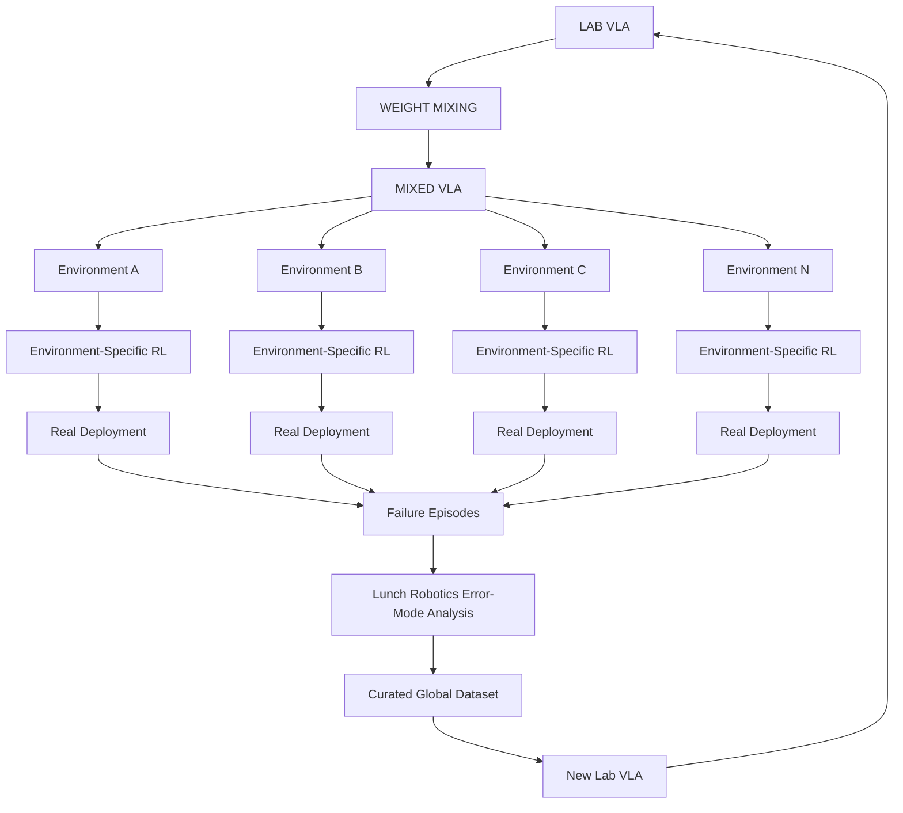

The architecture therefore separates **local specialization from global generalization**. A deployment is free to discover local solutions without automatically contaminating the global model, while recurring failures that reveal general capability gaps can be deliberately promoted into the shared brain.

---

# 20. Safety

Safety is implemented at multiple levels because no single model should be trusted to guarantee safe operation.

At the foundation level, the models are exposed to safety-oriented and adversarial training examples so that broad behavioral constraints are established before deployment. At the environment level, the calibrated digital twin allows the policy to experience dangerous scenarios without putting the real robot or environment at risk. These scenarios can include fragile objects, unstable surfaces, unsafe force application, dangerous tool use, restricted areas, and adversarial instructions.

A high-level 3D VLM planner evaluates user intent before execution and can reject clearly unsafe or inappropriate tasks. During execution, uncertain or high-risk candidate actions can be evaluated in the surrogate and, when necessary, the high-fidelity digital twin before being passed to the robot.


Runtime monitoring provides another safety layer by continuously observing execution and detecting unexpected or dangerous outcomes.

---

# 21. Robot SDK

The Robot SDK is the final hardware abstraction layer between the policy and the physical robot. The robot should interact with the user through natural language while the underlying system translates those instructions into task specifications, retrieves the appropriate skill context, plans the execution, generates VLA actions, and converts those actions into hardware-safe trajectories.

```mermaid
flowchart LR
    A["Human Speech"]
    --> B["Speech-to-Text"]

    B --> C["Task Specification"]
    C --> D["Tutorial Skill Retrieval"]

    D --> E["3D VLM Planner"]
    E --> F["Environment-Specific VLA"]

    F --> G["Robot SDK"]
    G --> H["Motion Smoother"]
    H --> I["Hardware Controller"]
    I --> J["Robot"]
```

The neural policy therefore does not need to directly satisfy every low-level hardware constraint. The SDK provides the final control and safety interface.

---

## 21.1 Motion Smoothing

A neural action policy can produce noisy or abrupt outputs, so the SDK applies online smoothing and jerk-limited trajectory generation.

```math
(q_{t+1}, \dot{q}_{t+1}, \ddot{q}_{t+1})
=
f_{\mathrm{smooth}}
(
a_t,
a_{\lt t},
q_t,
\dot{q}_t,
\ddot{q}_t
)
```

The resulting trajectory is constrained by the robot's hardware limits:

```math
\begin{align*}
|\dot{q}(t)| &\leq v_{\max} \\
|\ddot{q}(t)| &\leq a_{\max} \\
|\dddot{q}(t)| &\leq j_{\max}
\end{align*}
```

These constraints are read directly from the robot specification, keeping the policy hardware-agnostic.

For low-latency deployment, a diffusion-based action policy can additionally undergo **Consistency Distillation**, allowing an iterative diffusion policy to be transformed into a much faster inference process.

---

# 22. Runtime Task Execution

At runtime, the experience should be intentionally simple. The user can say:

> **"Clean the table."**

The system converts the request into a task specification, retrieves the relevant tutorial, uses the planner to determine the task structure, and passes the execution problem to the environment-specific VLA.

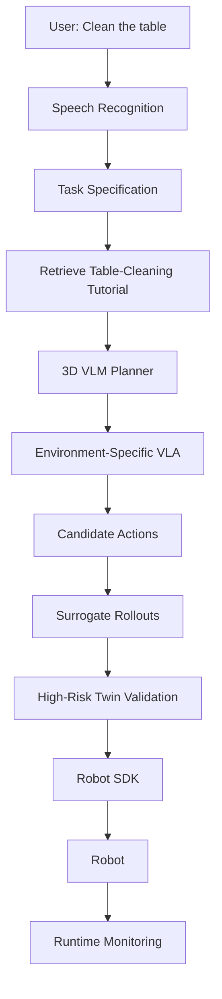

The tutorial supplies task-specific contextual knowledge, the planner determines the task structure, the VLA determines how the robot should act, the World Model predicts how the world will evolve, and the digital twin evaluates the physical consequences of candidate behaviors. The SDK ensures hardware-safe execution, while runtime monitoring determines whether the execution succeeded or entered a failure state.

---

# 23. End-to-End System

The full architecture is a continuous pipeline from foundation-model training to deployment and back again.

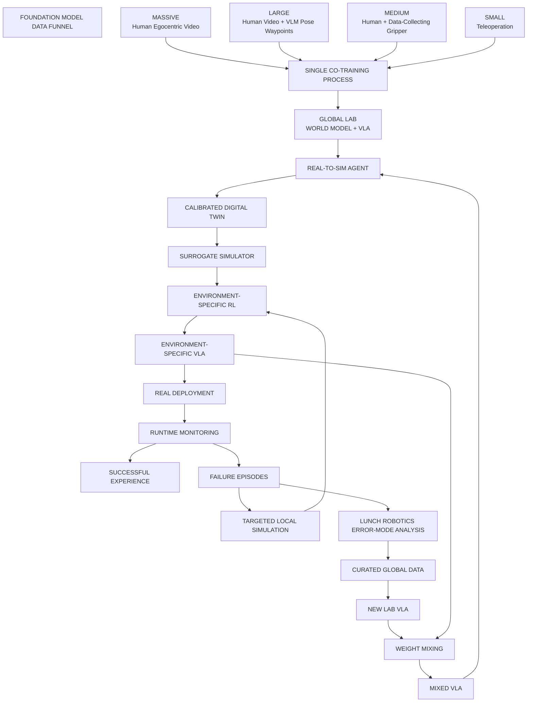

The local environment lifecycle is:

```math
\text{Mixed VLA}
\rightarrow
\text{Environment Reconstruction}
\rightarrow
\text{System Identification}
\rightarrow
\text{Calibrated Simulation}
\rightarrow
\text{Environment RL}
\rightarrow
\text{Environment-Specific VLA}
\rightarrow
\text{Real Deployment}
\rightarrow
\text{Failure}
\rightarrow
\text{Targeted Local Learning}
```

The global fleet lifecycle is:

```math
\text{Many Deployment Failures}
\rightarrow
\text{Lunch Robotics Error-Mode Analysis}
\rightarrow
\text{Curated Global Dataset}
\rightarrow
\text{New Lab VLA}
\rightarrow
\text{Weight Mixing}
\rightarrow
\text{Mixed VLA}
\rightarrow
\text{All Deployments}
```

The resulting architecture is not a one-way pipeline. It is a **closed learning system** in which the foundation model creates capable initial policies, environments provide the physical context required for specialization, deployments expose the weaknesses of those policies, and the company converts the most generalizable weaknesses into improvements to the shared brain.

---

# 24. What the User Actually Does

From the user's perspective, the system should be almost trivial. They provide the environment information, task descriptions, tactile probing, task demonstrations, and robot interface required to initialize the system.

```math
\text{Environment}
+
\text{Tasks}
+
\text{Tactile Probing}
+
\text{Task Videos}
+
\text{Robot SDK}
```

They do not manually build a simulator, model the environment's physics, perform system identification, create RL environments, engineer the training curriculum, generate synthetic datasets, train the policy, or tune low-level control. The platform performs those steps autonomously.

After deployment, the user simply uses the robot. When the robot makes a mistake, the user can point it out, while environmental cameras and VLM monitoring can independently detect many failures. The resulting event is automatically recorded and becomes part of the local learning loop and, when appropriate, the global error-analysis pipeline.

The user therefore does not need to become a robotics engineer in order to operate and improve the system.

---

# 25. The Core Research Thesis

The central thesis of Lunch Robotics is that universal robot intelligence should be built from four complementary components:

```math
\boxed{
\text{Foundation Model Data Funnel}
+
\text{Agentic Real-to-Sim}
+
\text{Environment-Specific RL}
+
\text{Curated Fleet Learning}
}
```

The Foundation Model Data Funnel solves the first problem:

> **How do we learn broad physical and manipulation intelligence without requiring enormous quantities of expensive robot data?**

The answer is to combine data sources with radically different scale and fidelity inside one continuously co-trained foundation model:

```math
\text{Massive Human Video}
+
\text{Human Action Learning}
+
\text{Robot-Relevant Manipulation}
+
\text{Teleoperation}
\rightarrow
\text{Global World Model + VLA}
```

The Real-to-Sim system solves the second problem:

> **How do we adapt that general intelligence to an arbitrary robot operating in an arbitrary physical environment?**

By transforming:

```math
\text{Real Environment}
\rightarrow
\text{Digital Twin}
\rightarrow
\text{System Identification}
\rightarrow
\text{Calibrated Simulation}
\rightarrow
\text{Massive RL}
\rightarrow
\text{Environment-Specific VLA}
```

The deployment learning system solves the third problem:

> **How do we continue improving after the robot is operating in the real world?**

The answer is to let each deployment learn locally while sending rich failure data back to the central lab. The Lunch Robotics team analyzes those failures across environments, identifies generalizable error modes, and curates the datasets required to teach those capabilities to the global model:

```math
\text{Deployment Failures}
\rightarrow
\text{Team Error-Mode Analysis}
\rightarrow
\text{Curated Data}
\rightarrow
\text{New Lab VLA}
```

Finally, the global and local models are combined and redistributed:

```math
\text{Lab VLA}
+
\text{Environment-Specific VLAs}
\rightarrow
\text{Mixed VLA}
\rightarrow
\text{All Deployments}
\rightarrow
\text{Environment-Specific RL}
```

The most important architectural principle is therefore:

> **The robots specialize locally, while Lunch Robotics learns globally.**

A deployed robot is not merely a consumer of a fixed model. It is an autonomous learning agent operating inside a particular physical environment and a sensor collecting valuable evidence about what the shared brain still does not understand. The centralized Lunch Robotics team then acts as the intelligence filter that determines which discoveries should become part of the universal model.

This creates a compounding learning flywheel:

```math
\boxed{
\text{More Deployments}
\rightarrow
\text{More Real-World Experience}
\rightarrow
\text{More Error Modes Discovered}
\rightarrow
\text{Better Curated Data}
\rightarrow
\text{Better Lab VLA}
\rightarrow
\text{Better Initialization}
\rightarrow
\text{Better Environment Adaptation}
\rightarrow
\text{Better Robots}
\rightarrow
\text{More Deployments}
}
```

The fundamental insight is that **deployment is not merely inference at the edge**. Deployment is where the system discovers what intelligence is still missing.

---

# 26. The Product Vision

The end state is **zero-to-hero robot autonomy**.

The user provides a robot, an environment, the tasks it needs to perform, a small amount of tactile probing, and task demonstrations. The rest of the system operates behind the scenes.

```math
\begin{aligned}
&
\text{Massive Human Video}
+
\text{Human Action Data}
+
\text{Robot-Relevant Data}
+
\text{Teleoperation}
\\
&\qquad\qquad\downarrow
\\
&
\text{Global World Model + VLA}
\\
&\qquad\qquad\downarrow
\\
&
\text{Real-to-Sim Agent}
\\
&\qquad\qquad\downarrow
\\
&
\text{Calibrated Digital Twin}
\\
&\qquad\qquad\downarrow
\\
&
\text{Massive Simulation RL}
\\
&\qquad\qquad\downarrow
\\
&
\text{Environment-Specific VLA}
\\
&\qquad\qquad\downarrow
\\
&
\text{Real Deployment}
\\
&\qquad\qquad\downarrow
\\
&
\text{Failure Discovery}
\\
&\qquad\qquad\downarrow
\\
&
\text{Targeted Local Learning}
\end{aligned}
```

Across the fleet, deployment failures are converted into curated improvements to the global model:

```math
\begin{aligned}
&
\text{Deployment Failures}
\\
&\qquad\qquad\downarrow
\\
&
\text{Lunch Robotics Error-Mode Analysis}
\\
&\qquad\qquad\downarrow
\\
&
\text{Curated Global Training Data}
\\
&\qquad\qquad\downarrow
\\
&
\text{New Lab VLA}
\\
&\qquad\qquad\downarrow
\\
&
\text{Weight Mixing}
\\
&\qquad\qquad\downarrow
\\
&
\text{Mixed VLA}
\\
&\qquad\qquad\downarrow
\\
&
\text{Every Deployment}
\end{aligned}
```

At deployment, the user can simply say:

> **"Clean the table."**

The robot understands the task, retrieves the relevant skill, reasons about the physical environment, imagines the desired outcome, evaluates candidate behaviors, executes them through a hardware-safe control stack, and monitors the result.

When the robot encounters something it does not understand, the system does not simply record a failure and move on. It captures the entire event, learns locally from the failure, and sends the information back to the Lunch Robotics lab. The team determines whether the failure reveals a broader capability gap, curates the appropriate training data, improves the global VLA, mixes the new global knowledge with the knowledge accumulated by specialized deployments, and redistributes the resulting model across the fleet.

The long-term objective is therefore not to build another robot-specific policy. It is to build a **universal brain that can be installed into any robot, adapted to any physical environment, and continuously improved by the collective experience of every robot running it.**
