# Lunch Robotics: Universal Brain for Any Robot

## The Vision

We propose an end-to-end engine that turns a useless robot into a useful and self-improving robot, requiring only:

* Video data of its environment
* One video per task of a human performing the task
* The robot's SDK and hardware specification

The user should not need to manually build a simulator, design an RL environment, engineer a training curriculum, or train the robot policy.

The required setup is:

1. **Environment + Task Data** collected in the target environment (straightforward video of the environment and a human doing the task)
2. **Robot SDK** installed on the robot
3. **Robot Hardware Specification** exposed through the SDK
4. Optional environment metadata and hints

The engine automatically:

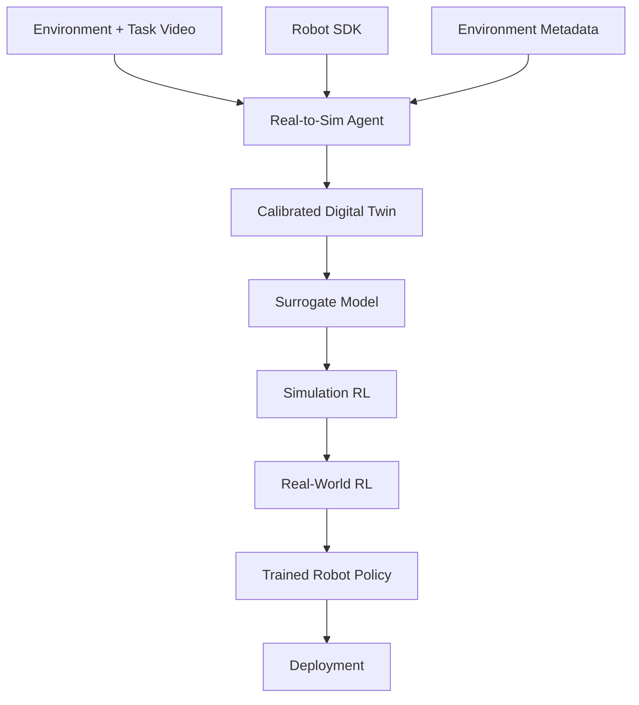

At deployment time, the user simply gives the robot a task.

For example:

> "Clean the table."

The task is captured through the robot's audio sensor, converted to text using speech recognition, and passed to the robot policy through the SDK.

The goal is:

```math
\text{Robot} + \text{Video} + \text{SDK} + \text{Task}
\rightarrow
\text{Autonomous Robot}
```

# 1. The Real-to-Sim Agent

The digital twin is constructed by an autonomous agent rather than a fixed reconstruction pipeline.

The agent is a **purposefully RL-trained LLM agent** whose task is to convert real-world interaction data into a sensible, executable, and calibrated simulation.

The agent is equipped with a toolbox for:

* Video understanding
* 3D reconstruction
* Simulator construction
* Physics simulation
* Trajectory extraction
* System identification
* Parameter optimization
* Simulation evaluation
* Experiment design
* World-model integration
* Code generation and execution

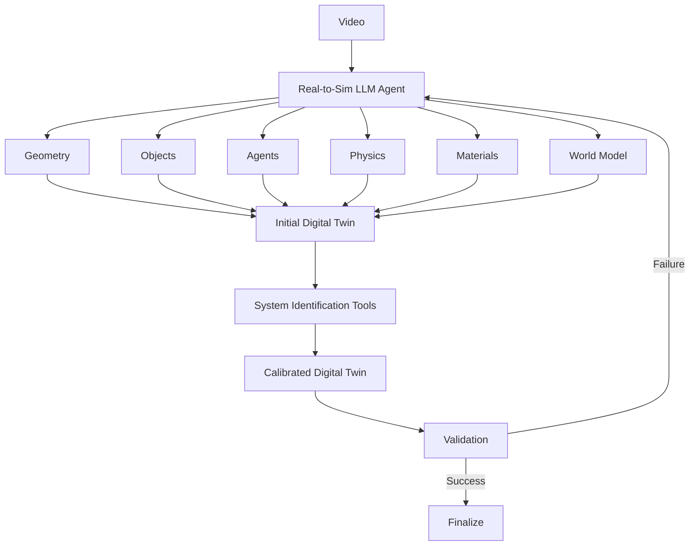

The agent is responsible for **constructing and validating the entire digital twin**.

It can:

* Inspect the video
* Identify objects and agents
* Reconstruct relevant geometry
* Select simulation primitives
* Determine which components should use explicit physics
* Determine which components require learned world-model dynamics
* Incorporate environment hints
* Create simulator code and configuration
* Identify uncertain parameters
* Invoke system-identification tools
* Run optimization and simulation experiments
* Compare simulated and real trajectories
* Diagnose mismatches
* Modify the simulator
* Repeat the process until the twin reaches the required fidelity

The agent therefore acts as an **AI simulation engineer and system-identification engineer**.

# 2. Agentic System Identification

The initial digital twin produced from video will inevitably be imperfect.

The critical insight is that the Real-to-Sim Agent does not need to solve system identification directly.

Instead, it is equipped with **specialized system-identification tools** that allow it to measure and optimize the simulator against real-world observations.

The agent may initially infer:

> "This object is a wooden table."

and construct a corresponding simulation model.

But many numerical parameters remain unknown:

```math
\theta =
\begin{bmatrix}
m \\
\mu \\
e \\
k \\
c \\
\vdots
\end{bmatrix}
```

where the parameters may include:

* $m$: mass
* $\mu$: friction
* $e$: elasticity or coefficient of restitution
* $k$: stiffness
* $c$: damping
* Other dynamics parameters

The agent can invoke system-identification tools to estimate them.

For example:

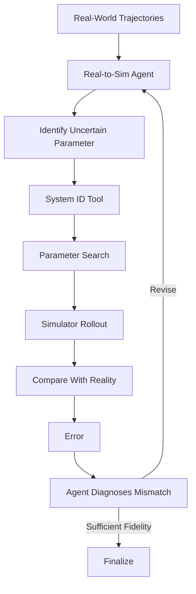

A generic optimization objective is:

```math
\theta^*
=
\arg\min_{\theta}
D\left(
\tau_{\mathrm{real}},
\tau_{\mathrm{sim}}(\theta)
\right)
```

The agent does not need to perform this numerical optimization itself.

Instead, it **decides when and how to use the optimization tools**, what parameters to expose, which observations to compare, and whether the resulting simulator is sufficiently accurate.

This creates an agentic system-identification loop:

```math
\text{Observe}
\rightarrow
\text{Hypothesize}
\rightarrow
\text{Simulate}
\rightarrow
\text{Measure Error}
\rightarrow
\text{Optimize}
\rightarrow
\text{Revise}
```

The division of labor is therefore:

> **The LLM reasons about the structure and debugging of the simulator; specialized system-identification tools perform the numerical estimation.**

This is analogous to giving a software engineer a compiler, profiler, debugger, and test suite rather than expecting the engineer to perform those operations manually.

# 3. Agentic Entities Are Simulated by a General World Model

Not every entity in the environment can be adequately represented by traditional physics.

Humans, cars, pedestrians, animals, and other robots make decisions.

The digital twin therefore uses a **general world model as the behavioral baseline for agentic entities**.

Rather than requiring access to their internal actions, the model predicts their future states directly from observations.

```math
S^{\mathrm{agent}}_{t+1:t+H}
\sim
P_{\phi}
\left(
S^{\mathrm{agent}}_{t+1:t+H}
\mid
S_{\leq t},
E
\right)
```

The same general world model can simulate different types of agentic entities.

Its predictions implicitly combine behavioral decisions with unobserved low-level dynamics.

The simulator therefore becomes:

```math
\text{Digital Twin}
=
\text{Explicit Physics}
+
\text{General World Model}
```

The Real-to-Sim Agent determines how these components should be composed and can use observed interaction data to validate the resulting behavior.

# 4. Surrogate Models Accelerate Simulation

Once the digital twin has been calibrated, the engine can use it to generate large amounts of high-quality synthetic experience.

However, high-fidelity physics simulation can itself become a computational bottleneck when reinforcement learning requires millions or billions of environment steps.

The calibrated digital twin therefore becomes the **teacher for a learned surrogate simulator**.

The engine generates trajectories from the calibrated simulator and trains a neural surrogate to approximate its state transitions:

```math
f_{\mathrm{sim}}(s_t, a_t)
\approx
f_{\mathrm{surrogate}}(s_t, a_t)
```

The surrogate can learn to predict future states directly:

```math
s_{t+1}
\approx
\hat{f}_{\psi}(s_t, a_t)
```

or, for longer horizons:

```math
s_{t+1:t+H}
\approx
\hat{F}_{\psi}
\left(
s_t,
a_{t:t+H-1}
\right)
```

The training process is:

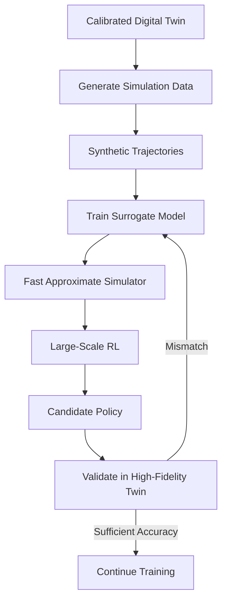

The surrogate is not intended to replace the digital twin as the source of truth.

The **calibrated digital twin remains the high-fidelity reference model**.

The surrogate is an acceleration layer that approximates the twin well enough for computationally intensive workloads such as massive-scale policy optimization and counterfactual exploration.

This creates a hierarchy:

```math
\text{Real World}
\rightarrow
\text{Calibrated Digital Twin}
\rightarrow
\text{Surrogate Model}
\rightarrow
\text{Fast Simulation}
\rightarrow
\text{Large-Scale RL}
```

The surrogate does not necessarily need to reproduce every physical detail of the digital twin.

Instead, it should accurately model the aspects of the dynamics that are relevant to the robot's current learning and planning problems.

This can make simulation substantially cheaper because neural inference can be much faster than repeatedly solving complex physics interactions.

The calibrated digital twin remains available for validation and correction.

When the surrogate encounters states where its predictions become unreliable, those states can be sent back to the high-fidelity simulator to generate additional training data.

This produces an active refinement loop:

```math
\text{Surrogate Rollout}
\rightarrow
\text{Uncertainty / Error Detection}
\rightarrow
\text{High-Fidelity Simulation}
\rightarrow
\text{New Training Data}
\rightarrow
\text{Surrogate Update}
```

The result is a **multi-fidelity simulation system** in which:

* The **real world** provides the initial observations.
* The **calibrated digital twin** provides high-fidelity physics and behavioral simulation.
* The **surrogate model** provides extremely fast approximate simulation.
* **RL** exploits the cheap simulation to perform large-scale policy optimization.
* The high-fidelity digital twin remains available for validation and correction.

The key idea is:

> **Use expensive simulation to learn the simulator's dynamics, then use the learned surrogate to make simulation cheap enough for massive-scale robot learning.**

# 5. Data Collection Protocol

To minimize deployment friction, data collection is kept as simple and non-intrusive as possible.

The user or operator provides only straightforward, easy-to-capture video recordings:

1. **Environment Video:** A simple video sweep showing the physical workspace, key objects, geometry, and lighting conditions.
2. **Task Demonstration Video:** A video of a human naturally performing the target task in that environment (e.g., picking up a cup, organizing items, cleaning a surface).

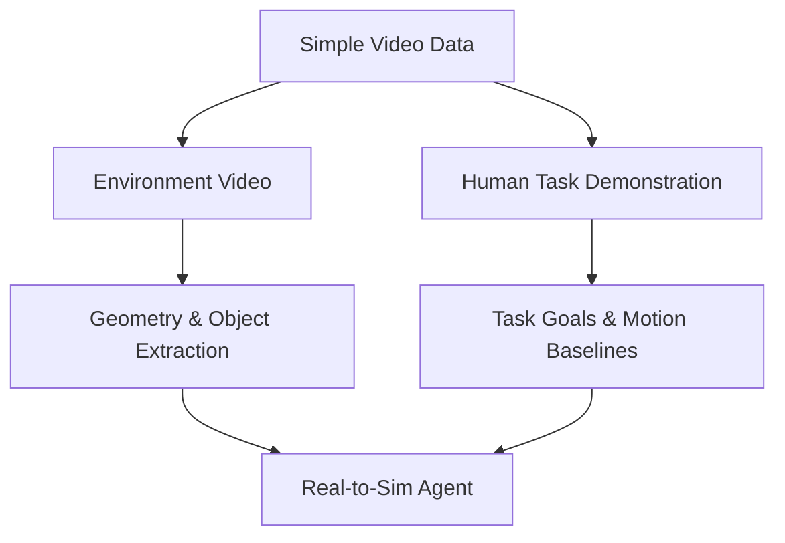

No specialized sensors, motion-capture suits, complex interaction trials, or complex robot behavior protocols are required. The Real-to-Sim Agent uses this video data to automatically deduce the environment's layout, target objects, and task objectives.

# 6. On-the-Fly Learning from Human Feedback

Deployment is not a static end state; the robot continually learns and improves through live human feedback.

When the robot makes a mistake or fails to complete a task as expected during execution, the human operator provides real-time feedback (via voice command, gesture, or interface input, such as "No, don't drop the cup like that, set it down gently").

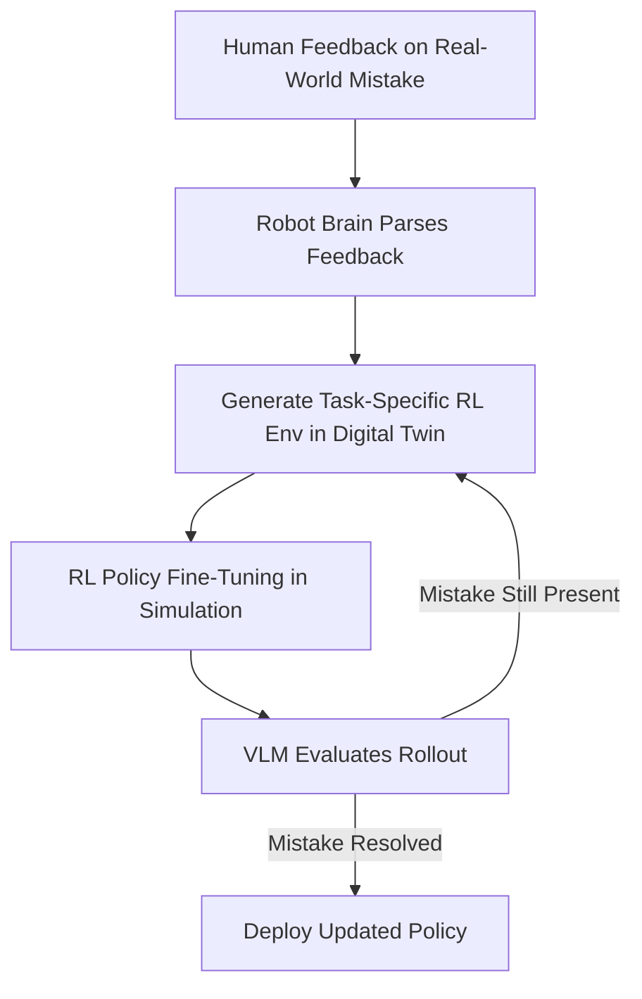

### Self-Correction Loop via Digital Twin

1. **Feedback Parsing:** The robot's central reasoning brain interprets the human's feedback to pinpoint the specific failure mode or sub-task error (e.g., wrong release height, improper force, incorrect placement trajectory).
2. **Automated RL Sub-Environment Creation:** The brain prompts the calibrated digital twin to instantiate a specialized, highly targeted RL training environment that recreates the precise state, geometry, and conditions under which the mistake occurred.
3. **Simulated Policy Refinement:** The policy undergoes focused reinforcement learning within this virtual environment to correct the error without requiring costly or risky physical trial-and-error.
4. **VLM Validation:** Before re-deploying to the physical robot, a Vision-Language Model (VLM) inspects simulated video rollouts of the newly trained policy. The VLM acts as an automated judge to verify whether the policy indeed resolved the specific error pointed out by the human.
5. **Redeployment:** Once the VLM confirms resolution, the updated policy parameters are deployed back to the physical robot.

# 7. Training the Robot Policy

Once the digital twin has been constructed and calibrated, and the surrogate model has been trained, the engine trains the robot's policy using fast simulation.

The policy learns:

```math
\pi_{\theta}(a_t \mid o_t, T)
```

where:

* $o_t$ is the robot's observation
* $T$ is the task
* $a_t$ is the robot action

The task is an explicit conditioning variable.

A single trained policy can therefore learn to perform many tasks rather than requiring a separate policy for every task.

The surrogate simulator provides massive amounts of experience:

```math
S_0
\rightarrow
A_0
\rightarrow
S_1
\rightarrow
A_1
\rightarrow
\cdots
```

allowing reinforcement learning to explore policies without consuming physical robot time.

The high-fidelity calibrated digital twin remains available to validate policies and correct surrogate-model errors.

# 8. Curriculum Learning

Training begins with simple tasks and progressively increases difficulty.

The curriculum can vary:

* Task length
* Number of objects
* Environmental clutter
* Precision requirements
* Number of interactions
* Disturbances
* Uncertainty
* Presence of other agents
* Consequences of failure

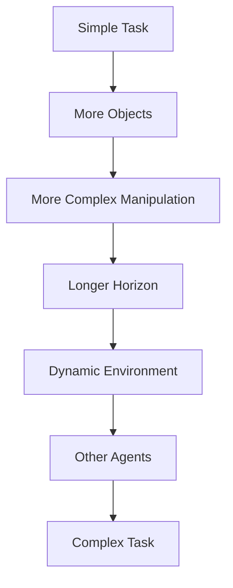

The curriculum can be automatically generated and adjusted based on the robot's performance.

The surrogate can provide the computational throughput required to explore large numbers of curriculum variations.

Policies or candidate behaviors can periodically be evaluated in the high-fidelity digital twin to ensure that optimization remains grounded in the calibrated simulation.

# 9. Real-World RL Closes the Sim-to-Real Gap

Simulation is not expected to perfectly reproduce reality.

Before deployment, the simulation-trained policy therefore undergoes a final stage of **real-world reinforcement learning**.

This stage also uses curriculum learning.

The robot begins with simple, low-risk tasks and progressively moves toward more complex tasks.

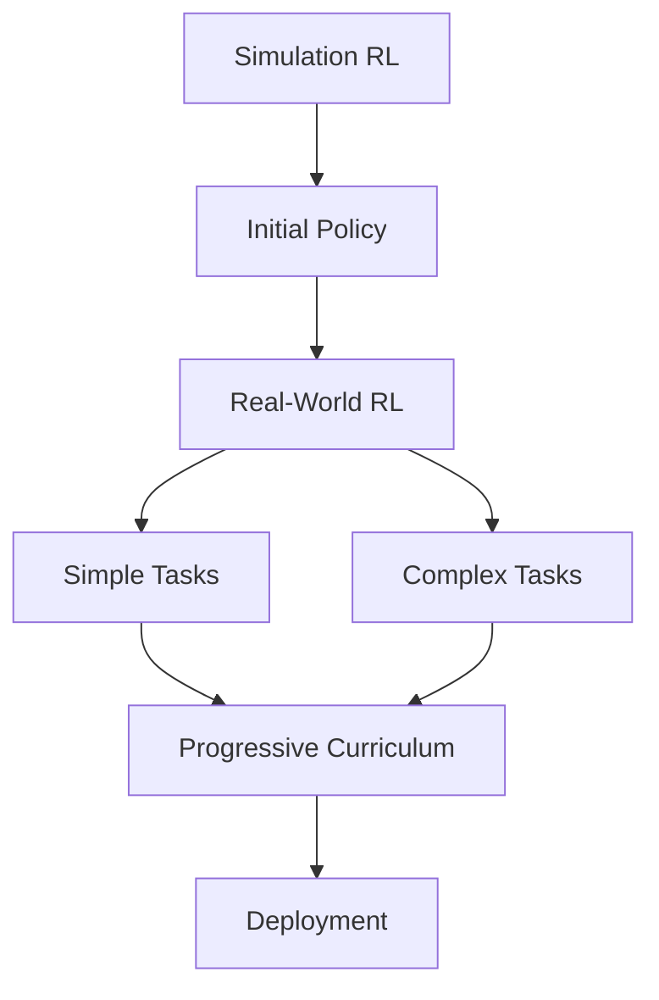

The purpose is not to relearn the entire policy.

It is to adapt the simulation-trained policy to:

* Residual physics errors
* Actuator imperfections
* Perception errors
* Unmodeled dynamics
* Real-world agent behavior
* Discrepancies between simulation and reality

A VLM provides automated task generation and reward evaluation.

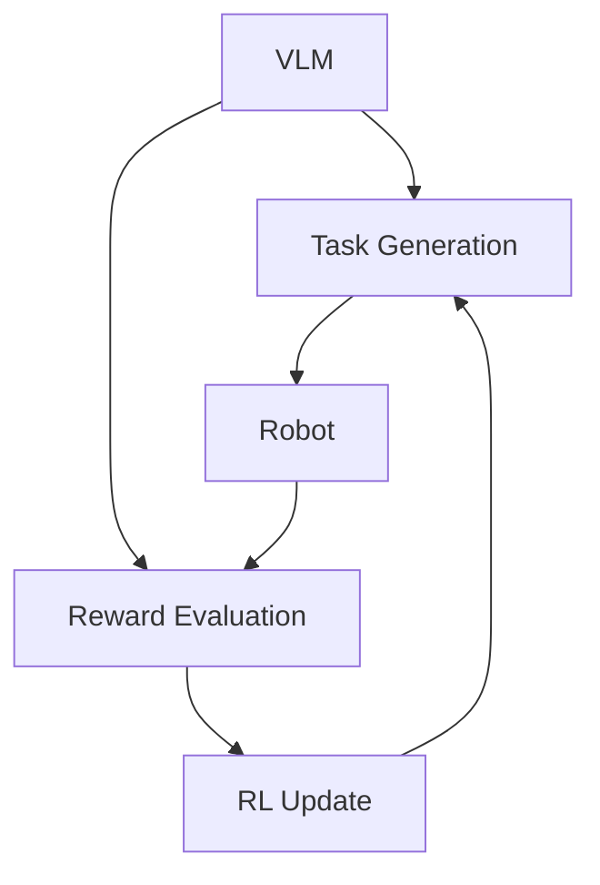

The VLM can generate increasingly difficult tasks and evaluate the robot's behavior without requiring a human to manually label trajectories.

This creates an automated loop:

```math
\text{Task Generation}
\rightarrow
\text{Real Interaction}
\rightarrow
\text{VLM Evaluation}
\rightarrow
\text{Reward}
\rightarrow
\text{RL}
\rightarrow
\text{Harder Task}
```

The final real-world RL stage therefore serves as a **closed-loop adaptation phase between the calibrated digital twin and reality**.

# 10. Task Interface

The deployed robot accepts tasks through natural language.

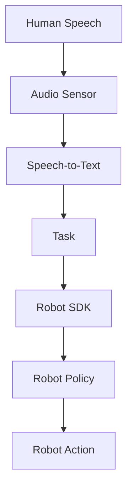

For example:

> "Put all the cups in the dishwasher."

becomes a structured task representation consumed by the policy.

The SDK provides the bridge between the learned policy and the robot's physical action interface.

This means the user does not need to understand the underlying policy, simulator, or RL infrastructure.

They provide the robot with a task.

# 11. Inference-Time Search

The digital twin is not discarded after training.

It remains available during deployment as a **counterfactual simulator**.

Before executing an uncertain action, the robot can simulate alternatives.

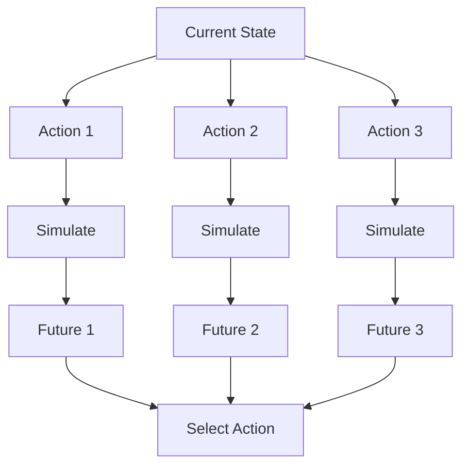

The robot can use the surrogate for fast exploration of candidate futures:

```math
\hat{S}_{t+1:t+H}
=
\hat{F}_{\psi}
\left(
S_t,
A_{t:t+H-1}
\right)
```

Candidate actions can then be evaluated quickly before being checked against the high-fidelity digital twin when necessary.

The robot can therefore use the same simulation hierarchy for both:

**learning what to do** and **reasoning about what to do next**.

This creates a closed relationship between training and inference:

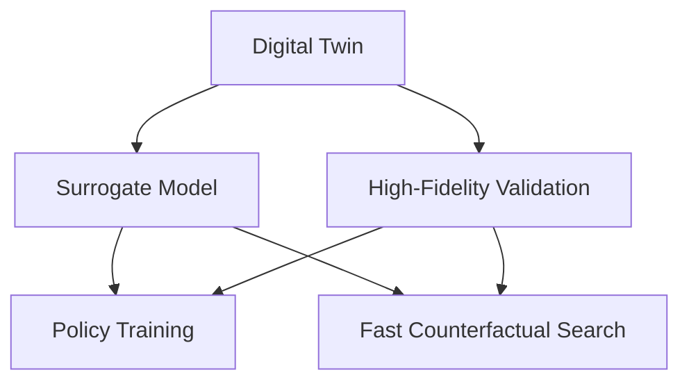

# 12. End-to-End System

The complete system can be viewed as four key stages:

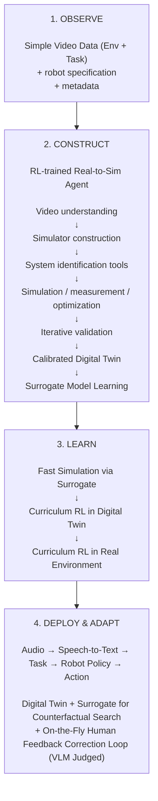

The resulting architecture is therefore:

```math
\text{Real World}
\rightarrow
\text{Video Data}
\rightarrow
\text{Real-to-Sim Agent}
\rightarrow
\text{Calibrated Digital Twin}
\rightarrow
\text{Surrogate Model}
\rightarrow
\text{Large-Scale RL}
\rightarrow
\text{Real-World RL}
\rightarrow
\text{Robot Policy}
\rightarrow
\text{Deployment}
\rightarrow
\text{Human Feedback}
\rightarrow
\text{Targeted RL}
```

The digital twin and surrogate model remain available after training, enabling counterfactual search and targeted policy refinement during deployment.

# The Core Research Thesis

The central hypothesis is:

> **A purposefully RL-trained AI agent, equipped with specialized simulation and system-identification tools, can convert a relatively small amount of real-world video data into a calibrated executable digital twin that is accurate enough to support large-scale robot policy learning, on-the-fly feedback refinement, and counterfactual planning.**

The key computational insight is that the calibrated digital twin can itself become a source of training data for a learned surrogate model.

This allows expensive high-fidelity simulation to be converted into a much cheaper approximation that can support massive-scale policy optimization and counterfactual exploration.

This changes the economics of robot learning.

Instead of:

```math
\text{Millions of Real-World Interactions}
\rightarrow
\text{Robot Policy}
```

the goal becomes:

```math
\text{Small Real-World Dataset}
\rightarrow
\text{AI Digital Twin}
\rightarrow
\text{System Identification}
\rightarrow
\text{Surrogate Model}
\rightarrow
\text{Fast Simulated RL}
\rightarrow
\text{Real-World RL}
\rightarrow
\text{Robot Policy}
\rightarrow
\text{On-the-Fly RL Feedback Corrections}
```

The important architectural distinction is:

> **The Real-to-Sim Agent is not itself the system-identification algorithm. It is an intelligent operator of system-identification tools.**

It decides what needs to be identified, chooses appropriate experiments and tools, interprets the resulting errors, and iteratively improves the simulator.

Likewise, the **surrogate model is not the digital twin itself**.

The calibrated digital twin is the high-fidelity reference. The surrogate is learned from that twin to provide a much faster approximation for workloads where the computational cost of high-fidelity simulation would otherwise become prohibitive.

The resulting architecture combines:

* **Agentic simulation construction**
* **Agentic system identification**
* **General world-model dynamics for agentic entities**
* **Calibrated high-fidelity digital twins**
* **Learned surrogate simulators**
* **Massive-scale simulated RL**
* **Real-world RL adaptation**
* **Inference-time counterfactual search**
* **On-the-fly human-feedback correction**

The ultimate product abstraction is therefore:

> **Give us the robot, interaction video, and action interface. An AI agent builds and calibrates its digital twin, learns a fast surrogate simulator, trains its policy, adapts it to reality, continuously self-corrects from live human feedback, and returns a robot capable of learning tasks specified in natural language.**
