# Lunch Robotics: Universal Brain for Any Robot

## The Vision

We are building a universal robot brain that can turn a general-purpose robot into an autonomous worker inside an arbitrary physical environment.

The core idea is to separate **general robot intelligence** from **environment-specific adaptation**.

General intelligence is learned once, offline, through a **Foundation Model Data Funnel** that progressively transforms massive amounts of human video into an increasingly robot-native World Model and VLA. Environment-specific intelligence is then acquired through an autonomous **Real-to-Sim Agent** that constructs and calibrates a digital twin of the deployment environment, allowing the robot brain to train against that environment at massive scale before touching the real world.

The result is a system that does not require every new robot or environment to start collecting enormous amounts of robot demonstrations from scratch.

The user provides:

* **Tactile Environment Probing Data** collected with a sensorized handheld gripper.
* **Environment Walkthrough Video** showing the physical workspace.
* **Environment & Task Context Description** explaining the environment, tasks, constraints, and other agents.
* **Two Videos per Task**: an execution demonstration for evaluation and a tutorial/explanation video that becomes a reusable skill.
* **Robot SDK + Hardware Specification** exposing the robot's embodiment and physical limits.
* **Vendor Random-Policy Calibration Recording**, approximately one minute of the robot executing random actions.

The system automatically constructs the digital twin, identifies its physical parameters, generates massive simulation experience, trains the robot policy, adapts it to hardware, and continuously improves it from failures.

The user should not need to manually build a simulator, write reinforcement-learning environments, engineer the training curriculum, perform system identification, or train the robot policy.

---

# 1. The Architecture

The entire system is composed of two layers.

### Layer 1 — Foundation Model Data Funnel

A universal foundation brain is trained before deployment:

```math
\text{Massive Human Video}
\rightarrow
\text{World Model V1}
\rightarrow
\text{VLA V1}
\rightarrow
\text{VLA V2}
\rightarrow
\text{VLA V3}
```

The data becomes progressively:

* smaller,
* more supervised,
* more embodiment-specific,
* and closer to the final robot-control distribution.

### Layer 2 — Environment-Specific Intelligence

The resulting foundation models are specialized to the actual robot and environment:

```math
\text{VLA V3 + World Model}
\rightarrow
\text{Real-to-Sim Agent}
\rightarrow
\text{Calibrated Digital Twin}
\rightarrow
\text{Surrogate Simulator}
\rightarrow
\text{Simulation RL}
\rightarrow
\text{Real-World Adaptation}
\rightarrow
\text{Deployment}
```

This separation is critical.

**The foundation models learn how the physical world and manipulation generally work.**

**The Real-to-Sim system teaches those models how this particular world behaves and how this particular robot interacts with it.**

---

# 2. Foundation Model Data Funnel

The foundation models are trained through a deliberate **data funnel**.

The principle is simple:

> Use enormous amounts of cheap human data to learn general world structure, then progressively trade data volume for supervision quality and embodiment relevance.

At the beginning, the system has access to enormous amounts of human video but almost no explicit robot action labels.

At the end, the system has relatively little data, but that data is extremely close to the final robot-control problem.

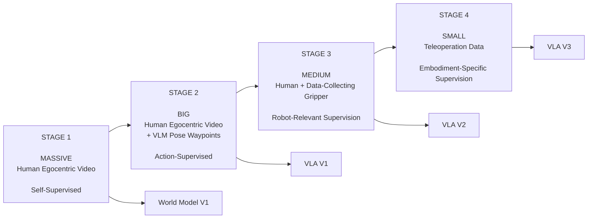

| Stage | Data                                                     | Supervision                                 | Base Model                                    | Result             |
| ----- | -------------------------------------------------------- | ------------------------------------------- | --------------------------------------------- | ------------------ |
| **1** | Massive human egocentric video                           | Self-supervised future + spatial prediction | Best JEPA-like World Model                    | **World Model V1** |
| **2** | Big human egocentric video + VLM pose waypoints          | Supervised action prediction                | Best foundation VLA + World Model imagination | **VLA V1**         |
| **3** | Medium human manipulation data + data-collecting gripper | Supervised action prediction                | VLA V1                                        | **VLA V2**         |
| **4** | Small teleoperation dataset                              | Direct robot action supervision             | VLA V2                                        | **VLA V3**         |

## 2.1 Stage 1 — Massive Human Egocentric Video

The first stage learns a general predictive model of the physical world from massive human egocentric video.

The starting point is the best available **JEPA-like World Model**, which is fine-tuned to predict both future observations and spatially masked regions of the environment.

The objective is not yet robot action prediction.

It is to learn the latent structure of the world:

* objects,
* spatial relationships,
* motion,
* interactions,
* scene evolution,
* contact-relevant visual structure,
* and temporal dynamics.

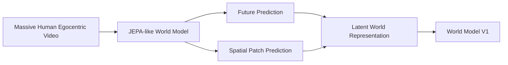

The output is **World Model V1**.

This becomes a core predictive component of the subsequent action model.

---

## 2.2 Stage 2 — Human Video + VLM Pose Waypoints

The second stage connects world understanding to action.

A large human egocentric video dataset is processed with a VLM that extracts **human pose-estimation waypoints** from demonstrations. These waypoints provide an approximate action trajectory associated with each video.

The best available foundation VLA is then fine-tuned to predict these actions.

Critically, the VLA also receives **latent future imagination from World Model V1**.

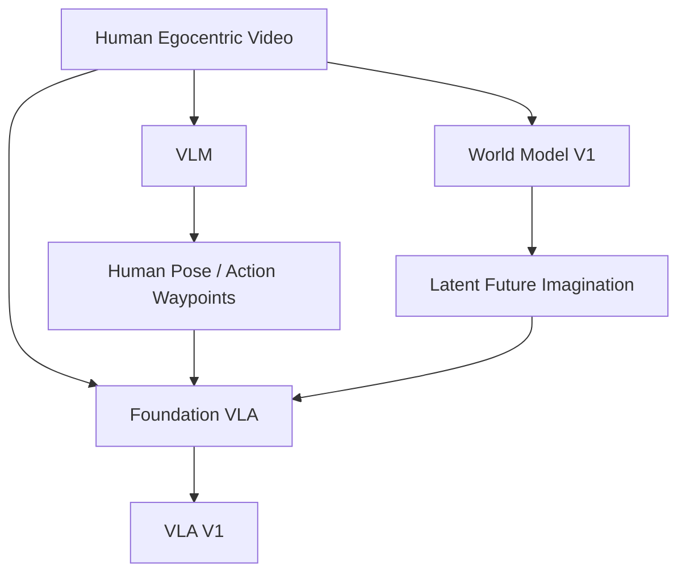

The model therefore begins learning:

```math
\text{Observation} + \text{Task} + \text{Predicted Future}
\rightarrow
\text{Action}
```

The result is **VLA V1**.

---

## 2.3 Stage 3 — Human Manipulation + Data-Collecting Gripper

The third stage moves much closer to the final robot-control distribution.

Humans perform manipulation tasks using a **data-collecting gripper**.

This introduces substantially more robot-relevant information:

* end-effector geometry,
* object interaction,
* contact events,
* manipulation trajectories,
* grasping,
* pushing,
* pulling,
* deformation,
* and interaction dynamics.

The dataset is smaller than the massive human-video datasets, but every sample contains much more embodiment-relevant information.

VLA V1 is fine-tuned on this data to produce **VLA V2**.

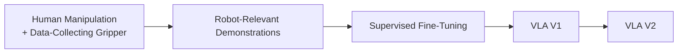

---

## 2.4 Stage 4 — Small Teleoperation Dataset

The final foundation-model stage uses a relatively small amount of **teleoperation data**.

This is the closest training distribution to the final robot because the demonstrations are generated by the actual robot embodiment.

VLA V2 is fine-tuned directly on this data to produce **VLA V3**.

The teleoperation dataset is deliberately split between two regimes:

**50% zero-shot**

The model must generalize to a task without receiving a task-specific robot demonstration.

**50% one-shot**

The model receives a single demonstration and must exploit it to execute the task.

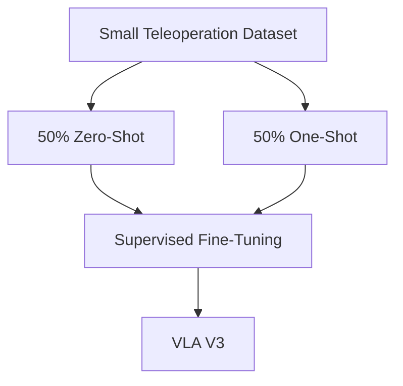

The final foundation model stack is therefore:

```math
\text{Human Video}
\rightarrow
\text{World Model}
\rightarrow
\text{Human Action Learning}
\rightarrow
\text{Robot-Relevant Action Learning}
\rightarrow
\text{Teleoperation Fine-Tuning}
```

This produces a robot brain that already possesses broad physical and manipulation knowledge before it ever encounters a particular deployment environment.

---

# 3. Deployment Inputs

For a particular robot and environment, the system requires a small amount of additional information.

## 3.1 Environment Walkthrough

The user records a **30–90 second walkthrough video** of the workspace.

The purpose is not to perfectly reconstruct the scene.

Instead, it provides:

* coarse room geometry,
* large objects,
* furniture,
* spatial layout,
* camera scale,
* and an initial scene representation.

This produces the initial digital twin.

---

## 3.2 Environment & Task Context Description

The user provides a detailed natural-language specification of the environment and tasks.

It should describe:

* what the environment is used for,
* relevant objects and their roles,
* environmental constraints,
* expected robot tasks,
* what constitutes success,
* unusual or non-obvious task procedures,
* potential humans or other agents,
* expected behavior of those agents,
* task-specific conventions,
* and any other information that a human would normally use to understand the situation.

This information is critical because a short video cannot reliably communicate everything that matters semantically.

The description therefore acts as a **semantic specification for the digital twin**.

---

## 3.3 Tactile Environment Probing

The user operates a sensorized handheld gripper and actively interacts with the environment.

The gripper can:

* tap surfaces,
* slide over surfaces,
* push objects,
* lift objects,
* squeeze objects,
* deform compliant materials,
* and probe contact conditions.

The system records:

* RGB-D video,
* gripper pose,
* contact forces,
* tactile pressure,
* forces and torques,
* slip information,
* and interaction trajectories.

This information is used primarily for **physical system identification**, rather than merely for visual reconstruction.

---

## 3.4 Two Videos Per Task

Each task has two different videos.

### Task Execution Video

The human simply performs the task without explaining it.

This video is primarily used for evaluation.

### Task Tutorial Video

The human explains the task before and while performing it.

The tutorial becomes a **modular skill representation** that can later be dynamically retrieved when the task is invoked.

This separates two concepts:

```math
\text{Execution Demonstration} \rightarrow \text{Evaluation}
```

```math
\text{Tutorial Demonstration} \rightarrow \text{Reusable Skill Context}
```

---

## 3.5 Robot Specification + Calibration Recording

The robot vendor provides:

* robot SDK,
* kinematics,
* joint limits,
* actuator information,
* end-effector specification,
* and hardware-specific control constraints.

The vendor additionally supplies approximately **one minute of random-policy execution data** containing synchronized robot observations and actions.

The user does not need to collect this data.

This clip helps the Real-to-Sim Agent identify the robot's:

* dynamics,
* actuator behavior,
* latency,
* joint response,
* and low-level control characteristics.

---

# 4. The Real-to-Sim Agent

Once the inputs are provided, the system does not run a fixed reconstruction pipeline.

Instead, an **RL-trained LLM agent acts as an autonomous simulation engineer and system-identification engineer**.

Its job is to construct the digital twin.

The agent has access to tools for:

* multimodal video analysis,
* tactile/contact signal analysis,
* 3D reconstruction,
* simulator generation,
* physics simulation,
* system identification,
* trajectory optimization,
* parameter estimation,
* experiment design,
* world-model integration,
* code generation,
* and simulation evaluation.

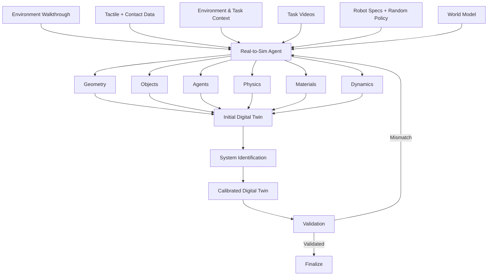

The agent is not simply reconstructing a visual replica.

It is trying to construct a **useful executable model of the world**.

That means deciding which aspects should be represented with explicit physics and which should be represented using learned dynamics.

---

# 5. Agentic System Identification

Visual reconstruction alone cannot determine important physical quantities.

A video does not directly tell us:

* how heavy an object is,
* how slippery a surface is,
* how compliant a material is,
* how much damping exists,
* or exactly how contact forces behave.

Tactile probing makes these quantities observable.

The Real-to-Sim Agent combines visual trajectories with tactile and force measurements to estimate the physical parameters of the digital twin.

```math
\theta =
\begin{bmatrix}
m \\
\mu_s \\
\mu_d \\
e \\
k \\
c \\
\vdots
\end{bmatrix}
```

where:

* $m$ is mass,
* $\mu_s$ is static friction,
* $\mu_d$ is dynamic friction,
* $e$ is restitution,
* $k$ is contact stiffness/compliance,
* $c$ is damping.

The agent continuously compares physical and simulated trajectories:

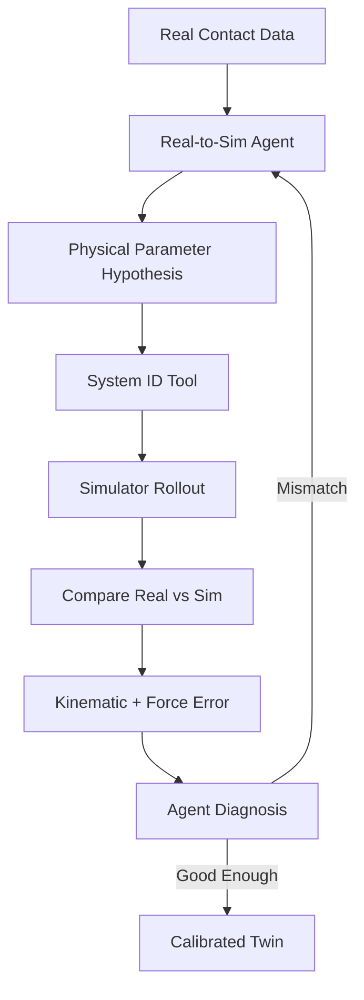

The optimization objective minimizes both motion and contact discrepancies:

```math
\theta^* =
\arg\min_{\theta}
\left(
D_{\mathrm{kin}}
\left(
\tau_{\mathrm{real}},
\tau_{\mathrm{sim}}(\theta)
\right)
+
\lambda
D_{\mathrm{force}}
\left(
W_{\mathrm{real}},
W_{\mathrm{sim}}(\theta)
\right)
\right)
```

The important distinction is that the **agent reasons about what needs to be identified**, while specialized optimization tools solve the numerical problem.

---

# 6. Explicit Physics + General World Model

Not every entity in the environment should be simulated with hand-designed physics.

Rigid objects and contact interactions can often be represented explicitly.

Complex agents such as humans, pets, or other non-scripted entities are better represented using the general World Model.

The World Model predicts how those entities evolve based on their observed history and environment:

```math
S^{\mathrm{agent}}_{t+1:t+H}
\sim
P_{\phi}
\left(
S^{\mathrm{agent}}_{t+1:t+H}
\mid
S_{\leq t}, E
\right)
```

The digital twin therefore combines:

```math
\text{Digital Twin}
=
\text{Explicit Calibrated Physics}
+
\text{Learned World Dynamics}
```

The Environment & Task Context Description is particularly important here because it tells the agent which entities matter, what they are supposed to do, and which behaviors are relevant to the task.

---

# 7. Learned Surrogate Simulator

High-fidelity simulation is expensive.

Once the digital twin is calibrated, the system uses it to generate large quantities of simulation data and trains a learned **surrogate model**.

```math
f_{\mathrm{sim}}(s_t,a_t)
\approx
f_{\mathrm{surrogate}}(s_t,a_t)
```

The surrogate trades some physical fidelity for enormous speed.

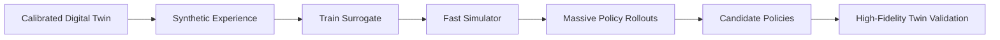

The result is a hierarchy:

```math
\text{Real World}
\rightarrow
\text{Calibrated Twin}
\rightarrow
\text{Surrogate}
\rightarrow
\text{Massive Simulation}
```

This makes large-scale policy optimization economically feasible.

---

# 8. Training the Environment-Specific Policy

The deployment policy starts from **VLA V3**, not from scratch.

It is conditioned on:

* current observation,
* task specification,
* World Model latent imagination,
* and retrieved tutorial skill context.

```math
\pi_{\theta}
\left(
a_t
\mid
o_t,
T,
z_{\mathrm{WM}},
S_{\mathrm{tutorial}}
\right)
```

where:

* $o_t$ is the current observation,
* $T$ is the task specification,
* $z_{\mathrm{WM}}$ is World Model latent imagination,
* $S_{\mathrm{tutorial}}$ is the retrieved task tutorial,
* $a_t$ is the action.

The foundation model therefore provides the broad prior, while the calibrated digital twin provides the environment-specific training ground.

---

# 9. Imagined Goal States and Motion-Based Rewards

Pure trajectory matching is brittle.

The same task can be solved through many valid trajectories, and exact human trajectories often overfit to a particular initial configuration.

Instead, the system uses the World Model and generative models to construct **latent goal-state and short-horizon motion representations**.

A target motion can be represented as:

```math
z_{\mathrm{target}(t:t+\delta)}
```

During simulation, the current state trajectory is encoded into the same latent space:

```math
z_{t:t+\delta}
=
\mathrm{Encoder}(s_{t:t+\delta})
```

The policy is rewarded for moving toward the imagined successful outcome:

```math
r_t =
w_{\mathrm{goal}}
\cdot
\mathrm{sim}
\left(
z_{t:t+\delta},
z_{\mathrm{target}(t:t+\delta)}
\right)
-
w_{\mathrm{penalty}}
\mathbb{I}_{\mathrm{fail}}(s_t)
```

This gives the policy a dense representation of **what successful progress looks like**, without requiring exact trajectory reproduction.

For tasks requiring sustained behavior, similarity must remain above a threshold over a temporal window.

A separate VLM judge detects catastrophic outcomes and applies strong penalties.

Examples include:

* knocking over fragile objects,
* crushing a deformable object,
* dropping a payload,
* entering forbidden regions,
* or producing clearly destructive behavior.

---

# 10. Simulation RL

The calibrated twin and surrogate allow the policy to experience enormous numbers of scenarios that would be expensive or impossible to collect manually.

The system can automatically vary:

* object positions,
* object properties,
* initial robot configuration,
* clutter,
* lighting,
* dynamics,
* task parameters,
* and behavior of other agents.

The training curriculum progresses from simple interactions to increasingly complex tasks:


The curriculum is generated automatically rather than manually engineered.

The Real-to-Sim Agent can identify weaknesses in the policy, instantiate targeted environments, and generate additional training scenarios around those weaknesses.

---

# 11. Real-World Adaptation

Simulation inevitably differs from reality.

The final adaptation stage therefore grounds the policy directly on physical hardware.

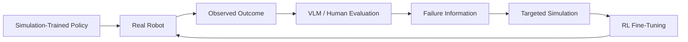

Real-world adaptation is intended to happen **approximately once every three months, or earlier when necessary**.

The user can provide another tactile-aware interaction recording or human feedback describing failures.

The system then converts those observations into targeted simulation and policy updates.

This means that the expensive real-world interaction loop is used primarily for **correction and calibration**, while the majority of learning happens in simulation.

---

# 12. Learning From Human Feedback

The robot continuously improves after deployment.

Suppose the robot receives feedback:

> "You're squeezing the paper cup too hard."

The system does not simply add that sentence to a prompt.

Instead, the reasoning system converts the feedback into a concrete physical failure condition.

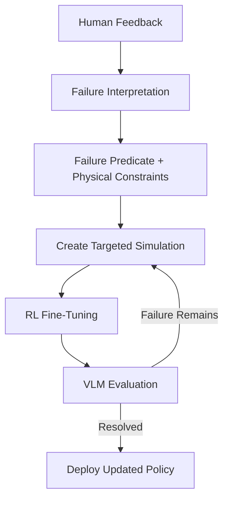

The result is a closed learning loop:

```math
\text{Failure}
\rightarrow
\text{Interpretation}
\rightarrow
\text{Simulation}
\rightarrow
\text{RL}
\rightarrow
\text{Validation}
\rightarrow
\text{Deployment}
```

This lets every deployment become a source of additional intelligence.

---

# 13. Safety

Safety exists at multiple layers.

## 13.1 Foundation-Level Safety

The foundation models are exposed to safety-oriented examples and adversarial situations during training.

The goal is to develop broad behavioral constraints before deployment.

## 13.2 Environment-Specific Adversarial Training

Once the digital twin exists, the robot can be intentionally exposed to dangerous scenarios inside simulation.

Examples include:

* fragile objects,
* unstable surfaces,
* dangerous tool usage,
* unsafe force application,
* restricted areas,
* and adversarial instructions.

The policy is heavily penalized for violating safety constraints.

## 13.3 Planner-Level Rejection

A high-level 3D VLM planner evaluates user intent before execution.

Clearly unsafe or inappropriate tasks can be rejected before they reach the low-level action policy.

## 13.4 Runtime Counterfactual Evaluation

Before executing uncertain or high-risk actions, the system can evaluate candidate trajectories inside the surrogate and, when necessary, the high-fidelity digital twin.


---

# 14. Robot SDK

The robot SDK is the final hardware abstraction layer.

At deployment, the user interacts through natural language.

```mermaid
flowchart LR
    A["Human Speech"]
    --> B["Speech-to-Text"]

    B --> C["Task Specification"]
    C --> D["Tutorial Skill Retrieval"]

    D --> E["3D VLM Planner"]
    E --> F["VLA V3 / Adapted Policy"]

    F --> G["Robot SDK"]
    G --> H["Motion Smoother"]
    H --> I["Hardware Controller"]
    I --> J["Robot"]
```

The neural policy produces high-level intended actions.

The SDK translates these into hardware-safe trajectories.

---

## 14.1 Motion Smoothing

A neural action model may produce noisy or abrupt outputs.

The SDK therefore applies online motion smoothing and jerk-limited trajectory generation.

```math
\left(
q_{t+1},
\dot{q}_{t+1},
\ddot{q}_{t+1}
\right)
=
f_{\mathrm{smooth}}
\left(
a_t,
a_{<t},
q_t,
\dot{q}_t,
\ddot{q}_t
\right)
```

The trajectory is constrained by hardware limits:

```math
\begin{align*}
|\dot{q}(t)| &\leq v_{\max} \\
|\ddot{q}(t)| &\leq a_{\max} \\
|\dddot{q}(t)| &\leq j_{\max}
\end{align*}
```

The SDK reads these limits directly from the robot specification, keeping the policy hardware-agnostic.

For low-latency deployment, the diffusion-based action policy can additionally undergo **Consistency Distillation**, transforming an iterative diffusion process into a much faster single-step inference policy.

---

# 15. Runtime Task Execution

At runtime, the interaction is intentionally simple.

The user says:

> **"Clean the table."**

The system:

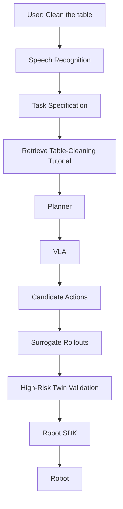

The tutorial provides task-specific contextual knowledge.

The VLA determines what to do.

The World Model predicts how the world will evolve.

The digital twin evaluates physical consequences.

The SDK ensures safe execution on the hardware.

---

# 16. End-to-End System

The complete architecture is:

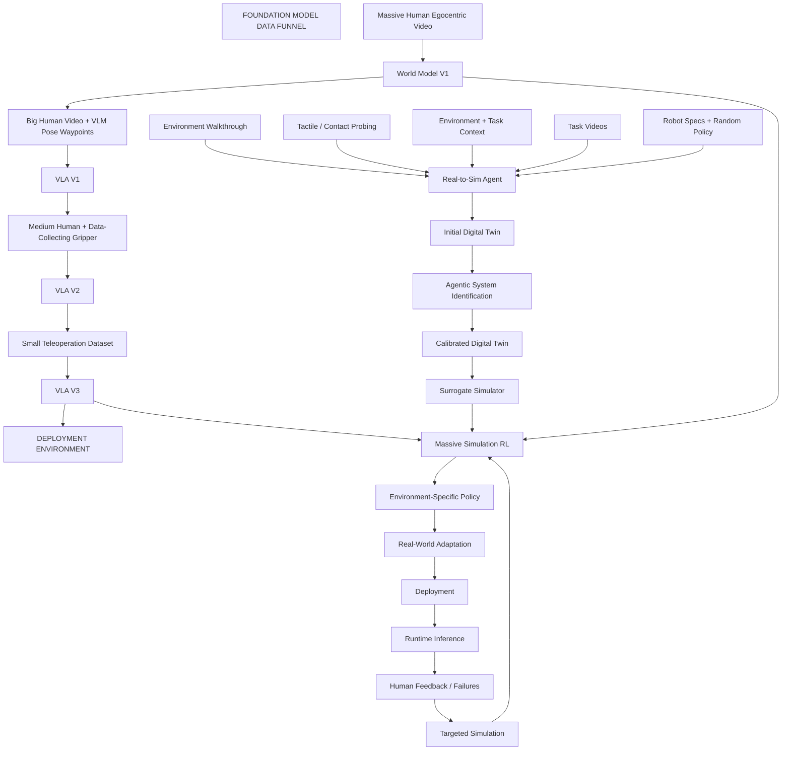

The resulting loop is:

```math
\text{Foundation Training}
\rightarrow
\text{Environment Reconstruction}
\rightarrow
\text{System Identification}
\rightarrow
\text{Simulation}
\rightarrow
\text{Policy Learning}
\rightarrow
\text{Real Deployment}
\rightarrow
\text{Feedback}
\rightarrow
\text{Learning}
```

---

# 17. What the User Actually Does

From the user's perspective, the system should be almost trivial.

They provide:

```math
\text{Environment}
+
\text{Tasks}
+
\text{Tactile Probing}
+
\text{Task Videos}
+
\text{Robot SDK}
```

The user does **not** manually:

* build a simulator,
* model physics,
* perform system identification,
* create RL environments,
* engineer a curriculum,
* generate synthetic data,
* train the policy,
* or tune low-level control.

The system does it autonomously.

---

# 18. The Core Research Thesis

The central thesis is that universal robot intelligence should be built as a **progressive funnel followed by environment-specific simulation**.

The Foundation Model Data Funnel solves the first problem:

> **How do we learn broad physical and manipulation intelligence without collecting enormous amounts of expensive robot data?**

By progressively transforming:

```math
\text{Massive Human Video}
\rightarrow
\text{World Model}
\rightarrow
\text{Human Action Learning}
\rightarrow
\text{Robot-Relevant Learning}
\rightarrow
\text{Teleoperation}
```

The Real-to-Sim system solves the second problem:

> **How do we adapt that general intelligence to an arbitrary robot operating in an arbitrary physical environment?**

By transforming:

```math
\text{Real Environment}
\rightarrow
\text{Digital Twin}
\rightarrow
\text{Calibrated Physics}
\rightarrow
\text{Surrogate}
\rightarrow
\text{Massive Simulation}
\rightarrow
\text{Real Adaptation}
```

Together:

```math
\boxed{
\text{Foundation Model Data Funnel}
+
\text{Agentic Real-to-Sim}
=
\text{Universal Robot Brain}
}
```

The most important architectural principle is therefore:

> **Learn general intelligence once from massive human data. Use expensive robot data only where embodiment actually matters. Then use an autonomous calibrated simulator to specialize that intelligence to any robot and any environment.**

---

# 19. The Product Vision

The end state is **zero-to-hero robot autonomy**.

The user gives the system the environment, the robot, the task descriptions, a small amount of tactile probing, and task demonstrations.

Behind the scenes:

```math
\text{Human Data}
\rightarrow
\text{World Model}
\rightarrow
\text{VLA}
\rightarrow
\text{Robot-Specific Adaptation}
\rightarrow
\text{Digital Twin}
\rightarrow
\text{Massive Simulation}
\rightarrow
\text{Autonomous Robot}
```

At deployment:

> **"Clean the table."**

The robot understands the task, retrieves the relevant skill, imagines the desired outcome, reasons about the physical environment, evaluates candidate actions, executes them through the hardware-safe SDK, and learns from mistakes.

The long-term objective is not to build another robot-specific policy.

It is to build a **universal brain that can be installed into any robot and taught any physical environment with minimal additional data.**
