# Lunch Robotics: Universal Brain for Any Robot

## The Vision

We are building a **universal robot brain** that can turn a general-purpose robot into an autonomous worker inside an arbitrary physical environment. The fundamental problem in robotics is not simply making robots capable of moving or manipulating objects, but giving them enough general intelligence to understand an unfamiliar world, reason about what should be done, predict the consequences of possible actions, adapt to the specific physics and embodiment of that world, and continuously improve as they encounter situations that were not represented in their original training data. Lunch Robotics separates this problem into **general physical intelligence, world simulation, adaptive reasoning, environment-specific intelligence, pre-deployment robustness, and continual fleet learning**, with each layer contributing a distinct capability to the overall system.

General robot intelligence is learned offline through a **Foundation Model Data Funnel** that combines massive amounts of human video with progressively more robot-relevant forms of supervision. Massive human video provides broad knowledge about the physical world, a generative World Model can then be used to produce large quantities of synthetic egocentric human manipulation experience that is filtered and action-annotated, human action supervision connects that knowledge to purposeful behavior, manipulation data collected with a data-collecting gripper introduces contact and embodiment information, and a smaller amount of teleoperation data provides direct grounding in robot control. The World Model itself is trained in two complementary phases: first, it learns the structure and evolution of the physical world from massive passive video through future and spatial prediction; second, it is further fine-tuned with **action-conditioned training**, where actions are explicitly provided as inputs and the model learns to predict what will happen after those actions. This transforms the World Model from a passive predictor into a learned **action-conditioned simulator** capable of evaluating hypothetical robot behaviors.

The synthetic egocentric-data stage is deliberately positioned between passive foundation-model pretraining and dense action-conditioned training. Once the foundation World Model is sufficiently capable, it can generate large numbers of hypothetical human manipulation episodes covering tasks, objects, viewpoints, and physical situations that are expensive to collect in the real world. It can do this both by generating completely new egocentric trajectories and by taking real human videos and modifying their initial frames with an image-editing model to create controlled variations of the scene, object configuration, or task. Humans and learned critics filter these generations for plausibility and usefulness, while pose-estimation models recover approximate hand and body actions from the surviving videos. These generated examples become an additional source of action-conditioned supervision, allowing the model to learn controllable physical dynamics at much greater scale than direct real-world collection alone would permit. Crucially, this is not treated as a closed synthetic-data loop: **real egocentric data remains the grounding source**, and the synthetic generation process is simultaneously used to discover where the foundation model is weak and determine which new real-world experiences should be collected to correct those weaknesses.

These datasets are not treated as isolated sequential stages in which each dataset replaces the previous one. They jointly train a shared **World Model + VLA foundation brain**, with the training distribution becoming increasingly robot-relevant while retaining the broad coverage of the lower-fidelity datasets. Once this foundation model has learned to perceive, predict, and act, it undergoes a reasoning stage in which the VLA is supervised on high-quality reasoning trajectories and then optimized with reinforcement learning so that it learns how to arrive at an action through useful reasoning rather than relying only on direct reactive mappings. Crucially, the amount of reasoning is not fixed: at inference time, the reasoning budget can be selected according to the task, uncertainty, and available compute.

After the global reasoning-capable brain has been built, it is adapted to a particular robot and environment through a final **agentic simulation RL stage** before deployment. A VLM agent acts as an autonomous curriculum and scenario-generation manager, deciding which tasks to train, how difficult they should be, how the environment should be varied, and from which initial states the robot should start. The curriculum progresses from small, simple tasks toward increasingly complex and long-horizon tasks while simultaneously varying the environment and initial state. This teaches the policy not only to solve the expected tasks, but to remain robust when objects, geometry, physics, clutter, or other agents differ from the nominal environment, and when the robot encounters a partially completed, degraded, or otherwise unexpected task state that requires recovery.

The final action-selection mechanism is therefore not a simple VLA-to-robot mapping. The system operates on **two nested timescales**. At a **lower frequency**, the World Model imagines three possible medium-horizon future trajectories representing different ways the current task could successfully progress, and a VLM scores those three imagined futures and selects the most desirable one as the current **target future**. At a **higher frequency**, the VLA generates three candidate action chunks, each candidate is passed once through the action-conditioned World Model to produce one predicted future trajectory, and a VLM compares those three predicted futures against the currently selected target future and chooses the candidate whose consequence best matches the target. The selected action chunk is then executed, and the high-frequency action-selection loop repeats several times before the target future is recomputed.

Conceptually, the architecture is:

```text
LOW-FREQUENCY TARGET PLANNING
────────────────────────────────────────

Observation + Task
        ↓
World Model
        ↓
3 Imagined Target Futures
        ↓
VLM Target Scoring
        ↓
Best Target Future
        │
        │ remains active for multiple
        │ high-frequency action decisions
        │
        ▼

HIGH-FREQUENCY ACTION SELECTION
────────────────────────────────────────

VLA
 ↓
3 Candidate Action Chunks
 ↓
World Model
 ↓
3 Predicted Future Trajectories
 ↓
VLM Comparison Against Target
 ↓
Best Action Chunk
 ↓
Robot
 ↓
New Observation
 ↓
Repeat

        │
        │ periodically
        ▼
Recompute Target Future
```

The target-selection stage is:

```math
\left\{
z_{\mathrm{target}}^{(1)}(t:t+H),
z_{\mathrm{target}}^{(2)}(t:t+H),
z_{\mathrm{target}}^{(3)}(t:t+H)
\right\}
\sim
\mathrm{WM}
\left(
s_t,
T
\right)
```

The VLM scores each target:

```math
r_j^{\mathrm{target}}
=
\mathrm{VLM}_{\mathrm{score}}
\left(
z_{\mathrm{target}}^{(j)},
s_t,
T
\right)
```

and selects:

```math
j^*
=
\arg\max_{j \in \{1,2,3\}}
r_j^{\mathrm{target}}
```

The selected target is:

```math
z_{\mathrm{target}}
=
z_{\mathrm{target}}^{(j^*)}
```

The VLA then samples three candidate action chunks:

```math
\left\{
a_t^{(1)},
a_t^{(2)},
a_t^{(3)}
\right\}
\sim
\pi_{\theta}
\left(
a_t
\mid
o_t,
T,
r_{1:k},
z_{\mathrm{target}},
S_{\mathrm{tutorial}}
\right)
```

Each candidate is passed through the action-conditioned World Model once:

```math
z_{\mathrm{pred}}^{(i)}(t:t+H)
=
\mathrm{WM}_{\mathrm{action}}
\left(
s_t,
a_t^{(i)}
\right)
```

The VLM scores the three predicted futures against the selected target:

```math
r_i
=
\mathrm{VLM}_{\mathrm{score}}
\left(
z_{\mathrm{pred}}^{(i)},
z_{\mathrm{target}},
s_t,
T
\right)
```

and selects:

```math
i^*
=
\arg\max_{i \in \{1,2,3\}}
r_i
```

The executed action is:

```math
a_t
=
a_t^{(i^*)}
```

The important distinction is therefore:

```text
3 target futures
        ↓
VLM
        ↓
1 selected target future
        ↓
3 candidate actions
        ↓
3 predicted futures
        ↓
VLM
        ↓
1 selected action
```

There are **three candidate futures at the action-selection stage, not nine**. The VLA proposes what could be done, the World Model predicts what would happen, and the VLM determines both which imagined future is desirable and which proposed action most closely produces that future. This gives Lunch Robotics a closed perception-reasoning-imagination-action loop in which the VLA does not need to perfectly predict the optimal action in a single forward pass; it only needs to generate a small set of plausible candidates, after which the World Model and VLM evaluate those candidates against a selected imagined target.

The reasoning-capable foundation brain is then adapted to a specific robot and physical environment by an autonomous **Real-to-Sim Agent**. Given a walkthrough of the environment, tactile probing data, task context, demonstrations, and the robot's hardware specification, the agent constructs and calibrates a digital twin, performs system identification, determines which aspects of the environment should be represented through explicit physics and which should be handled by learned dynamics, and trains a fast surrogate simulator. The resulting calibrated simulator becomes the training environment for Stage 7 agentic RL, where a VLM agent constructs the task curriculum and generates environment and initial-state variations. The output is an **environment-specific VLA** specialized to the particular robot and expected operating world.

The system does not stop learning after deployment. Each deployed robot continuously improves locally through simulation, while the platform monitors real-world execution for mistakes. A failure may be identified explicitly by the human user or automatically by a VLM observing the robot through cameras installed in the environment. Every detected mistake is captured as a rich episode containing the task and subtask being executed, the robot state and action trajectories, the reasoning context, the three target trajectories sampled during the most recent target update, the VLM scores used to select the target, the three candidate actions considered by the VLA, the World Model's predicted future for each candidate, the VLM scores used to rank those predicted futures against the target, the selected action, the actual execution, the corresponding decoded imagined videos, and the relevant simulator state and environment parameters.

These failures are **not automatically used to update the global model**. Instead, they are sent back to the Lunch Robotics team, where we analyze error modes across deployments and determine which failures are genuinely generalizable. Environment-specific quirks remain local, while problems that reveal broader capability gaps become the basis for carefully curated training datasets. Those curated datasets are then used to improve a new version of the **global lab VLA**, with the central training process applying additional supervised fine-tuning, reasoning supervision, reinforcement learning, World Model training, VLM training, or a combination of them depending on the identified capability gap. The updated lab model is then combined with knowledge accumulated in the environment-specific VLAs through continual weight mixing, producing a new mixed VLA that is redistributed to every deployment, after which each environment performs its own local RL again starting from this stronger initialization.

This creates a compounding global-local learning system:

```math
\boxed{
\text{Foundation Data}
\rightarrow
\text{World Model}
\rightarrow
\text{Synthetic Egocentric Action Data}
\rightarrow
\text{Action-Conditioned World Model}
\rightarrow
\text{Global VLA}
\rightarrow
\text{Reasoning SFT + RL}
\rightarrow
\text{Environment-Specific Agentic RL}
\rightarrow
\text{Deployment}
\rightarrow
\text{Failure Discovery}
\rightarrow
\text{Error-Mode Analysis}
\rightarrow
\text{Curated Data}
\rightarrow
\text{New Lab System}
\rightarrow
\text{Weight Mixing}
\rightarrow
\text{All Deployments}
}
```

The key product idea is therefore simple:

> **The robots specialize locally, while Lunch Robotics learns globally.**

---

# 1. The Architecture

The Lunch Robotics architecture is built around four nested learning systems operating on top of a shared reasoning-capable foundation model. The first is the **global foundation model**, which learns broad physical, manipulation, predictive, and reasoning intelligence. The second is the **environment-specific adaptation system**, which takes the shared model and specializes it to a particular robot and physical environment. The third is the **pre-deployment robustness system**, which uses VLM-guided curriculum generation and massive simulation RL to prepare that specialized model for the expected conditions and recover from unexpected initial states. The fourth is the **fleet learning system**, which turns deployment failures into curated global training data and feeds the resulting improvements back into the shared brain. At the center of the architecture is the interaction between the VLA, the World Model, and the VLM evaluator.

The World Model provides two distinct capabilities. First, it can imagine multiple possible desirable futures for the current task. Second, because it is action-conditioned, it can predict the consequence of each proposed action. The architecture operates at two different frequencies: the **target-future generation and target-future VLM scoring loop runs at lower frequency** and establishes a medium-horizon objective, while the **VLA action generation, World Model prediction, and candidate VLM scoring loop runs at higher frequency** and repeatedly selects short-horizon actions that move the robot toward the currently selected target.

The VLA therefore does not need to directly solve:

```math
(o_t, T)
\rightarrow
a_t^*
```

Instead, the overall system decomposes the problem into:

```math
(o_t, T)
\rightarrow
\{z_{\mathrm{target}}^{(1)},z_{\mathrm{target}}^{(2)},z_{\mathrm{target}}^{(3)}\}
\rightarrow
z_{\mathrm{target}}
\rightarrow
\{a_t^{(1)},a_t^{(2)},a_t^{(3)}\}
\rightarrow
\{z_{\mathrm{pred}}^{(1)},z_{\mathrm{pred}}^{(2)},z_{\mathrm{pred}}^{(3)}\}
\rightarrow
a_t^*
```

The complete nested control loop is:

```text
                 LOW-FREQUENCY LOOP
        ┌────────────────────────────────┐
        │                                │
Observation + Task                       │
        ↓                                │
World Model                              │
        ↓                                │
3 Target Future Samples                  │
        ↓                                │
VLM Target Scoring                       │
        ↓                                │
Selected Target Future                  │
        │                                │
        ▼                                │
              HIGH-FREQUENCY LOOP        │
                     │                   │
                  VLA                    │
                     ↓                   │
             3 Candidate Actions         │
                     ↓                   │
             World Model × 3            │
                     ↓                   │
             3 Predicted Futures        │
                     ↓                   │
             VLM Comparison             │
                     ↓                   │
              Best Action               │
                     ↓                   │
              Execute Chunk             │
                     ↓                   │
               Observation              │
                     │                   │
                     └───────────────────┘
```

A target can therefore remain fixed over several action-chunk decisions:

```math
z_{\mathrm{target}}^{(j)}
\qquad
\text{for}
\qquad
k_j \leq k < k_{j+1}
```

where \(j\) indexes target updates and \(k\) indexes the higher-frequency action decisions. This prevents the system from unnecessarily regenerating and semantically rescoring a new target future after every small action chunk. The target is recomputed when the robot has progressed sufficiently, when the current target becomes inconsistent with the observed state, when the environment changes materially, or when uncertainty rises enough to justify replanning.

---

# 2. Foundation Model Data Funnel

The foundation model and pre-deployment training process is organized as a **seven-stage data and learning funnel** in which the amount of available data decreases as fidelity, action grounding, reasoning, and environment specificity increase. The first six stages build a globally capable reasoning robot brain from massive human video through increasingly direct action supervision. The seventh stage takes that general brain into a calibrated simulation of the specific environment and robot in which it is expected to operate, where **agentic reinforcement learning exposes it to a curriculum of increasingly complex tasks, systematic environment variations, and varied initial states that teach the robot both robustness and recovery before real-world deployment**.

The seven stages are:

```text
                         ┌────────────────────────────┐
                         │ STAGE 7                    │
                         │ AGENTIC ENVIRONMENT RL     │
                         │ Curriculum + robustness   │
                         │ + recovery before reality  │
                         └─────────────┬──────────────┘
                                       │
                         ┌─────────────┴──────────────┐
                         │ STAGE 6                    │
                         │ REASONING SFT + RL         │
                         │ Adaptive reasoning         │
                         └─────────────┬──────────────┘
                                       │
                         ┌─────────────┴──────────────┐
                         │ STAGE 5                    │
                         │ TELEOPERATION              │
                         │ Direct robot actions       │
                         └─────────────┬──────────────┘
                                       │
                         ┌─────────────┴──────────────┐
                         │ STAGE 4                    │
                         │ HUMAN + GRIPPER DATA       │
                         │ Manipulation + contact     │
                         └─────────────┬──────────────┘
                                       │
                         ┌─────────────┴──────────────┐
                         │ STAGE 3                    │
                         │ SYNTHETIC HUMAN ACTION     │
                         │ Scalable action supervision│
                         └─────────────┬──────────────┘
                                       │
                         ┌─────────────┴──────────────┐
                         │ STAGE 2                    │
                         │ HUMAN VIDEO + ACTION       │
                         │ Approximate action data    │
                         └─────────────┬──────────────┘
                                       │
                    ┌──────────────────┴──────────────────┐
                    │ STAGE 1                             │
                    │ MASSIVE HUMAN EGOCENTRIC VIDEO      │
                    │ Broadest world coverage             │
                    └─────────────────────────────────────┘

                         ↓    ↓    ↓    ↓    ↓    ↓

                    GLOBAL FOUNDATION TRAINING

                         ↓

                 WORLD MODEL + VLA BRAIN

                         ↓

              STAGE 7 ENVIRONMENT SPECIALIZATION

                         ↓

                  REAL-WORLD DEPLOYMENT
```

The first six stages form the **global foundation training system**:

| Stage | Data                                         |      Scale | Supervision                       | Primary Capability                           |
| ----- | -------------------------------------------- | ---------: | --------------------------------- | -------------------------------------------- |
| **1** | Massive human egocentric video               |    Massive | Self-supervised                   | World representation and physical prediction |
| **2** | Human video + VLM pose waypoints             |      Large | Approximate action supervision    | Human action understanding                   |
| **3** | Synthetic human egocentric data              | Very Large | Synthetic action supervision      | Action-conditioned physical prediction       |
| **4** | Human manipulation + data-collecting gripper |     Medium | Robot-relevant action supervision | Contact and manipulation                     |
| **5** | Teleoperation data                           |      Small | Direct robot action supervision   | Robot control and embodiment                 |
| **6** | Reasoning traces + RL rollouts               |   Targeted | SFT + outcome-driven RL           | Adaptive reasoning and action selection      |

Stage 7 is different because its data is **generated specifically for the expected deployment**:

| Stage | Data                                                                    |   Scale | Supervision                      | Primary Capability                                        |
| ----- | ----------------------------------------------------------------------- | ------: | -------------------------------- | --------------------------------------------------------- |
| **7** | Agentic RL across curriculum + environment and initial-state variations | Massive | Environment reward + interaction | Environment-specific competence, robustness, and recovery |

The distinction is fundamental:

```text
Stages 1–6
        ↓
GLOBAL ROBOT BRAIN

Stage 7
        ↓
ENVIRONMENT-SPECIFIC ROBOT BRAIN

Real Deployment
        ↓
CONTINUAL LOCAL + GLOBAL LEARNING
```

Stage 7 is therefore not another foundation-data layer in the same sense as human video or teleoperation. It is the **final pre-deployment specialization stage** in which the global model is turned into a policy that is competent and robust in the particular robot and physical world where it is expected to operate.

---

# 2.1 The Data Pyramid

The data funnel has both a **scale dimension** and a **grounding dimension**. Data becomes smaller and more expensive as it moves toward direct robot action, but the lower stages are intentionally retained because they contain broad information that the highest-fidelity datasets cannot economically reproduce.

```text
                        HIGH FIDELITY / LOW SCALE
                                  ▲
                                  │
                         Reasoning + RL
                                  │
                           Teleoperation
                                  │
                       Human + Gripper
                                  │
                    Synthetic Human Actions
                                  │
                      Human + Waypoints
                                  │
                     Massive Human Video
                                  │
                                  ▼
                    LOW FIDELITY / HIGH SCALE
```

The critical addition is that the synthetic stage is **generated using both the foundation World Model and real-video seeds**. This creates a controlled bridge between broad passive world knowledge and dense action supervision without pretending that generated data contains novel grounding equivalent to real observations.

Stage 7 then sits orthogonally above this pyramid as the **environment-specific specialization layer**:

```text
GLOBAL DATA PYRAMID
        ↓
Global World Model + VLA
        ↓
Reasoning SFT + RL
        ↓
Calibrated Deployment Environment
        ↓
VLM Curriculum Agent
        ↓
Agentic Environment RL
        ↓
Robust Environment-Specific VLA
```

---

# 2.2 Stage 1 — Massive Human Egocentric Video

Massive human egocentric video provides the broadest source of physical-world information. The starting point is the best available **JEPA-like World Model**, which is trained or fine-tuned to predict future observations while also learning to predict spatially masked regions of the environment in latent space. The goal is not simply to reproduce pixels, but to learn a useful internal representation of objects, spatial relationships, motion, interactions, contact-relevant structure, and temporal evolution that can later support both future imagination and action-conditioned prediction.

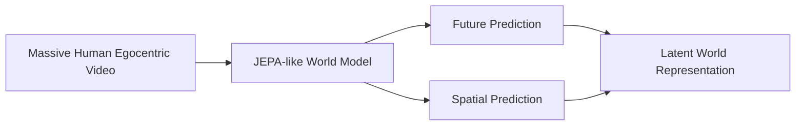

At this point, the World Model is primarily learning the structure of the world from passive observations. It answers questions such as what is likely to happen next, what the hidden part of the scene looks like, how objects are related in space and time, and how the physical state evolves. This creates the latent world representation that later becomes the basis for action-conditioned simulation.

---

# 2.3 Stage 2 — Human Video + VLM Pose Waypoints

The second data layer connects broad world understanding to purposeful action. A VLM processes large-scale human egocentric videos and extracts approximate pose and action waypoints, providing weak but scalable action supervision without requiring robot data. At the same time, the World Model produces latent future imagination from the observed video, allowing the VLA to learn from both the observed action trajectory and the predicted evolution of the environment.

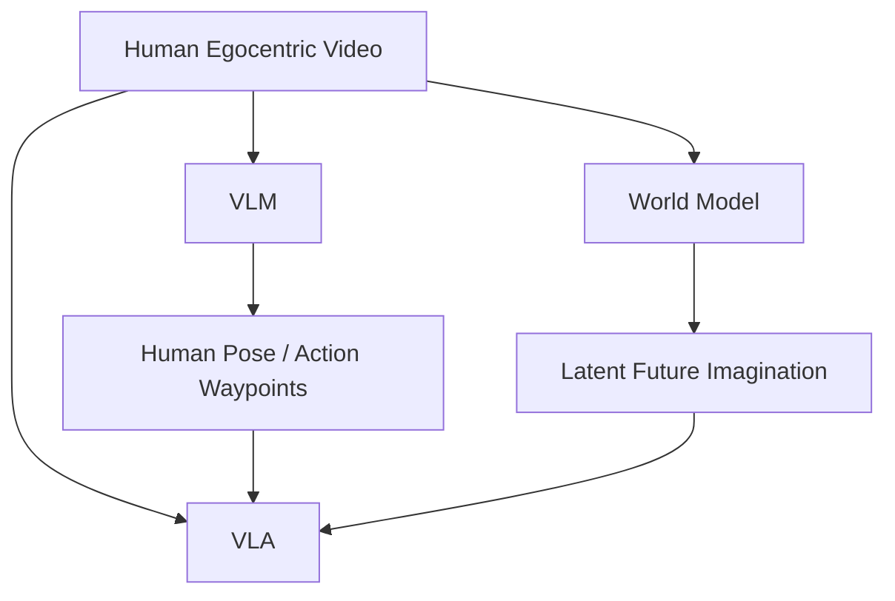

The model begins learning a relationship of the form:

```math
\text{Observation}
+
\text{Task}
+
\text{Predicted Future}
\rightarrow
\text{Action}
```

which creates a bridge between passive physical-world understanding and purposeful interaction.

---

# 2.4 Stage 3 — Synthetic Human Egocentric Action Data

Once the foundation World Model has learned a sufficiently broad model of human behavior, objects, scenes, and physical evolution, it becomes a **generative source of additional egocentric manipulation experience**. The system generates this experience through two complementary mechanisms. First, the World Model can generate entirely new human egocentric trajectories from a task, scene, or manipulation specification. Second, and importantly, the system can take the initial frames of real human egocentric videos and use a powerful **image-editing model** to create controlled visual variations of those real scenes before handing the modified initial conditions to the World Model. These edits can vary object identity, object appearance, object position, scene configuration, clutter, background conditions, and other visually controllable properties while preserving the basic structure of the observed real-world situation.

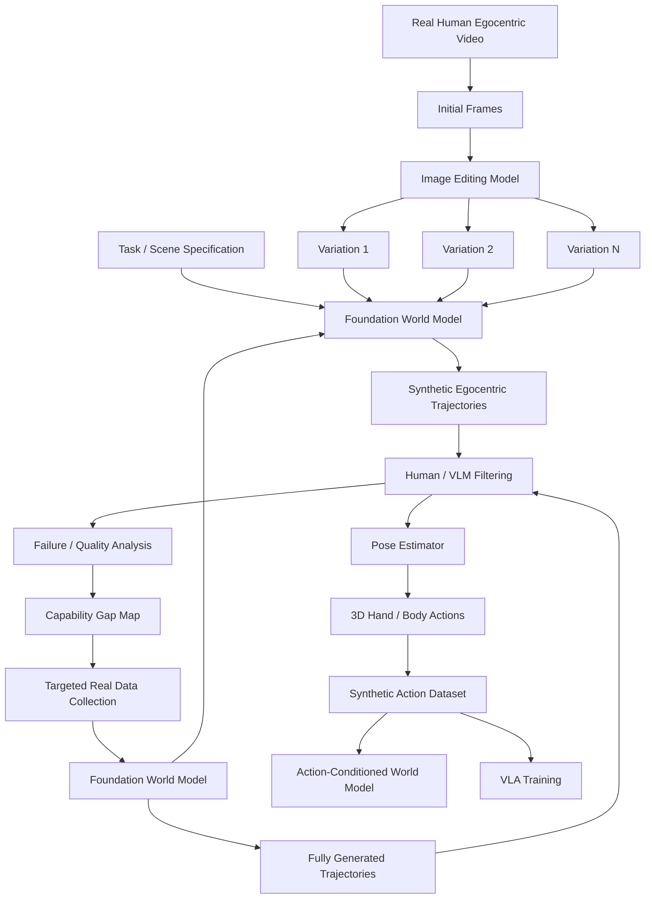

The second branch is particularly valuable because the real initial frames anchor the synthetic generation process to **actual camera statistics, real object appearances, real spatial configurations, real hand morphology, and real environmental layouts**. Instead of asking the World Model to hallucinate an entire scene from scratch, the system can start from a real observation and make small, controlled changes before generating the subsequent trajectory.

The image-editing branch can also create **small variations of the task itself**. A video of a person placing a red cup on a shelf could, for example, be transformed into variants involving a different cup, a slightly different shelf position, a different nearby object, or a slightly changed placement objective. The objective is not to generate arbitrary tasks that drift far from reality, but to create a dense neighborhood of related examples around genuine real-world observations.

The two synthetic branches therefore complement each other:

```text
                     SYNTHETIC HUMAN DATA
                              │
                ┌─────────────┴─────────────┐
                │                           │
                ▼                           ▼
       Fully generated trajectories   Real-video-seeded
                                      image variations
                │                           │
                │                           │
                └─────────────┬─────────────┘
                              ▼
                     World Model rollout
                              ↓
                   Human / VLM filtering
                              ↓
                      Pose estimation
                              ↓
                   Action annotations
```

The first filtering layer is deliberately human-led. Humans inspect generated trajectories and reject examples containing obvious physical inconsistencies, implausible contacts, temporal artifacts, bad hand geometry, contradictory object behavior, or other failures that would otherwise reinforce errors in the model. Over time, these human judgments can be distilled into learned critics and VLM-based quality filters, allowing the system to scale while maintaining a human-controlled quality bar.

The surviving videos are then processed with pose-estimation and reconstruction models to recover approximate hand and body trajectories:

```math
V_{\mathrm{synthetic}}
\rightarrow
\mathrm{PoseEstimator}
\rightarrow
A_{\mathrm{human}}
```

where \(A_{\mathrm{human}}\) can contain hand pose, wrist motion, body pose, temporal waypoints, and other available action representations.

The resulting synthetic demonstrations are then mixed with real human action data and increasingly grounded manipulation data to train the World Model and VLA.

The critical principle is that **synthetic data provides scale but not independent grounding**. The foundation World Model acquired its understanding from real observations, so its generations primarily sample and recombine knowledge already present in the model. Real-video-seeded editing adds another useful property: because synthetic generation starts from actual observations, the resulting examples remain anchored to real scene structure while varying selected factors.

The synthetic generation process also becomes a **diagnostic instrument for the foundation model**. The team can track which kinds of generations humans consistently reject, where pose reconstruction fails, which manipulation categories produce low-quality trajectories, and which task or object combinations lead to repeated inconsistencies.

This creates an active data-acquisition loop:

```text
Real Egocentric Data
        ↓
Foundation World Model
        ↓
Synthetic Egocentric Generation
        │
        ├── New generations from the World Model
        │
        └── Real-video initial frames
                ↓
          Image editing
                ↓
          Controlled variations
        │
        └──────────────┐
                       ▼
                Human / Learned Filtering
                       ↓
                 Failure Analysis
                       ↓
              Identify Weaknesses
                       ↓
          Targeted Real Data Collection
                       ↓
              Improved Foundation WM
                       ↺
```

The purpose of this loop is therefore broader than synthetic-data augmentation. The World Model becomes both a **data generator and a diagnostic model of its own uncertainty and blind spots**.

---

# 2.5 Action-Conditioned World Model Training

The passive World Model from Stage 1 is now exposed to increasingly large collections of action-labelled trajectories from real human video, synthetic human video, manipulation datasets, and teleoperation. Instead of learning only:

```math
z_{t+1}
\sim
P_{\phi}(z_{t+1} \mid s_t)
```

the model learns:

```math
z_{t+1}
\sim
P_{\phi}(z_{t+1} \mid s_t, a_t)
```

and over longer horizons:

```math
z_{t:t+H}
\sim
P_{\phi}
\left(
s_t,
a_{t:t+H-1}
\right)
```

The key conceptual transition is:

```text
Passive Observation
        ↓
"What normally happens next?"
        ↓
Action-Conditioned Prediction
        ↓
"What happens if I do this?"
```

The model can now be queried with hypothetical action sequences and asked to predict their consequences. Synthetic human action trajectories are particularly useful here because they provide large-scale coverage of action variations, while the real-world stages remain essential for correcting the model where its predictions diverge from reality.

This transforms the World Model into a learned **action-conditioned simulator**. The model does not need to produce a perfect pixel-level simulation of the future; it needs to accurately predict the latent aspects of the future that matter for decision-making, including object motion, contact state, task progress, spatial relationships, physical consequences, and other task-relevant changes.

---

# 2.6 Stage 4 — Human Manipulation + Data-Collecting Gripper

The fourth layer introduces substantially more direct information about manipulation and contact. Humans perform manipulation tasks using a **data-collecting gripper** that records end-effector motion and interaction signals, giving the model access to information that is difficult to recover from ordinary video alone, including grasping, pushing, pulling, contact transitions, deformation, slip, and other manipulation dynamics.

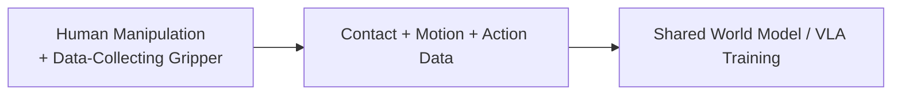

This dataset is useful for both sides of the system: for the VLA, it provides better action supervision; for the World Model, it provides better supervision for learning how actions transform physical states. The same action data therefore helps the system learn both what action should be taken and what will happen if that action is taken.

---

# 2.7 Stage 5 — Teleoperation

Teleoperation provides the highest-fidelity foundation-model supervision because demonstrations are generated directly by real robots. It provides true robot action distributions, embodiment-specific kinematics, actuator constraints, interaction dynamics, temporal structure, and realistic observation-action correlations, making it the most direct source of robot-specific grounding in the foundation model.

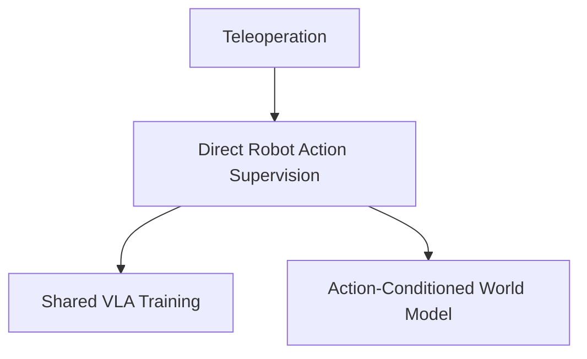

The same teleoperation trajectories therefore serve two complementary purposes: the VLA learns which actions are associated with successful behavior, while the World Model learns what happens after those actions are executed.

---

# 2.8 Stage 6 — Reasoning SFT + RL

The earlier stages teach the VLA **what the world looks like, how it evolves, how humans manipulate it, how robot actions affect it, and how to simulate those effects**. The sixth stage teaches the VLA **how to reason before proposing an action**.

At this point, the model already has access to an action-conditioned World Model capable of evaluating candidate behaviors, but many real tasks still require reasoning about long-horizon goals, object affordances, safety constraints, task ordering, uncertainty, tool selection, other agents, and possible future outcomes.

A purely reactive mapping from observation directly to action is therefore often insufficient. Stage 6 turns the VLA into a **reasoning-capable action proposal model**. The first part is supervised fine-tuning on high-quality reasoning trajectories paired with successful actions, teaching the VLA how to decompose tasks, identify relevant constraints, reason about the physical state, retrieve relevant skills, and determine what kinds of actions are worth considering.

```math
(o_t, T)
\rightarrow
r_{1:k}
\rightarrow
\{a_t^{(1)},a_t^{(2)},a_t^{(3)}\}
```

After SFT, the model is further optimized with reinforcement learning. The reward is tied to downstream physical outcomes. The VLA is rewarded when its reasoning produces candidate actions that lead to successful, safe, efficient, and robust behavior after being evaluated through the target-imagination, World Model, and VLM selection process and, ultimately, the environment.

The model therefore learns not merely to reason, but to reason in a way that produces **better candidate actions and better downstream decisions**.

---

# 2.9 Stage 7 — Agentic RL in the Expected Environment

After the global reasoning-capable brain has been trained, the model is specialized to the particular robot and environment through **massive agentic reinforcement learning inside the calibrated deployment simulator**.

Stage 7 follows the same fundamental mechanism as the local online RL loop used after deployment. The robot learns through interaction, task complexity is increased through curriculum learning, and the training environment is continuously varied. The key difference is that Stage 7 happens **before real-world deployment**, allowing the robot to acquire environment-specific competence, robustness, and recovery ability in simulation.

The central idea is:

> **The VLM agent constructs the worlds and situations the robot learns in; the robot agent learns how to operate within them.**

The Stage 7 architecture is:

```text
Global Reasoning-Capable VLA
        ↓
Calibrated Digital Twin
        ↓
VLM Training Agent
        ↓
Task Selection
        +
Environment Variation
        +
Initial-State Variation
        ↓
Simulation Episode
        ↓
Agentic RL
        ↓
Performance Evaluation
        ↓
VLM Training Agent
        ↺
```

The VLM agent acts as an **autonomous simulation curriculum manager**. It receives the environment description, calibrated simulator, robot capabilities, available task set, current policy performance, and known failure modes. It then decides what the robot should experience next.

Conceptually, the VLM agent chooses:

```math
\left(
T,
E,
s_0
\right)
\sim
\mathcal{G}_{\mathrm{VLM}}
\left(
E_{\mathrm{real}},
\mathcal{T},
\Pi,
\mathcal{F}
\right)
```

where:

* \(T\) is the selected task or subtask,
* \(E\) is the environment configuration,
* \(s_0\) is the initial physical state,
* \(E_{\mathrm{real}}\) is the calibrated deployment environment,
* \(\mathcal{T}\) is the available task set,
* \(\Pi\) represents the current policy and its performance,
* \(\mathcal{F}\) represents known failure modes.

The VLM agent therefore controls three dimensions of the training distribution:

```text
1. WHAT should the robot learn?
        ↓
   Task / subtask

2. WHAT WORLD should it learn it in?
        ↓
   Environment configuration / variation

3. FROM WHAT STATE should it start?
        ↓
   Initial-state variation / recovery scenario
```

---

# 2.10 VLM-Generated Curriculum

The Stage 7 curriculum follows the same basic principle as online local RL: the robot progresses from **small tasks to increasingly larger and more complex tasks**.

```text
Simple Primitive
        ↓
Small Task
        ↓
Multi-Step Task
        ↓
Multi-Object Task
        ↓
Long-Horizon Task
        ↓
Full Deployment Task
        ↓
Complex Multi-Stage Autonomy
```

Early training may begin with isolated primitives such as grasping, placing, pushing, opening, or navigating to a specific location. Once those behaviors become reliable, the curriculum combines them into increasingly complex sequences, eventually requiring the robot to complete the full tasks it is expected to perform in deployment.

The VLM agent monitors performance and decides when to increase difficulty:

```text
Current Policy
      ↓
VLM Agent evaluates performance
      ↓
Reliable on current curriculum?
      ├── No → generate more examples at current difficulty
      └── Yes
             ↓
       Increase difficulty
             ↓
       Generate next curriculum
```

The curriculum is therefore adaptive rather than a fixed script. The VLM agent repeatedly generates scenarios around the current capability boundary, concentrating simulation compute where it is most useful.

---

# 2.11 Environment Variation

For every curriculum level, the VLM agent creates multiple variations of the expected deployment environment. The objective is to prevent the environment-specific VLA from simply memorizing the exact configuration reconstructed by the Real-to-Sim system.

```text
                    EXPECTED ENVIRONMENT
                           │
                  ┌────────┴────────┐
                  │                 │
                  ▼                 ▼
             Nominal Scene      Variations
                                    │
                ┌───────────────────┼───────────────────┐
                │                   │                   │
                ▼                   ▼                   ▼
             Geometry            Objects            Physics
                │                   │                   │
          positions            identity            mass
          orientation           appearance          friction
          clutter               availability        compliance
                                                     contact
                │                   │                   │
                └───────────────────┼───────────────────┘
                                    │
                        ┌───────────┴───────────┐
                        │                       │
                        ▼                       ▼
                    Sensing                 Dynamic Events
                        │                       │
                  lighting                human movement
                  occlusion               object movement
                  sensor noise             interruptions
```

Relevant variations can include:

```text
STATIC CONDITIONS
├── Object positions
├── Object orientation
├── Object identity
├── Object appearance
├── Object quantity
├── Clutter
├── Lighting
├── Camera viewpoint
└── Scene configuration

PHYSICAL CONDITIONS
├── Mass
├── Friction
├── Compliance
├── Damping
├── Contact parameters
├── Actuator response
└── Sensor noise

TASK CONDITIONS
├── Goal specification
├── Initial state
├── Object availability
├── Task ordering
├── Partial completion
└── Time constraints

DYNAMIC CONDITIONS
├── Object displacement
├── Object occlusion
├── Human interruption
├── Moving agents
├── Unexpected contact
├── Tool failure
├── Grasp failure
└── Environmental disturbances
```

The system does not randomize everything uniformly. The VLM agent reasons about what variations are relevant to the actual deployment environment and generates them accordingly.

The objective is:

```math
E^*
=
\arg\max_E
\mathrm{Relevance}(E)
\cdot
\mathrm{Risk}(E)
\cdot
\mathrm{TransferValue}(E)
```

so that simulation compute is concentrated on plausible and valuable conditions.

Environment variation is applied **throughout the curriculum**, not only at the end. The robot therefore learns the task while simultaneously learning that the physical environment can change.

---

# 2.12 Initial-State Variation and Recovery Training

Environment variation alone is not sufficient for robust autonomy. A robot can be trained across many different scenes while still implicitly assuming that every task begins from a clean, ideal state.

Stage 7 therefore also varies the **initial task state**.

The VLM agent can intentionally initialize the environment and robot in states that are partially completed, unusual, degraded, or inconsistent with the nominal demonstration.

```text
Nominal Initial State

Cup on table
    ↓
Pick up cup
    ↓
Place cup
```

versus:

```text
Recovery Initial State

Cup already partially lifted
    ↓
Robot must infer current state
    ↓
Continue manipulation
```

or:

```text
Cup has slipped
    ↓
Robot detects unexpected state
    ↓
Replan
    ↓
Recover
    ↓
Complete task
```

or:

```text
Task is already 60% complete
    ↓
Robot enters midway
    ↓
Infer current state
    ↓
Continue from there
```

The purpose is to teach the robot that **it is not always starting from scratch**.

Initial-state variation can include:

```text
├── Object displaced from its expected position
├── Object in a different orientation
├── Failed or partial grasp
├── Task partially completed
├── Robot starting from an unusual pose
├── Object already moved
├── Missing expected object
├── Unexpected clutter
├── Obstruction introduced
└── Environment state altered by another agent
```

The robot therefore learns both **task execution** and **task recovery**.

---

# 2.13 Curriculum Over Task Complexity, Environment, and Initial State

The complete Stage 7 curriculum has **three simultaneous axes**:

```text
                         STAGE 7 CURRICULUM
                                │
             ┌──────────────────┼──────────────────┐
             │                  │                  │
             ▼                  ▼                  ▼
        TASK COMPLEXITY   ENVIRONMENT STATE   INITIAL STATE
             │                  │                  │
       small → large       nominal → varied    nominal → degraded
             │                  │                  │
             └──────────────────┼──────────────────┘
                                ↓
                           AGENTIC RL
```

This produces training scenarios such as:

```text
Level 1
Simple task
+ nominal environment
+ clean initial state

Level 2
Simple task
+ environment variation
+ clean initial state

Level 3
Multi-step task
+ environment variation
+ mildly perturbed initial state

Level 4
Long-horizon task
+ broad environment variation
+ partially completed task

Level 5
Full deployment task
+ broad environment variation
+ recovery from unexpected states
```

The robot is progressively taught:

> **Solve the task.**

then:

> **Solve the task under different environmental conditions.**

and eventually:

> **Solve the task even when the world is not in the state you expected.**

---

# 2.14 VLM Agent as Scenario Generator

The VLM agent is responsible for constructing the complete training scenario rather than merely providing a reward.

It observes:

```text
Environment description
Robot capabilities
Task requirements
Current curriculum
Policy performance
Simulation outcomes
Known failure modes
```

and decides:

```text
What task next?
What environment configuration?
What initial state?
How difficult should it be?
What variation should be introduced?
Should the curriculum advance or remain at the current level?
```

For example:

```text
Current policy is excellent at:
    picking objects from clear tables

Current weakness:
    recovering after object displacement

VLM Agent decides:
    increase task complexity slightly
    introduce object displacement
    initialize from partially completed states
    maintain realistic environment variation
```

The next batch of simulation episodes is then specifically designed around that weakness.

---

# 2.15 Agentic RL

Once the VLM agent constructs a scenario, the robot operates autonomously inside the simulator using the same complete architecture that will be used during deployment.

```text
Scenario Generated by VLM Agent
        ↓
Observation
        ↓
Reasoning
        ↓
Target-Future Generation
        ↓
VLM Target Selection
        ↓
Candidate Action Generation
        ↓
World Model Prediction
        ↓
VLM Candidate Evaluation
        ↓
Action Execution
        ↓
New Observation
        ↓
Continue / Recover / Replan
```

The agentic RL objective can be expressed conceptually as:

```math
\max_{\theta}
\mathbb{E}_{T,E,s_0}
\left[
R_{\mathrm{task}}
\left(
\tau;
T,E,s_0
\right)
\right]
```

where the policy is optimized over a distribution of tasks, environment configurations, and initial states rather than a single fixed scenario.

The learning process therefore trains the complete decision system:

```text
Reasoning
    ↓
Target Selection
    ↓
Action Proposal
    ↓
World Model Prediction
    ↓
VLM Evaluation
    ↓
Action Selection
    ↓
Execution
    ↓
Outcome
```

This is important because an eventual deployment failure may originate in the VLA's reasoning, candidate generation, World Model prediction, VLM ranking, target replanning, or recovery behavior rather than in the low-level policy alone.

---

# 2.16 Simulation Curriculum Feedback

The VLM training agent receives feedback from the outcome of simulation episodes and uses that feedback to continuously update the curriculum.

```text
Generated Scenario
        ↓
Agentic RL
        ↓
Outcome
        ↓
Success / Failure / Partial Success
        ↓
VLM Curriculum Agent
        ↓
Next Scenario
```

When the policy becomes highly reliable on a task distribution, the VLM agent increases task complexity or variation. When performance drops, it generates more examples at the current level until the policy recovers.

```text
Current Level
      ↓
Performance
      ↓
 ┌────┴────┐
 │         │
Good      Poor
 │         │
 ↓         ↓
Harder    More practice
tasks     at current level
 │         │
 └────┬────┘
      ↓
 Next Episodes
```

This creates a self-adjusting curriculum rather than a fixed sequence of manually authored training stages.

---

# 2.17 Learning Robustness, Not Memorization

The purpose of environment-specific RL is not to memorize the exact geometry observed during calibration. It is to learn the invariances and recovery strategies that remain valid across the expected deployment distribution.

For example, a robot should not learn:

> "The cup is always 22 cm to the left of the plate."

It should learn:

> "The cup is usually located somewhere on this workspace, and I should visually locate it and approach it safely."

The simulator therefore deliberately perturbs variables that should **not** change the underlying task strategy.

This makes Stage 7 a form of **environment-specific robustness learning**: the robot is trained against the variations that are expected to occur around its deployment environment rather than being overfit to one deterministic simulator state.

---

# 2.18 Simulation-to-Real Validation Gate

Before deployment, the environment-specific VLA must pass a final validation process across both the nominal digital twin and the generated robustness distribution.

```text
Calibrated Twin
      ↓
Nominal Evaluation
      ↓
Variation Evaluation
      ↓
Recovery Evaluation
      ↓
Long-Horizon Evaluation
      ↓
Safety Evaluation
      ↓
High-Fidelity Validation
      ↓
Deployment
```

The robot should only move toward real deployment once performance is robust across the relevant distribution rather than merely strong on the original reconstructed scene.

The high-fidelity simulator can also act as a final validation layer for policies trained in the faster surrogate:

```math
\pi_{\mathrm{surrogate}}
\rightarrow
\text{Surrogate Evaluation}
\rightarrow
\text{High-Fidelity Twin Evaluation}
\rightarrow
\text{Real Deployment}
```

The resulting hierarchy is:

```math
\text{Real Environment}
\rightarrow
\text{Calibrated Twin}
\rightarrow
\text{Surrogate}
\rightarrow
\text{Massive Agentic RL}
\rightarrow
\text{High-Fidelity Validation}
\rightarrow
\text{Real Robot}
```

---

# 2.19 Why Stage 7 Is Separate From Real Deployment

The purpose of Stage 7 is to move as much of the **learning burden as possible into simulation before the robot encounters the real environment**.

The system should therefore enter deployment having already experienced:

```text
Nominal behavior
+
Task progression
+
Object variation
+
Scene variation
+
Physics variation
+
Sensor noise
+
Task variation
+
Unexpected disturbances
+
Partial task states
+
Recovery
+
Long-horizon execution
```

Real deployment then becomes primarily a process of **validation, calibration, and discovering residual gaps**, rather than the first time the robot experiences meaningful variation.

This changes the role of deployment:

```text
WITHOUT STAGE 7

Global Model
    ↓
Specific Environment
    ↓
Real Robot
    ↓
Learn robustness through expensive failures


WITH STAGE 7

Global Model
    ↓
Specific Environment
    ↓
VLM-Generated Curriculum
    ↓
Environment + Initial-State Variations
    ↓
Massive Agentic Simulation RL
    ↓
Robustness + Recovery Training
    ↓
High-Fidelity Validation
    ↓
Real Robot
```

The real world therefore becomes the **final source of truth and error discovery**, rather than the primary place where basic environment-specific robustness must first be learned.

---

# 2.20 Why Co-Training Instead of Sequential Fine-Tuning?

The different global data layers contain complementary information, and sequential fine-tuning risks allowing the final, smallest dataset to dominate the model. Massive human video provides diversity and broad physical knowledge, synthetic human demonstrations provide large-scale action-conditioned coverage and a mechanism for probing current model weaknesses, teleoperation provides highly accurate grounding in robot embodiment, action-conditioned training teaches the World Model the relationship between actions and physical consequences, and reasoning training teaches the VLA how to use these capabilities effectively.

A simplified objective is:

```math
\mathcal{L}
=
\lambda_{\mathrm{WM}}
\mathcal{L}_{\mathrm{WM}}
+
\lambda_{\mathrm{WM-action}}
\mathcal{L}_{\mathrm{WM-action}}
+
\lambda_{\mathrm{human}}
\mathcal{L}_{\mathrm{human}}
+
\lambda_{\mathrm{synthetic}}
\mathcal{L}_{\mathrm{synthetic}}
+
\lambda_{\mathrm{gripper}}
\mathcal{L}_{\mathrm{gripper}}
+
\lambda_{\mathrm{teleop}}
\mathcal{L}_{\mathrm{teleop}}
+
\lambda_{\mathrm{reason}}
\mathcal{L}_{\mathrm{reason}}
```

The fundamental principle is:

> **Low-fidelity real data provides scale and broad world knowledge; synthetic data expands action-conditioned coverage and reveals model weaknesses; high-fidelity data provides grounding in manipulation and robot control; action-conditioned training turns prediction into simulation; reasoning training teaches the model how to use all of this intelligence effectively; environment-specific agentic RL turns that global intelligence into robust deployment behavior.**

---

# 2.21 Active Real-World Data Collection

The synthetic egocentric-data stage creates an explicit mechanism for deciding what additional real-world data should be acquired. Instead of assuming that more random video is always beneficial, Lunch Robotics can compare the foundation model's performance across generated tasks, measure generation quality, and identify the categories in which the model consistently produces implausible or incomplete behavior.

A simplified priority function can be thought of as:

```math
p(c)
\propto
\mathrm{Frequency}(c)
\cdot
\mathrm{FailureRate}(c)
\cdot
\mathrm{TransferValue}(c)
```

where \(c\) denotes a capability or interaction category.

This creates a continually updated **data acquisition frontier** describing where additional reality-grounded video is most valuable.

```text
Foundation Model
      ↓
Synthetic Generation
      ↓
Failure Distribution
      ↓
Capability Gap Map
      ↓
Prioritized Real Data Collection
      ↓
New Real Egocentric Data
      ↓
Foundation Model Update
```

---

# 3. Deployment Inputs

Once the global foundation model exists, a new deployment requires only a relatively small amount of environment-specific information. The user records a **30–90 second walkthrough video** of the workspace, providing coarse geometry, furniture, large objects, spatial layout, camera scale, and an initial scene representation from which the Real-to-Sim Agent can construct the initial digital twin.

The user also provides an **Environment & Task Context Description** explaining what the environment is used for, which objects matter, what tasks the robot is expected to perform, what constitutes success, unusual or non-obvious procedures, environmental constraints, and the behavior of other agents such as humans or autonomous systems.

The user additionally performs **tactile environment probing** with a sensorized handheld gripper. The gripper can tap, slide, push, lift, squeeze, deform compliant materials, and probe contact conditions while recording RGB-D video, pose, forces, tactile signals, slip information, and interaction trajectories. This information is primarily used for physical system identification rather than simply visual reconstruction.

Each task has two videos: an **execution demonstration**, where the human performs the task naturally without explaining it and which is primarily used for evaluation, and a **tutorial video**, where the human explains the task and its important details while performing it. The tutorial is transformed into a modular skill representation that can later be dynamically retrieved by the robot.

Finally, the robot vendor provides the **robot SDK and hardware specification**, including kinematics, joint limits, actuator information, end-effector specifications, and hardware control constraints. The vendor also provides approximately one minute of random-policy execution containing synchronized observations and actions. This recording helps the system identify robot dynamics, actuator behavior, latency, joint response, and low-level control characteristics.

---

# 4. The Real-to-Sim Agent

The system does not rely on a fixed, hand-engineered simulator-generation pipeline. Instead, an **RL-trained LLM agent acts as an autonomous simulation engineer and system-identification engineer**.

Given the environment videos, tactile measurements, task descriptions, robot specifications, and World Model predictions, the agent uses specialized tools to construct the digital twin.

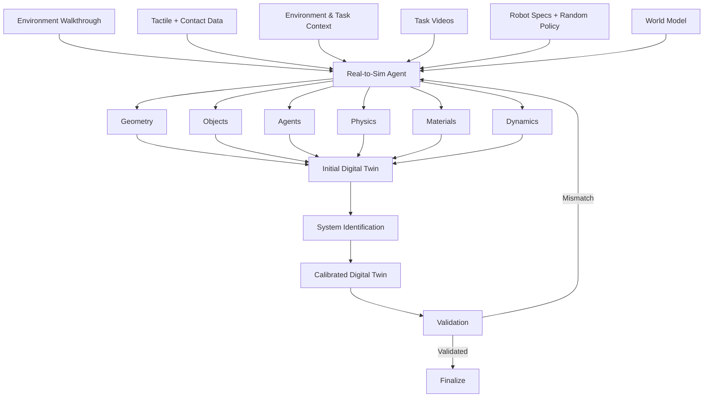

The goal is not to create a visually perfect replica of the environment. It is to create a **useful executable model of the world** that is sufficiently accurate for policy training, candidate-action evaluation, and counterfactual reasoning.

---

# 5. Agentic System Identification

Visual reconstruction alone cannot reveal many physical quantities that matter for manipulation. The system may need to estimate object mass, friction, compliance, damping, restitution, actuator response, and other parameters.

```math
\theta =
\begin{bmatrix}
m \\
\mu_s \\
\mu_d \\
e \\
k \\
c \\
\vdots
\end{bmatrix}
```

The system then minimizes the mismatch between real and simulated behavior:

```math
\theta^*
=
\arg\min_{\theta}
\left(
D_{\mathrm{kin}}
\left(
\tau_{\mathrm{real}},
\tau_{\mathrm{sim}}(\theta)
\right)
+
\lambda
D_{\mathrm{force}}
\left(
W_{\mathrm{real}},
W_{\mathrm{sim}}(\theta)
\right)
\right)
```

The important distinction is that the **agent reasons about what must be identified and which experiment will be informative**, while specialized numerical tools perform the parameter estimation itself.

---

# 6. Explicit Physics + General World Model

Not every entity in the environment should be represented with hand-designed physics. Rigid objects and contact interactions can often be modeled explicitly, while humans, pets, and other complex non-scripted entities are better represented through the general World Model.

```math
S^{\mathrm{agent}}_{t+1:t+H}
\sim
P_{\phi}
\left(
S_{\leq t},
E
\right)
```

The digital twin therefore becomes a hybrid system:

```math
\text{Digital Twin}
=
\text{Explicit Calibrated Physics}
+
\text{Learned World Dynamics}
```

The action-conditioned World Model adds another layer: explicit physics can handle quantities that require physical precision, while the learned model can predict complex, difficult-to-model interactions and other agent behavior.

---

# 7. Learned Surrogate Simulator

High-fidelity simulation is necessary for calibration and validation but is too expensive to run at the scale required for large-scale RL. The calibrated digital twin is therefore used to generate experience from which the system trains a learned **surrogate simulator**.

```math
f_{\mathrm{sim}}(s_t,a_t)
\approx
f_{\mathrm{surrogate}}(s_t,a_t)
```

The surrogate trades some physical fidelity for enormous speed and becomes the main engine for large-scale policy optimization and environment-specific training.

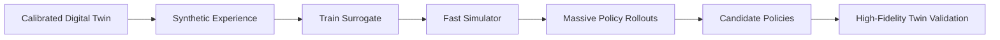

The resulting hierarchy is:

```math
\text{Real World}
\rightarrow
\text{Calibrated Twin}
\rightarrow
\text{Surrogate}
\rightarrow
\text{Massive Agentic RL}
```

There are therefore two simulation mechanisms in the architecture. The high-fidelity digital twin provides accurate physical validation, while the learned World Model provides extremely fast latent prediction for candidate actions.

---

# 8. Training the Environment-Specific VLA

The environment-specific VLA begins from the current **global or mixed VLA**, rather than being trained from scratch. It is conditioned on the current observation, the task specification, the selected World Model target imagination, and retrieved tutorial context:

```math
\pi_{\theta}
\left(
a_t
\mid
o_t,
T,
z_{\mathrm{target}},
S_{\mathrm{tutorial}}
\right)
```

The VLA generates three candidate action chunks:

```math
\{a_t^{(1)},a_t^{(2)},a_t^{(3)}\}
\sim
\pi_{\theta}
\left(
a_t
\mid
o_t,
T,
z_{\mathrm{target}},
S_{\mathrm{tutorial}}
\right)
```

The World Model then predicts one future for each candidate, and the VLM selects the candidate whose predicted future best matches the selected target.

The **training** of this VLA occurs through Stage 7 agentic RL:

```text
Global / Mixed VLA
        ↓
Calibrated Environment
        ↓
VLM Curriculum Agent
        ↓
Task + Environment + Initial-State Generation
        ↓
Agentic RL
        ↓
Environment-Specific VLA
```

The resulting environment-specific VLA therefore learns not just the nominal environment, but the expected distribution of physical conditions and recovery states around that environment.

---

# 9. Imagined Goal States and Target Future Trajectories

Exact trajectory matching is brittle because many different trajectories can successfully solve the same task. Instead, the training system uses the World Model and generative models to construct multiple possible latent representations of successful future states and short-horizon motions:

```math
\left\{
z_{\mathrm{target}}^{(1)}(t:t+H),
z_{\mathrm{target}}^{(2)}(t:t+H),
z_{\mathrm{target}}^{(3)}(t:t+H)
\right\}
```

The three target trajectories represent different plausible ways the world could be heading if the task is progressing successfully. They do not need to prescribe an exact robot trajectory, because two very different physical motions may lead to essentially the same successful state.

The VLM evaluates these possibilities:

```math
r_j^{\mathrm{target}}
=
\mathrm{VLM}_{\mathrm{score}}
\left(
z_{\mathrm{target}}^{(j)},
s_t,
T
\right)
```

and selects:

```math
j^*
=
\arg\max_{j \in \{1,2,3\}}
r_j^{\mathrm{target}}
```

The selected target is:

```math
z_{\mathrm{target}}
=
z_{\mathrm{target}}^{(j^*)}
```

This target remains active across multiple action chunks.

---

# 10. Three-Action World Model Selection

At each lower-frequency target update, the World Model first samples three possible target futures:

```math
\left\{
z_{\mathrm{target}}^{(1)},
z_{\mathrm{target}}^{(2)},
z_{\mathrm{target}}^{(3)}
\right\}
\sim
\mathrm{WM}(s_t,T)
```

The VLM scores them and selects:

```math
j^*
=
\arg\max_{j \in \{1,2,3\}}
r_j^{\mathrm{target}}
```

The selected target future is:

```math
z_{\mathrm{target}}
=
z_{\mathrm{target}}^{(j^*)}
```

This target remains fixed while the high-frequency action-selection loop executes multiple action chunks.

At each high-frequency action decision, the VLA generates three candidate action chunks:

```math
\{a_t^{(1)},a_t^{(2)},a_t^{(3)}\}
```

Each candidate is passed through the action-conditioned World Model once:

```math
z_{\mathrm{pred}}^{(i)}(t:t+H)
=
\mathrm{WM}_{\mathrm{action}}
\left(
s_t,
a_t^{(i)}
\right)
```

The VLM compares them against the selected target:

```math
r_i
=
\mathrm{VLM}_{\mathrm{score}}
\left(
z_{\mathrm{pred}}^{(i)},
z_{\mathrm{target}},
s_t,
T
\right)
```

and selects:

```math
i^*
=
\arg\max_{i \in \{1,2,3\}}
r_i
```

The architecture therefore has exactly:

```text
3 target futures
        ↓
1 selected target
        ↓
3 candidate action chunks
        ↓
3 predicted candidate futures
        ↓
1 selected action
```

The **target-imagination process happens at lower frequency**, while the **action-chunk generation, World Model simulation, and VLM candidate-scoring process happens at higher frequency**.

---

# 11. Environment-Specific Agentic RL

Stage 7 is the core **pre-deployment learning stage**. The VLM curriculum agent continuously constructs simulation episodes, while the environment-specific VLA learns through RL.

The stage follows the same learning philosophy as online local RL:

```text
Task Curriculum
+
Environment Variation
+
Initial-State Variation
        ↓
Agentic RL
        ↓
Improved Policy
        ↓
New Evaluation
        ↓
Updated Curriculum
```

The difference is that Stage 7 can perform this learning at massive scale before exposing the policy to physical hardware.

The VLM agent creates the scenario, while the robot agent learns inside it.

```text
OUTER AGENT
VLM
    ↓
chooses task + environment + initial state

INNER AGENT
Robot VLA
    ↓
reasons + imagines + acts + evaluates + recovers
```

This creates a nested optimization loop:

```text
                 VLM TRAINING AGENT
                         │
            ┌────────────┼────────────┐
            │            │            │
         Task      Environment   Initial State
            │            │            │
            └────────────┼────────────┘
                         ↓
                  Simulation Episode
                         ↓
                     Agentic RL
                         ↓
                  Policy Evaluation
                         ↓
                 VLM Curriculum Update
                         ↺
```

The simulator therefore becomes an **automatically generated training distribution** rather than a single fixed environment.

---

# 12. Real Deployment and Local Continual Learning

Simulation will inevitably differ from reality, so deployment creates a continual local learning loop. The environment-specific VLA operates on the real robot while its calibrated simulator continues to generate additional training scenarios and perform local simulation RL.

```math
\text{Real Deployment}
\rightarrow
\text{Observed Outcome}
\rightarrow
\text{Failure Identification}
\rightarrow
\text{VLM Scenario Generation}
\rightarrow
\text{Targeted Simulation}
\rightarrow
\text{Online Local RL}
\rightarrow
\text{Updated Environment-Specific VLA}
```

The local post-deployment loop uses the same mechanism as Stage 7:

```text
VLM Training Agent
        ↓
Task Curriculum
        +
Environment Variations
        +
Initial-State Variations
        ↓
Local Simulation RL
```

The key difference is that **real-world failures now provide the evidence used to decide what new scenarios should be generated**.

---

# 13. Post-Deployment Failure Data

Every deployed robot is a source of valuable real-world experience. The system monitors execution continuously and identifies situations in which the robot makes a mistake. These mistakes can be explicitly reported by the human user or automatically detected by a VLM observing the robot through cameras installed in the environment.

The system captures the complete decision context:

```text
Failure Episode
├── Task being executed
├── Subtask being executed
├── Environment and task context
├── Robot state trajectory
├── Reasoning trajectory / decision context
├── Target trajectory 1
├── Target trajectory 2
├── Target trajectory 3
├── VLM score for target 1
├── VLM score for target 2
├── VLM score for target 3
├── Selected target trajectory
├── Candidate action 1
├── Candidate action 2
├── Candidate action 3
├── World Model prediction for action 1
├── World Model prediction for action 2
├── World Model prediction for action 3
├── VLM score for predicted future 1
├── VLM score for predicted future 2
├── VLM score for predicted future 3
├── Selected action
├── Actual robot action trajectory
├── Real video of the robot execution
├── Failure timestamp / event
├── Human feedback or VLM failure judgment
└── Relevant simulator state + environment parameters
```

---

# 14. Failure-Conditioned Data Generation

A single failure should not remain a single training example. Once a failure is identified, the system reconstructs the relevant state inside the calibrated digital twin and uses the VLM training agent to generate a local curriculum around the failure.

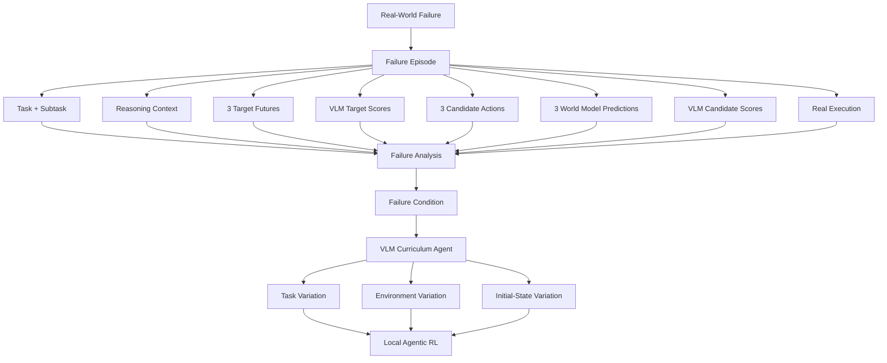

The objective is not to memorize the original mistake. It is to train the policy on the surrounding state distribution so that similar failures become less likely.

For example:

```text
Real failure:
object displaced unexpectedly

        ↓

VLM training agent generates:
├── small displacement
├── medium displacement
├── large displacement
├── different object orientations
├── partially completed manipulation
├── alternative recovery states
└── nearby environmental variations

        ↓

Local curriculum RL
        ↓
Improved recovery policy
```

---

# 15. Sending Deployment Failures Back to the Lunch Robotics Lab

The raw failure stream is also sent back to the Lunch Robotics lab, but **raw deployment failures are not directly used to fine-tune the global VLA**.

The central dataset pipeline begins with human-led error-mode analysis because different deployments produce different kinds of mistakes and not all failures represent deficiencies in the universal brain.

Some failures are caused by local geometry, local objects, local task conventions, or environment-specific calibration. Others reveal genuine limitations in general robot intelligence, World Model prediction, target imagination, candidate generation, reasoning, VLM evaluation, or action selection.

The Lunch Robotics team analyzes failure episodes across deployments to identify **systematic, recurring, and generalizable error modes**.

---

# 16. Curating the Global Training Dataset

Once a generalizable error mode has been identified, the Lunch Robotics team creates a **curated training dataset** around that capability gap.

```math
\mathcal{D}_{\mathrm{curated}}
=
\mathrm{Curate}
\left(
\mathcal{D}_{\mathrm{deployment}},
\mathcal{D}_{\mathrm{simulation}},
\mathcal{D}_{\mathrm{reasoning}},
\mathcal{D}_{\mathrm{WM}},
\mathcal{D}_{\mathrm{VLM}},
\mathcal{D}_{\mathrm{foundation}}
\right)
```

The curated dataset can combine selected real-world failures with successful examples, counterfactual successful trajectories, targeted simulation rollouts, adversarial near-failure scenarios, World Model imagined trajectories, decoded imagined videos, reasoning traces, candidate action sets, target-future alternatives, VLM rankings, and relevant examples from the original foundation datasets.

The central question is:

> **What capability is actually missing, where in the decision loop does the failure originate, and what data will teach the global system that capability in a way that transfers beyond the environment where the failure was observed?**

---

# 17. Fine-Tuning a New Global Lab System

The curated dataset is used to improve the **global lab system**:

```math
W_{\mathrm{lab}}'
=
\mathrm{FineTune}
\left(
W_{\mathrm{lab}},
\mathcal{D}_{\mathrm{curated}}
\right)
```

Different capability gaps may require updating different components.

VLA:

```math
W_{\mathrm{VLA}}'
=
\mathrm{FineTune}
\left(
W_{\mathrm{VLA}},
\mathcal{D}_{\mathrm{VLA,curated}}
\right)
```

World Model:

```math
W_{\mathrm{WM}}'
=
\mathrm{FineTune}
\left(
W_{\mathrm{WM}},
\mathcal{D}_{\mathrm{WM,curated}}
\right)
```

VLM:

```math
W_{\mathrm{VLM}}'
=
\mathrm{FineTune}
\left(
W_{\mathrm{VLM}},
\mathcal{D}_{\mathrm{VLM,curated}}
\right)
```

The resulting global system therefore evolves as a coordinated stack:

```text
Curated Failure Data
        ↓
 ┌──────┼──────────────┐
 ↓      ↓              ↓
VLA   World Model     VLM
 ↓      ↓              ↓
 └──────┼──────────────┘
        ↓
   New Lab System
```

---

# 18. Environment-Specific VLAs and the Global Lab VLA

The architecture maintains two distinct classes of model.

The **global lab VLA** is the shared general-purpose model maintained by Lunch Robotics, capturing broadly reusable capabilities learned from the foundation data funnel and from curated deployment-derived training.

Each deployment maintains its own **environment-specific VLA**, which is optimized for its physical environment, robot embodiment, objects, task distribution, local dynamics, and local operating conventions.

```text
                          GLOBAL LAB VLA
                               │
                               ▼
                       Shared Initialization
                               │
                 ┌─────────────┼─────────────┐
                 │             │             │
                 ▼             ▼             ▼
           Environment A  Environment B  Environment C
           Specific VLA   Specific VLA   Specific VLA
                 │             │             │
                 ▼             ▼             ▼
        Local Agentic Simulation RL
                 │
                 ▼
        Real Deployment + Local Learning
```

---

# 19. Continual Weight Mixing

The next step is to combine the information accumulated by the global lab VLA and the environment-specific VLAs.

Suppose:

```math
W_{\mathrm{lab}}
```

is the current global model and:

```math
W_1, W_2, \ldots, W_N
```

are environment-specific models.

After the lab VLA has been improved using curated deployment data:

```math
W_{\mathrm{lab}}'
=
\mathrm{FineTune}
\left(
W_{\mathrm{lab}},
\mathcal{D}_{\mathrm{curated}}
\right)
```

the system performs a continual model-merging step:

```math
W_{\mathrm{mixed}}
=
\mathrm{Mix}
\left(
W_{\mathrm{lab}}',
W_1,
W_2,
\ldots,
W_N
\right)
```

The exact implementation may eventually use parameter-space merging, model deltas, adapter composition, selective merging, or another technique. The architectural principle is that useful information accumulated centrally and useful knowledge discovered through deployment should be consolidated into a stronger common initialization.

The resulting **mixed VLA** is redistributed to all environments. Each deployment then starts a new round of environment-specific adaptation from this shared state:

```math
W_i^{(t+1)}
=
\mathrm{Adapt}
\left(
W_{\mathrm{mixed}},
E_i
\right)
```

Every global update therefore becomes available to the entire fleet.

---

# 20. The Global-Local Learning Flywheel

Lunch Robotics consequently has three interacting learning loops.

The **foundation-model loop** discovers and scales general physical knowledge:

```math
\boxed{
\text{Real Human Egocentric Video}
\rightarrow
\text{Foundation World Model}
\rightarrow
\text{Synthetic Egocentric Data}
\rightarrow
\text{Failure / Weakness Analysis}
\rightarrow
\text{Targeted Real Data Collection}
\rightarrow
\text{Stronger Foundation World Model}
}
```

The **pre-deployment environment loop** specializes the global brain:

```math
\boxed{
\text{Mixed VLA}
\rightarrow
\text{Real-to-Sim}
\rightarrow
\text{Calibrated Environment}
\rightarrow
\text{VLM Curriculum Agent}
\rightarrow
\text{Task + Environment + Initial-State Variation}
\rightarrow
\text{Agentic RL}
\rightarrow
\text{Robust Environment-Specific VLA}
}
```

The **post-deployment local loop** continues improving the specific environment:

```math
\boxed{
\text{Environment-Specific VLA}
\rightarrow
\text{Real Deployment}
\rightarrow
\text{Failure}
\rightarrow
\text{VLM Scenario Generation}
\rightarrow
\text{Targeted Simulation}
\rightarrow
\text{Local Agentic RL}
\rightarrow
\text{Improved Environment-Specific VLA}
}
```

The **global fleet loop** turns collective experience into improvements to the shared brain:

```math
\boxed{
\text{Many Deployments}
\rightarrow
\text{Failure Episodes}
\rightarrow
\text{Team Error-Mode Analysis}
\rightarrow
\text{Curated Data}
\rightarrow
\text{New Lab System}
\rightarrow
\text{Weight Mixing}
\rightarrow
\text{Mixed VLA}
\rightarrow
\text{All Deployments}
}
```

Together, these loops create a system in which **reality grounds the model, the model generates hypotheses, synthetic data expands training, simulation builds robustness, deployment discovers residual failures, and curated experience improves the shared brain**.

---

# 21. Safety

Safety is handled through two main mechanisms.

First, the **planner VLM is supervised fine-tuned specifically for safety**, so that it learns to identify unsafe tasks, situations, and intended behaviors before the robot begins acting.

Second, at inference time, an additional **VLM safety checker** evaluates the candidate trajectories produced by the system.

The target futures can be safety-checked before one is selected as the desired future, while the three predicted candidate futures can also be safety-checked before the final candidate is selected:

```text
LOW FREQUENCY
World Model
  ↓
3 Target Futures
  ↓
VLM Target Evaluation + Safety
  ↓
Safe Target Future
  ↓

HIGH FREQUENCY
VLA
  ↓
3 Candidate Actions
  ↓
World Model
  ↓
3 Predicted Future Trajectories
  ↓
Decode to Visual Trajectories
  ↓
VLM Safety Checker
  ↓
Reject Unsafe Futures
  ↓
VLM Task-Alignment Scoring
  ↓
Select Safe Best Candidate
  ↓
Robot
```

The safety mechanism therefore sits directly inside the target-selection and action-selection loops rather than relying only on the policy to have learned safe behavior.

---

# 22. Robot SDK

The Robot SDK is the final hardware abstraction layer between the policy and the physical robot.

The robot should interact with the user through natural language while the underlying system translates those instructions into task specifications, retrieves the appropriate skill context, determines the required reasoning budget, generates target futures, evaluates them, generates VLA candidate actions, evaluates their possible consequences through the World Model and VLM, and converts the selected action into a hardware-safe trajectory.

```mermaid
flowchart LR
    A["Human Speech"]
    --> B["Speech-to-Text"]

    B --> C["Task Specification"]
    C --> D["Tutorial Skill Retrieval"]

    D --> E["3D VLM Planner"]
    E --> F["Reasoning Budget"]

    F --> G["Environment-Specific VLA"]

    G --> H["World Model: 3 Target Futures"]

    H --> I["VLM Target Selection"]

    I --> J["3 Candidate Actions"]

    J --> K["World Model: 3 Predicted Futures"]

    K --> L["VLM Future Comparison"]

    L --> M["Selected Action"]

    M --> N["Robot SDK"]
    N --> O["Motion Smoother"]
    O --> P["Hardware Controller"]
    P --> Q["Robot"]
```

---

# 22.1 Motion Smoothing

A neural action policy can produce noisy or abrupt outputs, so the SDK applies online smoothing and jerk-limited trajectory generation:

```math
(q_{t+1}, \dot{q}_{t+1}, \ddot{q}_{t+1})
=
f_{\mathrm{smooth}}
(
a_t,
a_{<t},
q_t,
\dot{q}_t,
\ddot{q}_t
)
```

The resulting trajectory is constrained by the robot's hardware limits:

```math
\begin{aligned}
|\dot{q}(t)| &\leq v_{\max} \\
|\ddot{q}(t)| &\leq a_{\max} \\
|\dddot{q}(t)| &\leq j_{\max}
\end{aligned}
```

These constraints are read directly from the robot specification, keeping the policy hardware-agnostic. For low-latency deployment, a diffusion-based action policy can additionally undergo **Consistency Distillation**, allowing an iterative diffusion policy to be transformed into a much faster inference process.

---

# 23. Runtime Task Execution

At runtime, the experience should be intentionally simple. The user can say:

> **"Clean the table."**

The system converts the request into a task specification, retrieves the relevant tutorial, uses the planner to determine the task structure and difficulty, selects an appropriate reasoning budget, and passes the execution problem to the environment-specific VLA.

The runtime system then operates on two nested timescales.

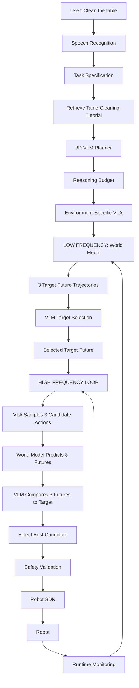

The high-frequency loop repeatedly executes:

```text
VLA
 ↓
3 Candidate Actions
 ↓
3 World Model Futures
 ↓
VLM Comparison
 ↓
Best Action
 ↓
Execute Action Chunk
 ↓
New Observation
 ↓
Repeat
```

The lower-frequency loop periodically executes:

```text
Current Observation
 ↓
World Model
 ↓
3 Target Futures
 ↓
VLM Scoring
 ↓
Selected Target
 ↓
Return to High-Frequency Loop
```

The target therefore remains active across multiple action chunks. It is recomputed when the robot has made sufficient progress, when the current target has become stale, when the observed state diverges from the expected state, when the environment changes materially, or when uncertainty increases sufficiently to justify replanning.

---

# 24. End-to-End System

The full architecture is a continuous pipeline from foundation-model training to deployment and back again.

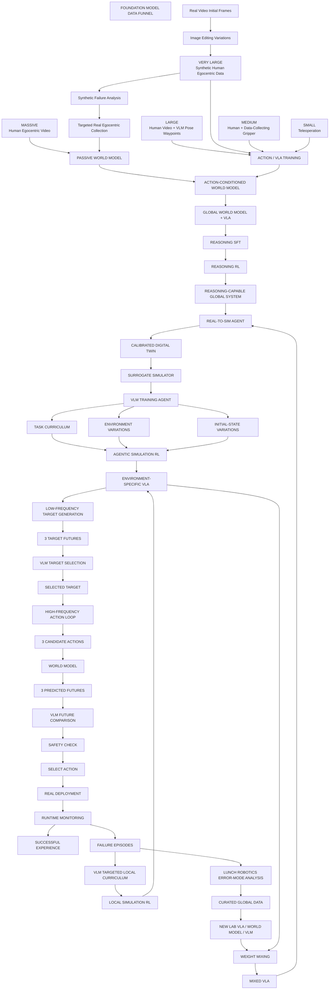

The local environment lifecycle is:

```math
\text{Mixed VLA}
\rightarrow
\text{Environment Reconstruction}
\rightarrow
\text{System Identification}
\rightarrow
\text{Calibrated Simulation}
\rightarrow
\text{VLM Curriculum Agent}
\rightarrow
\text{Task + Environment + Initial-State Variation}
\rightarrow
\text{Agentic RL}
\rightarrow
\text{Environment-Specific VLA}
\rightarrow
\text{Reasoning}
\rightarrow
\text{3 Target Futures}
\rightarrow
\text{VLM Target Selection}
\rightarrow
\text{Selected Target}
\rightarrow
\text{3 Candidate Actions}
\rightarrow
\text{3 World Model Predictions}
\rightarrow
\text{VLM Candidate Selection}
\rightarrow
\text{Repeated High-Frequency Control}
\rightarrow
\text{Target Replanning}
\rightarrow
\text{Real Deployment}
\rightarrow
\text{Failure}
\rightarrow
\text{VLM Targeted Local Curriculum}
\rightarrow
\text{Local Simulation RL}
```

The global fleet lifecycle is:

```math
\text{Many Deployment Failures}
\rightarrow
\text{Lunch Robotics Error-Mode Analysis}
\rightarrow
\text{Curated Global Dataset}
\rightarrow
\text{New Lab VLA / World Model / VLM}
\rightarrow
\text{Weight Mixing}
\rightarrow
\text{Mixed VLA}
\rightarrow
\text{All Deployments}
```

The foundation-model lifecycle is:

```math
\text{Massive Real Egocentric Video}
\rightarrow
\text{Passive Foundation World Model}
\rightarrow
\left[
\begin{array}{c}
\text{New Synthetic Egocentric Generation}
\\
+
\\
\text{Real Initial Frames}
\rightarrow
\text{Image Editing}
\rightarrow
\text{Controlled Variations}
\end{array}
\right]
\rightarrow
\text{Filtering + Action Extraction}
\rightarrow
\text{Action-Conditioned Training}
\rightarrow
\text{Synthetic Failure Analysis}
\rightarrow
\text{Targeted Real Data Collection}
\rightarrow
\text{Foundation World Model Update}
\rightarrow
\text{Repeat}
```

The pre-deployment environment-training lifecycle is:

```math
\text{Global Reasoning-Capable VLA}
\rightarrow
\text{Real-to-Sim}
\rightarrow
\text{Calibrated Expected Environment}
\rightarrow
\text{VLM Curriculum Agent}
\rightarrow
\left[
\begin{array}{c}
\text{Task Curriculum}
\\
+
\\
\text{Environment Variations}
\\
+
\\
\text{Initial-State Variations}
\end{array}
\right]
\rightarrow
\text{Agentic RL}
\rightarrow
\text{Robust Environment-Specific VLA}
\rightarrow
\text{High-Fidelity Validation}
\rightarrow
\text{Real Deployment}
```

The resulting architecture is not a one-way pipeline. It is a **closed learning system** in which the foundation model learns from reality, the World Model generates synthetic hypotheses about reality, real-video-seeded image editing creates controlled variations around genuine observations, synthetic data expands action-conditioned training, model failures identify missing knowledge, targeted real-world collection corrects those weaknesses, reasoning training teaches the model how to use its predictive machinery, the Real-to-Sim system constructs the expected deployment world, a VLM agent constructs the curriculum and variation distribution, agentic RL trains competence and recovery, target imagination defines the medium-horizon objective, VLM target selection determines which future is desirable, the VLA generates multiple local action alternatives, the World Model predicts their consequences, VLM comparison selects the best local action, environments provide the physical context required for specialization, deployments expose the residual weaknesses of those policies, and the company converts the most generalizable weaknesses into improvements to the shared brain.

---

# 25. The Core Research Thesis

The central thesis of Lunch Robotics is that universal robot intelligence should be built from seven complementary components:

```math
\boxed{
\text{Foundation Model Data Funnel}
+
\text{Generative Egocentric Data Flywheel}
+
\text{Action-Conditioned World Model}
+
\text{Reasoning SFT + RL}
+
\text{Agentic Real-to-Sim}
+
\text{VLM-Agentic Environment RL}
+
\text{Curated Fleet Learning}
}
```

The Foundation Model Data Funnel solves the first problem: **how do we learn broad physical and manipulation intelligence without requiring enormous quantities of expensive robot data?**

The answer is to combine data sources with radically different scale and fidelity inside one continuously co-trained foundation model:

```math
\text{Massive Human Video}
+
\text{Human Action Learning}
+
\text{Synthetic Human Action Data}
+
\text{Robot-Relevant Manipulation}
+
\text{Teleoperation}
\rightarrow
\text{Global World Model + VLA}
```

The generative egocentric-data flywheel solves the next problem: **how do we scale action-conditioned experience and determine which missing parts of reality are most important to collect?**

```math
\text{Foundation World Model}
\rightarrow
\left[
\begin{array}{c}
\text{New Human Video Generation}
\\
+
\\
\text{Real Initial Frames}
\rightarrow
\text{Image-Edited Variations}
\end{array}
\right]
\rightarrow
\text{Synthetic Human Videos}
\rightarrow
\text{Filtering}
\rightarrow
\text{Pose / Action Extraction}
\rightarrow
\text{Action-Conditioned Training}
```

and:

```math
\text{Synthetic Failures}
\rightarrow
\text{Weakness Analysis}
\rightarrow
\text{Targeted Real Data Collection}
\rightarrow
\text{Better Foundation World Model}
```

The essential principle is:

> **Synthetic data scales the model's existing beliefs; real-world data determines whether those beliefs are correct.**

The Action-Conditioned World Model solves the next problem: **how does the robot predict the consequences of an action before committing to it?**

```math
\text{Current State}
+
\text{Action}
\rightarrow
\text{Predicted Future Trajectory}
```

Target future imagination solves the next problem: **how does the robot decide what future it should be moving toward when there are multiple valid ways to solve a task?**

```math
\text{Current State}
+
\text{Task}
\rightarrow
\text{3 Target Futures}
\rightarrow
\text{VLM Ranking}
\rightarrow
\text{Selected Target Future}
```

Reasoning SFT and RL solve the next problem: **how do we teach the model to use all of this knowledge intelligently rather than simply mapping observations directly to actions?**

```math
\text{Observation}
+
\text{Task}
+
\text{World Model}
\rightarrow
\text{Adaptive Reasoning}
\rightarrow
\text{Candidate Actions}
```

The Real-to-Sim system solves the next problem: **how do we adapt that general intelligence to an arbitrary robot operating in an arbitrary physical environment?**

```math
\text{Real Environment}
\rightarrow
\text{Digital Twin}
\rightarrow
\text{System Identification}
\rightarrow
\text{Calibrated Simulation}
```

Stage 7 then solves a separate but crucial problem:

> **How do we make the environment-specific robot robust before it ever enters the real world?**

The answer is to put the model into a calibrated simulation and have a VLM agent continually generate:

```text
Task Curriculum
+
Environment Variations
+
Initial-State Variations
```

and optimize the robot through agentic RL:

```math
\text{Calibrated Environment}
+
\text{Curriculum}
+
\text{Variations}
+
\text{Initial States}
\rightarrow
\text{Agentic RL}
\rightarrow
\text{Robust Environment-Specific VLA}
```

The crucial distinction is:

> **Stage 7 is the pre-deployment version of local online RL.**

It teaches the robot progressively harder tasks while continuously varying the physical environment and initial task state. This gives the policy both **robustness to environmental variation** and **the ability to recover when it does not start from the expected state**.

The VLM agent therefore operates one level above the policy:

```text
VLM Training Agent
        ↓
chooses what the robot should experience

Robot VLA
        ↓
learns how to solve and recover within those experiences
```

The candidate-action mechanism solves the next problem: **how do we avoid relying on a single VLA prediction to make every decision perfectly?**

```math
\{a_t^{(1)},a_t^{(2)},a_t^{(3)}\}
\rightarrow
\{z_{\mathrm{pred}}^{(1)},z_{\mathrm{pred}}^{(2)},z_{\mathrm{pred}}^{(3)}\}
\rightarrow
\text{VLM Comparison}
\rightarrow
a_t^*
```

The action whose predicted future best matches the selected target future is executed:

```math
a_t^*
=
a_t^{\left(
\arg\max_i
\mathrm{VLM}_{\mathrm{score}}
\left(
z_{\mathrm{pred}}^{(i)},
z_{\mathrm{target}}
\right)
\right)}
```

The deployment learning system solves the final problem: **how do we continue improving after the robot is operating in the real world?**

The answer is to let each deployment learn locally while sending rich failure data back to the central lab. The Lunch Robotics team analyzes those failures across environments, identifies generalizable error modes, and curates the datasets required to teach those capabilities to the global model.

```math
\text{Deployment Failures}
\rightarrow
\text{Team Error-Mode Analysis}
\rightarrow
\text{Curated Data}
\rightarrow
\text{New Lab VLA / World Model / VLM}
```

Finally, the global and local models are combined and redistributed:

```math
\text{Lab VLA}
+
\text{Environment-Specific VLAs}
\rightarrow
\text{Mixed VLA}
\rightarrow
\text{All Deployments}
\rightarrow
\text{Environment-Specific Agentic RL}
```

The most important architectural principle is therefore:

> **The robots specialize locally, while Lunch Robotics learns globally.**

A deployed robot is not merely a consumer of a fixed model. It is an autonomous learning agent operating inside a particular physical environment and a sensor collecting valuable evidence about what the shared brain still does not understand.

At the foundation level, the World Model itself also acts as a data-generation and diagnosis engine: it produces hypothetical human experiences, uses real observations as seeds for controlled variations, exposes its own blind spots, and directs the organization toward the real-world data needed to improve its understanding of physical reality.

At the deployment level, the VLM training agent performs the analogous role for environment-specific learning: it constructs the curriculum, varies the environment, varies the initial state, and continually adapts the training distribution to the current policy.

This creates a compounding learning system:

```math
\boxed{
\text{More Real Data}
\rightarrow
\text{Better Foundation Model}
\rightarrow
\text{More Useful Synthetic Experience}
\rightarrow
\text{Better Action Conditioning}
\rightarrow
\text{Better World Model}
\rightarrow
\text{Better Reasoning}
\rightarrow
\text{Better Target Imagination}
\rightarrow
\text{Better VLM Evaluation}
\rightarrow
\text{Better Simulation Training}
\rightarrow
\text{More Robust Robot}
\rightarrow
\text{Better Real Deployment}
\rightarrow
\text{More Real-World Experience}
}
```

and across the fleet:

```math
\boxed{
\text{More Deployments}
\rightarrow
\text{More Real-World Experience}
\rightarrow
\text{More Error Modes Discovered}
\rightarrow
\text{Better Curated Data}
\rightarrow
\text{Better Lab VLA}
\rightarrow
\text{Better World Model}
\rightarrow
\text{Better Target Imagination}
\rightarrow
\text{Better VLM Evaluation}
\rightarrow
\text{Better Reasoning}
\rightarrow
\text{Better Agentic Simulation RL}
\rightarrow
\text{Better Initialization}
\rightarrow
\text{Better Environment Adaptation}
\rightarrow
\text{Better Robots}
\rightarrow
\text{More Deployments}
}
```

---

# 26. The Product Vision

The end state is **zero-to-hero robot autonomy**. The user provides a robot, an environment, the tasks it needs to perform, a small amount of tactile probing, and task demonstrations. The rest of the system operates behind the scenes.

```math
\begin{aligned}
&
\text{Massive Human Video}
+
\text{Human Action Data}
+
\text{Synthetic Human Action Data}
+
\text{Robot-Relevant Data}
+
\text{Teleoperation}
\\
&\qquad\qquad\downarrow
\\
&
\text{Global World Model + VLA}
\\
&\qquad\qquad\downarrow
\\
&
\text{Action-Conditioned World Model}
\\
&\qquad\qquad\downarrow
\\
&
\text{Reasoning SFT + RL}
\\
&\qquad\qquad\downarrow
\\
&
\text{Reasoning-Capable Global VLA}
\\
&\qquad\qquad\downarrow
\\
&
\text{Real-to-Sim Agent}
\\
&\qquad\qquad\downarrow
\\
&
\text{Calibrated Digital Twin}
\\
&\qquad\qquad\downarrow
\\
&
\text{VLM Curriculum Agent}
\\
&\qquad\qquad\downarrow
\\
&
\text{Task + Environment + Initial-State Variation}
\\
&\qquad\qquad\downarrow
\\
&
\text{Massive Agentic Simulation RL}
\\
&\qquad\qquad\downarrow
\\
&
\text{Robust Environment-Specific VLA}
\\
&\qquad\qquad\downarrow
\\
&
\text{Reasoning}
\\
&\qquad\qquad\downarrow
\\
&
\text{LOW-FREQUENCY TARGET IMAGINATION}
\\
&\qquad\qquad\downarrow
\\
&
\text{3 Target Futures}
\\
&\qquad\qquad\downarrow
\\
&
\text{VLM Target Selection}
\\
&\qquad\qquad\downarrow
\\
&
\text{Selected Target Future}
\\
&\qquad\qquad\downarrow
\\
&
\text{HIGH-FREQUENCY ACTION SELECTION}
\\
&\qquad\qquad\downarrow
\\
&
\text{3 Candidate Action Chunks}
\\
&\qquad\qquad\downarrow
\\
&
\text{3 World Model Predicted Futures}
\\
&\qquad\qquad\downarrow
\\
&
\text{VLM Future Comparison}
\\
&\qquad\qquad\downarrow
\\
&
\text{Selected Action}
\\
&\qquad\qquad\downarrow
\\
&
\text{Real Deployment}
\\
&\qquad\qquad\downarrow
\\
&
\text{Failure Discovery}
\\
&\qquad\qquad\downarrow
\\
&
\text{Targeted Local Learning}
\end{aligned}
```

Across the fleet, deployment failures are converted into curated improvements to the global model:

```math
\begin{aligned}
&
\text{Deployment Failures}
\\
&\qquad\qquad\downarrow
\\
&
\text{Lunch Robotics Error-Mode Analysis}
\\
&\qquad\qquad\downarrow
\\
&
\text{Curated Global Training Data}
\\
&\qquad\qquad\downarrow
\\
&
\text{New Lab VLA + World Model + VLM}
\\
&\qquad\qquad\downarrow
\\
&
\text{Weight Mixing}
\\
&\qquad\qquad\downarrow
\\
&
\text{Mixed VLA}
\\
&\qquad\qquad\downarrow
\\
&
\text{Every Deployment}
\end{aligned}
```

At deployment, the user can simply say:

> **"Clean the table."**

The robot understands the task, retrieves the relevant skill, determines how much reasoning is required, enters its environment-specific policy, and operates through the nested target/action decision loop. It periodically imagines three possible medium-horizon target futures, uses a VLM to select the best target, generates three plausible action chunks, predicts one future for each through the World Model, compares those three imagined futures against the target using the VLM, selects the action associated with the best future, executes it through a hardware-safe control stack, and monitors the result.

The selected target is not regenerated for every individual action chunk. The robot repeatedly performs the fast action-selection loop against that target and periodically generates a new set of target futures as the task progresses.

Before reaching this deployment point, however, the robot has already undergone a dedicated environment-specific curriculum. A VLM agent has generated progressively more difficult tasks, varied the physical environment around the calibrated deployment world, and initialized tasks from different states, including partially completed and degraded states. The policy therefore enters reality having already learned not only how to perform the expected tasks, but how to operate under the kinds of variation and recovery conditions it is expected to encounter.

When the robot encounters something it does not understand, the system does not simply record a failure and move on. It captures the entire event, uses the local VLM training agent to generate targeted simulation scenarios, and learns locally from the failure. The information also goes back to the Lunch Robotics lab, where the team determines whether the failure reveals a broader capability, reasoning, target-imagination, prediction, VLM-ranking, or action-selection gap.

The team then curates the appropriate training data, improves the global VLA and/or World Model and/or VLM, mixes the new global knowledge with the knowledge accumulated by specialized deployments, and redistributes the resulting system across the fleet.

At the foundation level, the same philosophy applies before deployment. Real egocentric video teaches the World Model how the physical world behaves; the World Model then generates large quantities of hypothetical human manipulation experience and can also use real video initial frames as seeds for an image-editing model that creates controlled scene variations and slight task variations; humans and learned critics identify where those generations are implausible; pose-estimation models turn the surviving generations into action supervision; and the resulting failure patterns determine which real-world experiences should be collected next.

The long-term objective is not to build another robot-specific policy. It is to build a **universal brain that can be installed into any robot, adapted to any physical environment, reason at the appropriate level for any task, learn broad physical intelligence from massive real-world experience, use its World Model to generate and interrogate synthetic human experience, use real video as a seed for controlled synthetic variation, identify the limits of its own understanding, guide targeted real-world data collection, adapt itself to an expected deployment environment through VLM-guided curriculum learning, become robust through large-scale simulation RL across environmental and initial-state variations, recover from unexpected states, periodically imagine multiple possible desirable futures, select the best target future, generate multiple candidate action chunks at high frequency, simulate their consequences through the World Model, use a VLM to choose the action whose predicted outcome best matches the currently selected future, and continuously improve through the collective experience of every robot running it.**

The complete philosophy can be summarized as:

```text
REALITY
   ↓
Foundation Learning
   ↓
World Model
   ↓
Synthetic Hypotheses
   ↓
Targeted Real Data
   ↓
Global Reasoning Brain
   ↓
Real-to-Sim
   ↓
VLM-Generated Curriculum
   ↓
Environment Variations
   +
Initial-State Variations
   ↓
Agentic Simulation RL
   ↓
Robust Environment-Specific Robot
   ↓
Real Deployment
   ↓
Residual Failures
   ↓
Local Recovery Learning
   ↓
Global Error-Mode Analysis
   ↓
Curated Global Improvement
   ↓
All Robots
```

The fundamental insight is:

> **Reality provides the grounding. World Models generate hypotheses. VLM agents decide what to learn. RL learns how to act. Simulation provides scale. Deployment provides new evidence. Lunch Robotics turns the most generalizable evidence into a better universal brain.**
