# Lunch Robotics: Universal Brain for Any Robot

## The Vision

We are building a **universal robot brain** that can turn a general-purpose robot into an autonomous worker inside an arbitrary physical environment. The fundamental problem in robotics is not simply making robots capable of moving or manipulating objects. It is giving them enough general intelligence to understand an unfamiliar world, reason about what should be done, predict the consequences of possible actions, adapt to the specific physics and embodiment of that world, and continuously improve as they encounter situations that were not represented in their original training data.

Lunch Robotics separates this problem into **general physical intelligence, world simulation, adaptive reasoning, environment-specific intelligence, and continual fleet learning**.

General robot intelligence is learned offline through a **Foundation Model Data Funnel** that combines massive amounts of human video with progressively more robot-relevant forms of supervision. Massive human video provides broad knowledge about the physical world. Human action supervision connects that knowledge to purposeful behavior. Manipulation data collected with a data-collecting gripper introduces contact and embodiment information. A smaller amount of teleoperation data provides direct grounding in robot control.

The World Model itself is trained in two complementary phases. First, it learns the structure and evolution of the physical world from massive passive video through future and spatial prediction. It is then further fine-tuned with **action-conditioned training**, where actions are explicitly provided as inputs to the model and it learns to predict what will happen after those actions. This transforms the World Model from a passive predictor into a learned **action-conditioned simulator** capable of evaluating hypothetical robot behaviors.

These datasets are not treated as isolated sequential stages in which each dataset replaces the previous one. They jointly train a shared **World Model + VLA foundation brain**, with the training distribution becoming increasingly robot-relevant while retaining the broad coverage of the lower-fidelity datasets.

Once this foundation model has learned to perceive, predict, and act, it undergoes a reasoning stage. The VLA is supervised on high-quality reasoning trajectories and then optimized with reinforcement learning so that it learns how to arrive at an action through useful reasoning rather than relying only on direct reactive mappings. Crucially, the amount of reasoning is not fixed. At inference time, the reasoning budget can be selected according to the task, uncertainty, and available compute.

The final action-selection mechanism is therefore not a simple VLA-to-robot mapping.

At every decision step, the VLA samples **three candidate actions**. Each candidate is passed through the action-conditioned World Model, which predicts the future trajectory that would result from executing that action. These predicted futures are compared against a target future trajectory imagined by the World Model for the current task and state. The candidate whose predicted future is closest to the desired imagined trajectory in latent space is selected for execution.

```math
d_i
=
\left\|
z_{\mathrm{pred}}^{(i)}(t:t+H)
-
z_{\mathrm{target}}(t:t+H)
\right\|_2
```

and:

```math
i^*
=
\arg\min_i d_i
```

The executed action is therefore:

```math
a_t
=
a_t^{(i^*)}
```

The VLA proposes what could be done. The World Model predicts what would happen. The imagined target defines what should happen. The latent comparison selects the action whose predicted consequence is closest to the desired future.

This gives Lunch Robotics a closed perception-reasoning-imagination-action loop in which the VLA does not need to perfectly predict the optimal action in a single forward pass. It only needs to generate a small set of plausible candidates. The World Model then acts as the learned simulator that evaluates them.

The reasoning-capable foundation brain is then adapted to a specific robot and physical environment by an autonomous **Real-to-Sim Agent**. Given a walkthrough of the environment, tactile probing data, task context, demonstrations, and the robot's hardware specification, the agent constructs and calibrates a digital twin, performs system identification, determines which aspects of the environment should be represented through explicit physics and which should be handled by learned dynamics, and trains a fast surrogate simulator.

The foundation VLA can then undergo massive simulation RL inside this environment-specific model, producing an **environment-specific VLA** specialized to the particular robot and world.

The system does not stop learning after deployment. Each deployed robot continuously improves locally through simulation, while the platform monitors real-world execution for mistakes. A failure may be identified explicitly by the human user or automatically by a VLM observing the robot through cameras installed in the environment.

Every detected mistake is captured as a rich episode containing the task and subtask being executed, the robot state and action trajectories, the reasoning context, the three candidate actions considered by the VLA, the World Model's predicted future for each candidate, the target imagined future, the selected action, the actual execution, the corresponding decoded imagined videos, and the relevant simulator state and environment parameters.

These failures are **not automatically used to update the global model**.

Instead, they are sent back to the Lunch Robotics team, where we analyze error modes across deployments and determine which failures are genuinely generalizable. Environment-specific quirks remain local. Problems that reveal broader capability gaps become the basis for carefully curated training datasets.

Those curated datasets are then used to improve a new version of the **global lab VLA**. Depending on the capability gap, the central training process can improve the model through additional supervised fine-tuning, reasoning supervision, reinforcement learning, World Model training, or a combination of them.

The updated lab model is then combined with knowledge accumulated in the environment-specific VLAs through continual weight mixing, producing a new mixed VLA that is redistributed to every deployment. Each environment then performs its own local RL again starting from this stronger initialization.

This creates a compounding global-local learning system:

```math
\boxed{
\text{Foundation Data}
\rightarrow
\text{World Model}
\rightarrow
\text{Action-Conditioned World Model}
\rightarrow
\text{Global VLA}
\rightarrow
\text{Reasoning SFT + RL}
\rightarrow
\text{Environment Adaptation}
\rightarrow
\text{Deployment}
\rightarrow
\text{Failure Discovery}
\rightarrow
\text{Error-Mode Analysis}
\rightarrow
\text{Curated Data}
\rightarrow
\text{New Lab VLA}
\rightarrow
\text{Weight Mixing}
\rightarrow
\text{All Deployments}
}
```

The key product idea is therefore simple:

> **The robots specialize locally, while Lunch Robotics learns globally.**

---

# 1. The Architecture

The Lunch Robotics architecture is built around three nested learning systems operating on top of a shared reasoning-capable foundation model.

The first is the **global foundation model**, which learns broad physical, manipulation, predictive, and reasoning intelligence.

The second is the **environment-specific adaptation system**, which takes the shared model and specializes it to a particular robot and physical environment.

The third is the **fleet learning system**, which turns deployment failures into curated global training data and feeds the resulting improvements back into the shared brain.

At the center of the architecture is the interaction between the VLA and the World Model.

The World Model provides two distinct capabilities. First, it can imagine a desirable future trajectory for the current task. Second, because it is action-conditioned, it can simulate the consequences of proposed actions.

The VLA therefore does not need to directly solve:

```math
(o_t, T)
\rightarrow
a_t^*
```

Instead, it solves:

```math
(o_t, T)
\rightarrow
\{a_t^{(1)}, a_t^{(2)}, a_t^{(3)}\}
```

The World Model then solves:

```math
(s_t, a_t^{(i)})
\rightarrow
z_{t:t+H}^{(i)}
```

and compares the predicted futures against the imagined target:

```math
z_{\mathrm{target}}(t:t+H)
```

The final action is:

```math
a_t^*
=
a_t^{\left(
\arg\min_i
\left\|
z_{t:t+H}^{(i)}
-
z_{\mathrm{target}}(t:t+H)
\right\|_2
\right)}
```

This creates the central action-selection loop:

```text
Observation + Task
        ↓
      VLA
        ↓
  3 Candidate Actions
     ↙    ↓    ↘
    a1    a2    a3
     ↓    ↓    ↓
  World Model Simulator
     ↓    ↓    ↓
 Future  Future  Future
     ↘    ↓    ↙
   Latent Comparison
          ↓
   Best Candidate
          ↓
        Robot
```

The architecture therefore separates **proposal** from **evaluation**.

The VLA proposes actions using its learned policy and reasoning capability.

The World Model evaluates the physical consequences.

The imagined target future provides the reference for what successful progress should look like.

---

# 2. Foundation Model Data Funnel

The foundation model is trained through a deliberate **data funnel** in which the amount of available data decreases as fidelity and robot relevance increase.

Massive datasets provide broad coverage of the physical world, while smaller datasets provide increasingly direct supervision about manipulation, contact, embodiment, and robot actions.

A separate World Model training progression runs through this funnel. The World Model first learns from passive observations and is then trained to model the effects of actions.

The final reasoning stage teaches the VLA how to use this predictive machinery effectively.

The five primary foundation stages are:

```text
                         ┌────────────────────────────┐
                         │ STAGE 5                    │
                         │ REASONING SFT + RL         │
                         │ Adaptive reasoning         │
                         └─────────────┬──────────────┘
                                       │
                         ┌─────────────┴──────────────┐
                         │ STAGE 4                    │
                         │ TELEOPERATION              │
                         │ Direct robot actions       │
                         └─────────────┬──────────────┘
                                       │
                         ┌─────────────┴──────────────┐
                         │ STAGE 3                    │
                         │ HUMAN + GRIPPER DATA       │
                         │ Manipulation + contact     │
                         └─────────────┬──────────────┘
                                       │
                         ┌─────────────┴──────────────┐
                         │ STAGE 2                    │
                         │ HUMAN VIDEO + ACTION       │
                         │ Approximate action data    │
                         └─────────────┬──────────────┘
                                       │
                    ┌──────────────────┴──────────────────┐
                    │ STAGE 1                             │
                    │ MASSIVE HUMAN EGOCENTRIC VIDEO      │
                    │ Broadest world coverage             │
                    └─────────────────────────────────────┘

                         ↓    ↓    ↓    ↓    ↓

                    SHARED FOUNDATION TRAINING

                         ↓    ↓    ↓    ↓    ↓

              WORLD MODEL + VLA + ACTION SIMULATION
```

Within this funnel, the World Model itself has two training phases:

```math
\text{Passive World Model}
\rightarrow
\text{Action-Conditioned World Model}
```

The first learns what the world does.

The second learns what happens **when an action is taken**.

---

## 2.1 The Data Pyramid

| Stage | Data                                         | Scale    | Supervision                       | Primary Capability                           |
| ----- | -------------------------------------------- | -------- | --------------------------------- | -------------------------------------------- |
| **1** | Massive human egocentric video               | Massive  | Self-supervised                   | World representation and physical prediction |
| **2** | Human video + VLM pose waypoints             | Large    | Approximate action supervision    | Human action understanding                   |
| **3** | Human manipulation + data-collecting gripper | Medium   | Robot-relevant action supervision | Contact and manipulation                     |
| **4** | Teleoperation data                           | Small    | Direct robot action supervision   | Robot control and embodiment                 |
| **5** | Reasoning traces + RL rollouts               | Targeted | SFT + outcome-driven RL           | Adaptive reasoning and action selection      |

The World Model is progressively transformed from a passive predictive model into an action-conditioned simulator as action data becomes available.

---

# 2.2 Stage 1 — Massive Human Egocentric Video

Massive human egocentric video provides the broadest source of physical-world information.

The starting point is the best available **JEPA-like World Model**, which is trained or fine-tuned to predict future observations while also learning to predict spatially masked regions of the environment in latent space.

The goal is not simply to reproduce pixels.

It is to learn a useful internal representation of objects, spatial relationships, motion, interactions, contact-relevant structure, and temporal evolution.

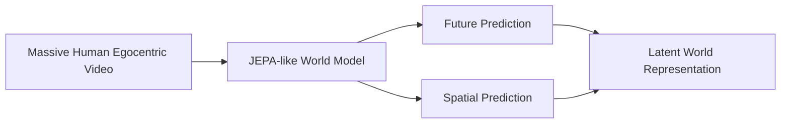

At this point, the World Model is primarily learning the structure of the world from passive observations.

It answers questions such as:

> What is likely to happen next?

> What does the hidden part of the scene look like?

> How are objects related in space and time?

> How does the physical state evolve?

This creates the latent world representation that later becomes the basis for action-conditioned simulation.

---

# 2.3 World Model Training Stage — Action-Conditioned Simulation

The next World Model training stage explicitly introduces **actions as inputs**.

Instead of learning only:

```math
z_{t+1}
\sim
P_{\phi}(z_{t+1} \mid s_t)
```

the model learns:

```math
z_{t+1}
\sim
P_{\phi}(z_{t+1} \mid s_t, a_t)
```

and over longer horizons:

```math
z_{t:t+H}
\sim
P_{\phi}
\left(
s_t,
a_{t:t+H-1}
\right)
```

The model is fine-tuned using datasets containing observations paired with actions and resulting future states.

Teleoperation, robot manipulation data, data-collecting gripper trajectories, and other action-labeled datasets progressively teach the World Model the relationship:

```text
Current World State
        +
     Action
        ↓
Future World State
```

This transforms the World Model into a learned **action-conditioned simulator**.

The model does not need to produce a perfect pixel-level simulation of the future.

It needs to accurately predict the latent aspects of the future that matter for decision-making: object motion, contact state, task progress, spatial relationships, physical consequences, and other task-relevant changes.

The resulting model can answer:

> **"If the robot takes this action, what will the world look like afterward?"**

This capability becomes central to the final action-selection loop.

---

# 2.4 Stage 2 — Human Video + VLM Pose Waypoints

The second data layer connects broad world understanding to purposeful action.

A VLM processes large-scale human egocentric videos and extracts approximate pose and action waypoints.

These trajectories provide weak but scalable action supervision without requiring robot data.

At the same time, the World Model produces latent future imagination from the observed video.

The VLA can therefore learn from both the observed action trajectory and the predicted evolution of the environment.

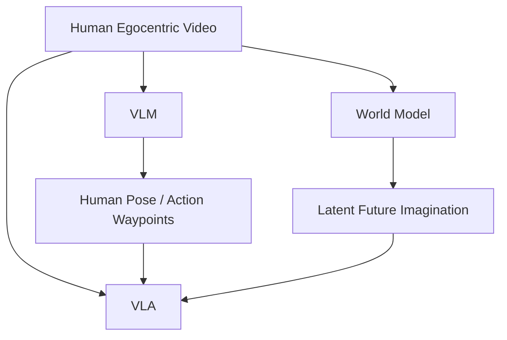

The model begins learning a relationship of the form:

```math
\text{Observation}
+
\text{Task}
+
\text{Predicted Future}
\rightarrow
\text{Action}
```

This creates a bridge between passive physical-world understanding and purposeful interaction.

---

# 2.5 Stage 3 — Human Manipulation + Data-Collecting Gripper

The third layer introduces substantially more direct information about manipulation and contact.

Humans perform manipulation tasks using a **data-collecting gripper** that records end-effector motion and interaction signals.

This gives the model access to information that is difficult to recover from ordinary video alone, including grasping, pushing, pulling, contact transitions, deformation, slip, and other manipulation dynamics.

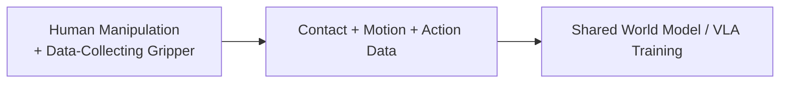

This dataset is useful for both sides of the system.

For the VLA, it provides better action supervision.

For the World Model, it provides better supervision for learning how actions transform physical states.

The same action data therefore helps the system learn both:

```math
\text{What action should I take?}
```

and:

```math
\text{What will happen if I take this action?}
```

---

# 2.6 Stage 4 — Teleoperation

Teleoperation provides the highest-fidelity foundation-model supervision because demonstrations are generated directly by real robots.

It provides true robot action distributions, embodiment-specific kinematics, actuator constraints, interaction dynamics, temporal structure, and realistic observation-action correlations.

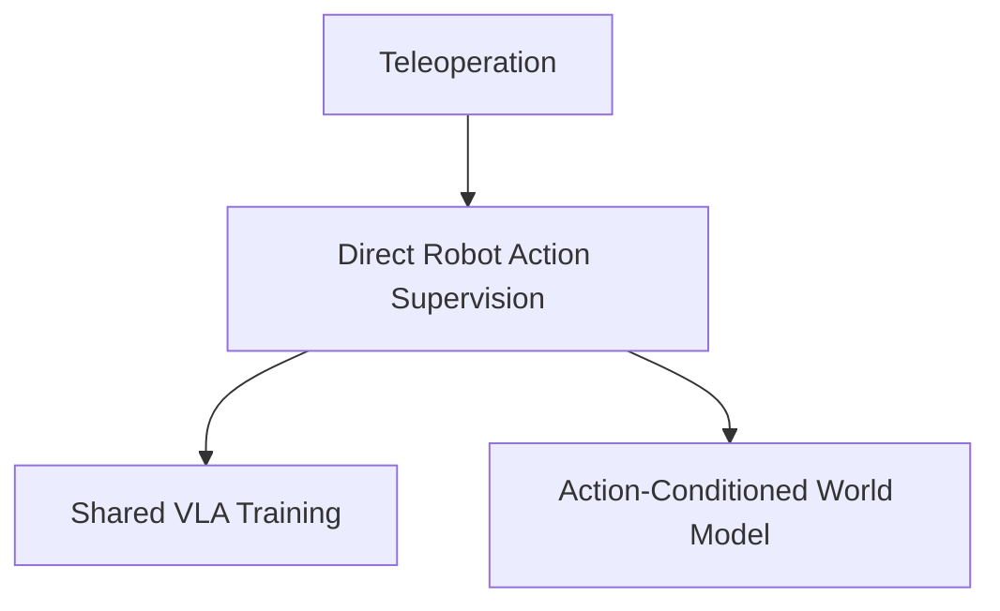

The same teleoperation trajectories therefore serve two complementary purposes.

The VLA learns which actions are associated with successful behavior.

The World Model learns what happens after those actions are executed.

Because teleoperation is expensive, its value comes from fidelity rather than scale.

The teleoperation dataset can be split between zero-shot and one-shot regimes so that the foundation model is trained both to generalize without a robot demonstration and to exploit a single demonstration when one is available.

---

# 2.7 Stage 5 — Reasoning SFT + RL

The earlier stages teach the VLA **what the world looks like, how it evolves, how humans manipulate it, how robot actions affect it, and how to simulate those effects**.

The fifth stage teaches the VLA **how to reason before proposing an action**.

At this point, the model already has access to an action-conditioned World Model capable of evaluating candidate behaviors.

Many real tasks nevertheless require reasoning about long-horizon goals, object affordances, safety constraints, task ordering, uncertainty, tool selection, other agents, and possible future outcomes.

A purely reactive mapping from observation directly to action is therefore often insufficient.

Stage 5 turns the VLA into a **reasoning-capable action proposal model**.

## Reasoning SFT

The first part of Stage 5 is supervised fine-tuning on high-quality reasoning trajectories paired with successful actions.

These trajectories teach the VLA how to decompose tasks, identify relevant constraints, reason about the physical state, retrieve relevant skills, and determine what kinds of actions are worth considering.

```math
(o_t, T)
\rightarrow
r_{1:k}
\rightarrow
\{a_t^{(1)}, a_t^{(2)}, a_t^{(3)}\}
```

The important point is that reasoning does not have to terminate in a single deterministic action.

Reasoning can instead produce a distribution over promising candidate behaviors.

## Reasoning RL

After SFT, the model is further optimized with reinforcement learning.

The reward is not based simply on whether the reasoning text looks convincing.

It is tied to downstream physical outcomes.

The VLA is rewarded when its reasoning produces candidate actions that lead to successful, safe, efficient, and robust behavior after being evaluated through the World Model and, ultimately, the environment.

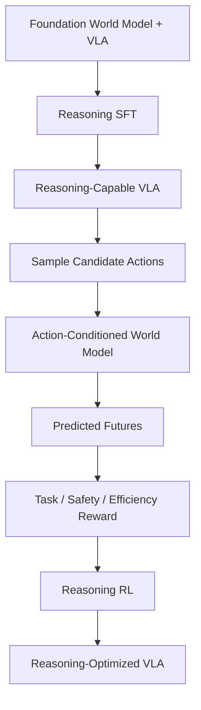

The model therefore learns not merely to reason, but to reason in a way that produces **better candidate actions**.

---

# 2.8 Why the VLA Samples Multiple Actions

A single VLA prediction can be locally plausible while still being a poor decision.

Instead of requiring the neural policy to identify the unique optimal action in one forward pass, Lunch Robotics lets it generate a small set of plausible alternatives.

At each decision step:

```math
\{a_t^{(1)}, a_t^{(2)}, a_t^{(3)}\}
\sim
\pi_{\theta}
\left(
a_t
\mid
o_t,
T,
r_{1:k},
z_{\mathrm{WM}},
S_{\mathrm{tutorial}}
\right)
```

The three candidate actions can differ in grasp position, approach direction, force, timing, motion, or any other aspect of the action representation.

The VLA therefore acts as a **proposal mechanism**.

The World Model acts as the **candidate evaluator**.

This separation reduces the amount of precision required from the VLA itself.

Instead of:

```math
\text{VLA}
\rightarrow
\text{Perfect Action}
```

the architecture becomes:

```math
\text{VLA}
\rightarrow
\text{Three Plausible Actions}
\rightarrow
\text{World Model Evaluation}
\rightarrow
\text{Best Action}
```

---

# 2.9 Target Future Imagination

Before evaluating the three candidate actions, the World Model generates an imagined trajectory representing the desired direction of task progress.

This target trajectory is conditioned on the current state, task specification, and available contextual information.

```math
z_{\mathrm{target}}(t:t+H)
=
\mathrm{WM}
\left(
s_t,
T
\right)
```

This is not necessarily an exact human trajectory.

It represents a **latent future state sequence consistent with successful task execution**.

The target can therefore capture things such as:

* the object being moved toward the correct location,
* a container becoming correctly oriented,
* a grasp approaching a useful configuration,
* a task state becoming progressively more complete,
* a human or other agent remaining in an acceptable location.

The model is therefore asking:

> **What future should the robot be moving toward?**

---

# 2.10 Action-Conditioned Future Prediction

Each candidate action is then passed to the action-conditioned World Model.

For candidate \(i\):

```math
z_{\mathrm{pred}}^{(i)}(t:t+H)
=
\mathrm{WM}_{\mathrm{action}}
\left(
s_t,
a_t^{(i)}
\right)
```

The World Model predicts the future latent trajectory that should result if candidate \(a_t^{(i)}\) is executed.

For the three actions:

```math
a_t^{(1)}
\rightarrow
z_{\mathrm{pred}}^{(1)}(t:t+H)
```

```math
a_t^{(2)}
\rightarrow
z_{\mathrm{pred}}^{(2)}(t:t+H)
```

```math
a_t^{(3)}
\rightarrow
z_{\mathrm{pred}}^{(3)}(t:t+H)
```

The result is three imagined consequences of three possible actions.

---

# 2.11 Latent Future Matching

The three predicted futures are compared against the target imagined trajectory.

For each candidate:

```math
d_i
=
\left\|
z_{\mathrm{pred}}^{(i)}(t:t+H)
-
z_{\mathrm{target}}(t:t+H)
\right\|_2
```

The action with the smallest latent distance is selected:

```math
i^*
=
\arg\min_{i \in \{1,2,3\}}
d_i
```

and:

```math
a_t
=
a_t^{(i^*)}
```

The complete mechanism is therefore:

```math
\boxed{
\text{Observation}
\rightarrow
\text{Reasoning}
\rightarrow
\text{3 VLA Actions}
\rightarrow
\text{3 World Model Futures}
\rightarrow
\text{Latent Comparison}
\rightarrow
\text{Best Action}
}
```

This is the central decision-making mechanism of the Lunch Robotics architecture.

The VLA determines **what could be done**.

The World Model determines **what would happen**.

The target imagination determines **what should happen**.

The latent distance determines **which proposed action best moves the robot toward that future**.

---

# 2.12 Adaptive Reasoning at Inference Time

A defining property of the architecture is that reasoning depth is **not fixed globally**.

At inference time, the amount of reasoning performed before generating candidate actions can be selected according to task complexity, uncertainty, and available compute.

```math
k
=
f(T, E, B)
```

where \(T\) is the task, \(E\) represents the current environment and uncertainty, and \(B\) is the available inference-time compute budget.

The same VLA can therefore behave differently depending on the problem.

| Task                                                  | Reasoning Budget    |
| ----------------------------------------------------- | ------------------- |
| Pick up a cup from an empty table.                    | Minimal             |
| Load fragile dishes into a dishwasher.                | Moderate            |
| Prepare coffee while navigating around moving humans. | Extended            |
| Recover after an unexpected object displacement.      | Extended / adaptive |

A simple task should not incur the computational cost of deep deliberation.

A difficult task should be allowed to use more.

The objective is therefore not to maximize reasoning length.

It is to maximize **useful reasoning per unit of inference compute**.

More reasoning can also produce better candidate diversity before the World Model evaluation stage.

```math
\text{More Difficult Task}
\rightarrow
\text{More Reasoning}
\rightarrow
\text{Better Candidate Actions}
\rightarrow
\text{Better World Model Evaluation}
```

---

# 2.13 Why Co-Training Instead of Sequential Fine-Tuning?

The different data layers contain complementary information, and sequential fine-tuning risks allowing the final, smallest dataset to dominate the model.

Massive human video provides diversity and broad physical knowledge.

Teleoperation provides highly accurate grounding in robot embodiment.

Action-conditioned training teaches the World Model the relationship between actions and physical consequences.

Reasoning training teaches the VLA how to use these capabilities effectively.

Co-training keeps these forms of information connected.

A simplified objective is:

```math
\mathcal{L}
=
\lambda_{\mathrm{WM}}
\mathcal{L}_{\mathrm{WM}}
+
\lambda_{\mathrm{WM-action}}
\mathcal{L}_{\mathrm{WM-action}}
+
\lambda_{\mathrm{human}}
\mathcal{L}_{\mathrm{human}}
+
\lambda_{\mathrm{gripper}}
\mathcal{L}_{\mathrm{gripper}}
+
\lambda_{\mathrm{teleop}}
\mathcal{L}_{\mathrm{teleop}}
+
\lambda_{\mathrm{reason}}
\mathcal{L}_{\mathrm{reason}}
```

The fundamental principle is:

> **Low-fidelity data provides scale and broad world knowledge; high-fidelity data provides grounding in manipulation and robot control; action-conditioned training turns prediction into simulation; reasoning training teaches the model how to use all of this intelligence effectively.**

---

# 3. Deployment Inputs

Once the global foundation model exists, a new deployment requires only a relatively small amount of environment-specific information.

The user records a **30–90 second walkthrough video** of the workspace. This provides coarse geometry, furniture, large objects, spatial layout, camera scale, and an initial scene representation from which the Real-to-Sim Agent can construct the initial digital twin.

The user also provides an **Environment & Task Context Description** explaining what the environment is used for, which objects matter, what tasks the robot is expected to perform, what constitutes success, unusual or non-obvious procedures, environmental constraints, and the behavior of other agents such as humans or autonomous systems.

This description serves as the semantic specification that complements the visual reconstruction.

The user additionally performs **tactile environment probing** with a sensorized handheld gripper.

The gripper can tap, slide, push, lift, squeeze, deform compliant materials, and probe contact conditions while recording RGB-D video, pose, forces, tactile signals, slip information, and interaction trajectories.

This information is primarily used for physical system identification rather than simply visual reconstruction.

Each task has two videos.

The first is an **execution demonstration**, where the human performs the task naturally without explaining it and which is primarily used for evaluation.

The second is a **tutorial video**, where the human explains the task and its important details while performing it. The tutorial is transformed into a modular skill representation that can later be dynamically retrieved by the robot.

```math
\text{Execution Demonstration}
\rightarrow
\text{Evaluation}
```

```math
\text{Tutorial Demonstration}
\rightarrow
\text{Reusable Skill Context}
```

Finally, the robot vendor provides the **robot SDK and hardware specification**, including kinematics, joint limits, actuator information, end-effector specifications, and hardware control constraints.

The vendor also provides approximately one minute of random-policy execution containing synchronized observations and actions.

This recording helps the system identify robot dynamics, actuator behavior, latency, joint response, and low-level control characteristics.

It also provides valuable action-conditioned training data for the World Model.

---

# 4. The Real-to-Sim Agent

The system does not rely on a fixed, hand-engineered simulator-generation pipeline.

Instead, an **RL-trained LLM agent acts as an autonomous simulation engineer and system-identification engineer**.

It reasons over the environment videos, tactile measurements, task descriptions, robot specifications, and World Model predictions, then uses specialized tools to construct the digital twin.

The agent has access to tools for multimodal video analysis, tactile and force analysis, 3D reconstruction, simulator generation, physics simulation, system identification, trajectory optimization, parameter estimation, experiment design, World Model integration, code generation, and simulation evaluation.

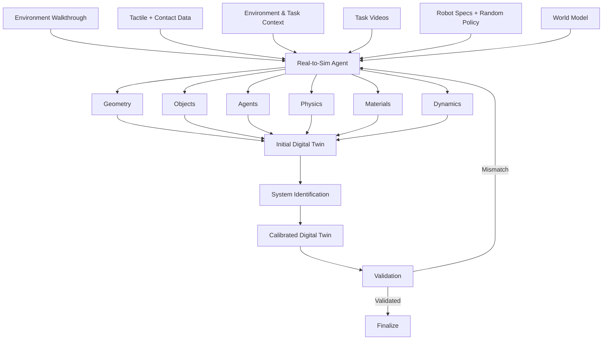

The goal is not to create a visually perfect replica of the environment.

It is to create a **useful executable model of the world** that is sufficiently accurate for policy training, candidate-action evaluation, and counterfactual reasoning.

The agent determines which aspects should be explicitly simulated and which should instead be represented through learned dynamics.

---

# 5. Agentic System Identification

Visual reconstruction alone cannot reveal many of the physical quantities that matter for manipulation.

The system may need to estimate object mass, friction, compliance, damping, restitution, actuator response, and other parameters.

```math
\theta =
\begin{bmatrix}
m \\
\mu_s \\
\mu_d \\
e \\
k \\
c \\
\vdots
\end{bmatrix}
```

The Real-to-Sim Agent combines visual trajectories, tactile interactions, force measurements, and robot observations to estimate these parameters.

```math
\theta^*
=
\arg\min_{\theta}
\left(
D_{\mathrm{kin}}
\left(
\tau_{\mathrm{real}},
\tau_{\mathrm{sim}}(\theta)
\right)
+
\lambda
D_{\mathrm{force}}
\left(
W_{\mathrm{real}},
W_{\mathrm{sim}}(\theta)
\right)
\right)
```

The important distinction is that the **agent reasons about what must be identified and which experiment will be informative**, while specialized numerical tools perform the parameter estimation itself.

```text
Real Interaction
      ↓
What does not match?
      ↓
Which physical parameter explains it?
      ↓
Run System Identification
      ↓
Update Digital Twin
      ↓
Validate Again
```

The result is a calibrated environment model rather than a purely visual reconstruction.

---

# 6. Explicit Physics + General World Model

Not every entity in the environment should be represented with hand-designed physics.

Rigid objects and contact interactions can often be modeled explicitly, while humans, pets, and other complex non-scripted entities are better represented through the general World Model.

```math
S^{\mathrm{agent}}_{t+1:t+H}
\sim
P_{\phi}
\left(
S_{\leq t},
E
\right)
```

The digital twin therefore becomes a hybrid system:

```math
\text{Digital Twin}
=
\text{Explicit Calibrated Physics}
+
\text{Learned World Dynamics}
```

The Environment & Task Context Description is especially useful here because it tells the Real-to-Sim Agent which entities matter, what they are expected to do, and which aspects of their behavior are relevant to the robot's tasks.

The action-conditioned World Model adds another layer to this hybrid system.

Explicit physics can handle quantities that require physical precision, while the learned model can predict complex, difficult-to-model interactions and other agent behavior.

---

# 7. Learned Surrogate Simulator

High-fidelity simulation is necessary for calibration and validation but is too expensive to run at the scale required for large-scale RL.

The calibrated digital twin is therefore used to generate experience from which the system trains a learned **surrogate simulator**.

```math
f_{\mathrm{sim}}(s_t,a_t)
\approx
f_{\mathrm{surrogate}}(s_t,a_t)
```

The surrogate trades some physical fidelity for enormous speed and becomes the main engine for large-scale policy optimization, candidate evaluation, and reasoning training.

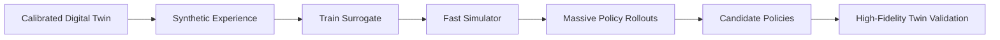

The resulting hierarchy is:

```math
\text{Real World}
\rightarrow
\text{Calibrated Twin}
\rightarrow
\text{Surrogate}
\rightarrow
\text{Massive Simulation}
```

There are therefore two simulation mechanisms in the architecture.

The high-fidelity digital twin provides accurate physical validation.

The learned World Model provides extremely fast latent prediction for candidate actions.

The latter becomes particularly important at runtime, where three candidate actions can be evaluated at every control decision without requiring three expensive high-fidelity simulator rollouts.

---

# 8. Training the Environment-Specific VLA

The environment-specific VLA begins from the current **global or mixed VLA**, rather than being trained from scratch.

It is conditioned on the current observation, the task specification, World Model latent imagination, and retrieved tutorial context.

```math
\pi_{\theta}
\left(
a_t
\mid
o_t,
T,
z_{\mathrm{WM}},
S_{\mathrm{tutorial}}
\right)
```

where \(o_t\) is the current observation, \(T\) is the task specification, \(z_{\mathrm{WM}}\) is the World Model latent imagination, \(S_{\mathrm{tutorial}}\) is the retrieved skill context, and \(a_t\) is the robot action proposal.

The important distinction is that the VLA does not directly determine the final executed action.

Instead, it generates three candidates:

```math
\{a_t^{(1)}, a_t^{(2)}, a_t^{(3)}\}
\sim
\pi_{\theta}
\left(
a_t
\mid
o_t,
T,
z_{\mathrm{WM}},
S_{\mathrm{tutorial}}
\right)
```

The World Model then evaluates those candidates.

The shared model therefore provides:

* general physical intelligence,
* manipulation knowledge,
* reasoning,
* candidate action generation,
* and the prior used to interpret the current state.

The environment-specific training process teaches it the particular robot embodiment and physical world.

The result is an **environment-specific VLA that proposes actions intelligently and knows how to reason about the environment before proposing them**.

---

# 9. Imagined Goal States and Target Future Trajectories

Exact trajectory matching is brittle because many different trajectories can successfully solve the same task.

Instead, the training system uses the World Model and generative models to construct latent representations of successful future states and short-horizon motions.

```math
z_{\mathrm{target}}(t:t+H)
```

The target trajectory is an imagined representation of where the world should be heading if the task is progressing successfully.

It does not need to prescribe an exact robot trajectory.

Two very different physical motions may lead to essentially the same successful state.

The latent target therefore represents **task-relevant future structure rather than a single demonstrated trajectory**.

This creates a more flexible objective:

```math
\text{Current State}
\rightarrow
\text{Desired Future Region}
```

rather than:

```math
\text{Current State}
\rightarrow
\text{Exact Demonstration Trajectory}
```

---

# 10. Three-Action World Model Selection

At every decision point, the VLA generates three candidate actions.

```math
\{a_t^{(1)}, a_t^{(2)}, a_t^{(3)}\}
```

Each candidate is passed through the action-conditioned World Model:

```math
z_{\mathrm{pred}}^{(i)}(t:t+H)
=
\mathrm{WM}_{\mathrm{action}}
\left(
s_t,
a_t^{(i)}
\right)
```

This produces three predicted future trajectories:

```text
Candidate 1
    ↓
World Model
    ↓
Predicted Future 1

Candidate 2
    ↓
World Model
    ↓
Predicted Future 2

Candidate 3
    ↓
World Model
    ↓
Predicted Future 3
```

Each future is then compared to the target imagined future.

```math
d_i
=
\left\|
z_{\mathrm{pred}}^{(i)}(t:t+H)
-
z_{\mathrm{target}}(t:t+H)
\right\|_2
```

The selected candidate is:

```math
i^*
=
\arg\min_{i \in \{1,2,3\}}
d_i
```

and the robot receives:

```math
a_t
=
a_t^{(i^*)}
```

The complete mechanism is:

```math
\boxed{
\begin{aligned}
&
\text{Observation + Task}
\\
&\downarrow
\\
&
\text{Reasoning}
\\
&\downarrow
\\
&
\text{VLA Samples 3 Candidate Actions}
\\
&\downarrow
\\
&
\text{Action-Conditioned World Model}
\\
&\downarrow
\\
&
\text{3 Predicted Future Trajectories}
\\
&\downarrow
\\
&
\text{Compare Against Target Imagined Future}
\\
&\downarrow
\\
&
\text{Minimum Latent Distance}
\\
&\downarrow
\\
&
\text{Execute Selected Action}
\end{aligned}
}
```

This makes the World Model an active part of the control policy rather than a passive auxiliary model.

The VLA proposes.

The World Model simulates.

The imagined trajectory defines the target.

The latent distance performs the selection.

---

# 11. Environment-Specific Simulation RL

The calibrated twin and surrogate allow the environment-specific VLA to experience an enormous variety of scenarios.

The system can vary object positions, physical properties, robot configurations, clutter, lighting, dynamics, task parameters, and the behavior of other agents.

The curriculum can progress automatically from simple interactions to increasingly complex tasks:

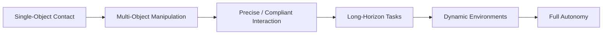

The RL process optimizes not only the action proposals but also the interaction between reasoning, candidate generation, World Model evaluation, and final action selection.

A useful training episode can therefore contain:

```text
Current State
      ↓
Reasoning
      ↓
3 Candidate Actions
      ↓
World Model Rollouts
      ↓
Target Future Comparison
      ↓
Selected Action
      ↓
Environment Outcome
      ↓
Reward
```

The system can train the VLA to generate candidates that are diverse enough to provide useful alternatives while still concentrating probability mass around physically plausible actions.

The Real-to-Sim Agent can identify weaknesses in both action generation and candidate selection and generate additional simulations around them.

---

# 12. Real Deployment and Local Continual Learning

Simulation will inevitably differ from reality, so deployment creates a continual local learning loop.

The environment-specific VLA operates on the real robot while its calibrated simulator continues to generate additional training scenarios and perform online RL.

```math
\text{Real Deployment}
\rightarrow
\text{Observed Outcome}
\rightarrow
\text{Failure Identification}
\rightarrow
\text{Targeted Simulation}
\rightarrow
\text{Online Simulation RL}
\rightarrow
\text{Updated Environment-Specific VLA}
```

The real robot therefore provides the evidence about where the current model is wrong, while the simulator provides the scale needed to explore and optimize the correction.

This includes failures in:

* perception,
* reasoning,
* candidate action generation,
* World Model prediction,
* candidate selection,
* and low-level execution.

For example, the VLA may generate three plausible grasps, but the World Model may incorrectly predict the consequences of one of them.

Alternatively, the World Model may correctly identify the best candidate, but the robot's low-level controller may fail to execute it accurately.

These failure modes can be separated and diagnosed because the architecture records the entire candidate-selection process.

---

# 13. Post-Deployment Failure Data

Every deployed robot is a source of valuable real-world experience.

The system monitors execution continuously and identifies situations in which the robot makes a mistake.

These mistakes can be explicitly reported by the human user or automatically detected by a VLM observing the robot through cameras installed in the environment.

The system does not merely record a sentence describing the mistake.

It captures the complete decision context:

```text
Failure Episode
├── Task being executed
├── Subtask being executed
├── Environment and task context
├── Robot state trajectory
├── Reasoning trajectory / decision context
├── Candidate action 1
├── Candidate action 2
├── Candidate action 3
├── World Model prediction for action 1
├── World Model prediction for action 2
├── World Model prediction for action 3
├── Target imagined trajectory
├── Latent distance for each candidate
├── Selected action
├── Actual robot action trajectory
├── Real video of the robot execution
├── Failure timestamp / event
├── Human feedback or VLM failure judgment
└── Relevant simulator state + environment parameters
```

This is particularly valuable because the system can compare:

```math
\text{Reasoning}
\rightarrow
\text{Candidate Actions}
\rightarrow
\text{Imagined Futures}
\rightarrow
\text{Selected Action}
\rightarrow
\text{Real Outcome}
```

A failure may therefore reveal an error in the reasoning, candidate generation, World Model, target imagination, selection mechanism, or actual control.

The resulting dataset is much richer than a standard failure log because it captures the complete decision process leading to the action.

---

# 14. Failure-Conditioned Data Generation

A single failure should not remain a single training example.

Once a failure is identified, the system reconstructs the relevant state inside the calibrated digital twin and generates a large distribution of nearby scenarios.

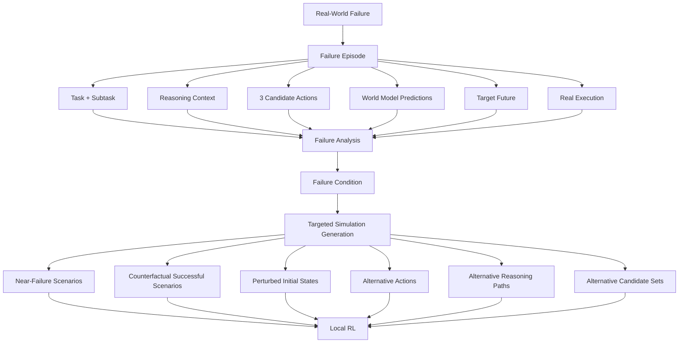

For example, if a robot squeezes a paper cup too hard, the system can generate scenarios with different cup positions, masses, compliance, approach directions, grasp forces, timings, and robot configurations.

It can also generate alternative candidate-action sets and train the World Model to distinguish which proposed actions would produce desirable futures.

The goal is not to memorize the original mistake.

The goal is to learn the boundary between successful and unsuccessful behavior and to improve the complete decision loop:

```math
\text{Reason}
\rightarrow
\text{Propose}
\rightarrow
\text{Predict}
\rightarrow
\text{Compare}
\rightarrow
\text{Act}
```

This powers the local environment-specific learning loop.

---

# 15. Sending Deployment Failures Back to the Lunch Robotics Lab

The raw failure stream is also sent back to the Lunch Robotics lab, but **raw deployment failures are not directly used to fine-tune the global VLA**.

The central dataset pipeline begins with human-led error-mode analysis.

Different deployments will produce different kinds of mistakes.

Some are caused by local geometry, local objects, local task conventions, or environment-specific calibration.

Others reveal a genuine limitation in general robot intelligence, World Model prediction, candidate generation, reasoning, or action selection.

The Lunch Robotics team analyzes failure episodes across deployments to distinguish these cases and identify **systematic, recurring, and generalizable error modes**.

For example:

```text
Environment A:
Candidate grasp predicts success but damages object.

Environment B:
Candidate push predicts stable motion but causes slip.

Environment C:
Candidate pull predicts the wrong contact transition.

                    ↓

          Cross-Deployment Analysis

                    ↓

Generalizable Error Mode:
World Model underestimates contact dynamics.
```

The same process can reveal reasoning-level failures:

```text
Environment A:
Robot generates three nearly identical candidates.

Environment B:
Robot fails to include a recovery action.

Environment C:
Robot does not generate alternatives after uncertainty increases.

                    ↓

          Cross-Deployment Analysis

                    ↓

Generalizable Error Mode:
Insufficient candidate diversity under uncertainty.
```

Or selection failures:

```text
Environment A:
Best predicted candidate is consistently misranked.

Environment B:
Latent distance does not correlate with task progress.

Environment C:
The World Model predicts plausible futures but the target trajectory is poorly defined.

                    ↓

          Cross-Deployment Analysis

                    ↓

Generalizable Error Mode:
Weak future representation for task-oriented action selection.
```

This distinction is critical because the global model should learn reusable capabilities, not absorb every local quirk from every deployment.

The result of the analysis is therefore a set of prioritized global capability gaps, including both **action-level deficiencies and reasoning- and prediction-level deficiencies**.

---

# 16. Curating the Global Training Dataset

Once a generalizable error mode has been identified, the Lunch Robotics team creates a **curated training dataset** around that capability gap.

The curated dataset can combine selected real-world failure episodes with successful examples, counterfactual successful trajectories, targeted simulation rollouts, adversarial near-failure scenarios, World Model imagined trajectories, decoded imagined videos, high-quality reasoning traces, candidate action sets, and relevant examples from the original foundation datasets.

```math
\mathcal{D}_{\mathrm{curated}}
=
\mathrm{Curate}
\left(
\mathcal{D}_{\mathrm{deployment}},
\mathcal{D}_{\mathrm{simulation}},
\mathcal{D}_{\mathrm{reasoning}},
\mathcal{D}_{\mathrm{WM}},
\mathcal{D}_{\mathrm{foundation}}
\right)
```

This is a deliberate dataset-engineering step rather than an automatic ingestion pipeline.

The team is effectively asking:

> **What capability is actually missing, where in the decision loop does the failure originate, and what data will teach the global system that capability in a way that transfers beyond the environment where the failure was observed?**

The answer might require improving the VLA's reasoning, increasing the diversity of candidate actions, improving the action-conditioned World Model, improving the target future representation, or improving the final latent selection objective.

The curated dataset therefore teaches the underlying capability rather than the superficial details of the environments where the failure first appeared.

---

# 17. Fine-Tuning a New Global Lab VLA

The curated dataset is used to improve the **global lab VLA**.

```math
W_{\mathrm{lab}}'
=
\mathrm{FineTune}
\left(
W_{\mathrm{lab}},
\mathcal{D}_{\mathrm{curated}}
\right)
```

The new release can improve both action capability and reasoning capability.

Some capability gaps may require new demonstrations and supervised fine-tuning.

Others may be better addressed through additional reinforcement learning, especially when the failure involves deciding among multiple candidate actions, allocating reasoning compute, or recovering from uncertainty.

Some failures will primarily indicate weaknesses in the action-conditioned World Model.

In those cases, the central training pipeline can produce targeted action-conditioned data and update the World Model separately:

```math
W_{\mathrm{WM}}'
=
\mathrm{FineTune}
\left(
W_{\mathrm{WM}},
\mathcal{D}_{\mathrm{WM,curated}}
\right)
```

The resulting global system therefore evolves as a coordinated stack:

```text
Curated Failure Data
        ↓
 ┌──────┼────────┐
 ↓      ↓        ↓
VLA   Reasoning  World Model
 ↓      ↓        ↓
 └──────┼────────┘
        ↓
   New Lab System
```

The important distinction is:

```text
Raw deployment failures
          ↓
Lunch Robotics analysis
          ↓
Generalizable error modes
          ↓
Curated training dataset
          ↓
Action / World Model / Reasoning improvement
          ↓
New Lab VLA + World Model
```

The deployment fleet is therefore a source of **candidate knowledge**, while the Lunch Robotics lab decides what knowledge becomes part of the global brain.

---

# 18. Environment-Specific VLAs and the Global Lab VLA

The architecture maintains two distinct classes of model.

The **global lab VLA** is the shared general-purpose model maintained by Lunch Robotics.

It captures broadly reusable capabilities learned from the foundation data funnel and from curated deployment-derived training.

It also contains the general reasoning ability required to decide how much computation to allocate before generating candidate actions.

Each deployment maintains its own **environment-specific VLA**, which is optimized for its physical environment, robot embodiment, objects, task distribution, local dynamics, and local operating conventions.

```text
                          GLOBAL LAB VLA
                               │
                               ▼
                       Shared Initialization
                               │
                 ┌─────────────┼─────────────┐
                 │             │             │
                 ▼             ▼             ▼
           Environment A  Environment B  Environment C
           Specific VLA   Specific VLA   Specific VLA
                 │             │             │
                 ▼             ▼             ▼
        Local Simulation RL + Real Deployment
```

The local models therefore inherit a common general intelligence and reasoning capability while learning the unique behavior required by their environments.

The same principle applies to the World Model.

The global model provides broad physical priors.

The environment-specific system adapts prediction to the actual robot, objects, materials, geometry, and dynamics of the deployment.

---

# 19. Continual Weight Mixing

The next step is to combine the information accumulated by the global lab VLA and the environment-specific VLAs.

Suppose:

```math
W_{\mathrm{lab}}
```

is the current global model and:

```math
W_1, W_2, \ldots, W_N
```

are environment-specific models.

After the lab VLA has been improved using curated deployment data:

```math
W_{\mathrm{lab}}'
=
\mathrm{FineTune}
\left(
W_{\mathrm{lab}},
\mathcal{D}_{\mathrm{curated}}
\right)
```

the system performs a continual model-merging step:

```math
W_{\mathrm{mixed}}
=
\mathrm{Mix}
\left(
W_{\mathrm{lab}}',
W_1,
W_2,
\ldots,
W_N
\right)
```

The exact implementation may eventually use parameter-space merging, model deltas, adapter composition, selective merging, or another technique.

The architectural principle is that useful information accumulated centrally and useful knowledge discovered through deployment should be consolidated into a stronger common initialization.

The resulting **mixed VLA** is redistributed to all environments.

Each deployment then starts a new round of environment-specific adaptation from this shared state:

```math
W_i^{(t+1)}
=
\mathrm{Adapt}
\left(
W_{\mathrm{mixed}},
E_i
\right)
```

Every global update therefore becomes available to the entire fleet.

---

# 20. The Global-Local Learning Flywheel

Lunch Robotics consequently has two interacting learning loops.

The **local loop** teaches each robot how to operate in its own physical world:

```math
\boxed{
\text{Mixed VLA}
\rightarrow
\text{Environment RL}
\rightarrow
\text{Environment-Specific VLA}
\rightarrow
\text{Deployment}
\rightarrow
\text{Failure}
\rightarrow
\text{Targeted Simulation}
\rightarrow
\text{Environment RL}
}
```

The local loop can improve perception, reasoning, candidate generation, World Model usage, candidate selection, recovery, and environment-specific knowledge without immediately modifying the shared model.

The **global loop** turns the collective experience of the fleet into improvements to the shared brain:

```math
\boxed{
\text{Many Deployments}
\rightarrow
\text{Failure Episodes}
\rightarrow
\text{Team Error-Mode Analysis}
\rightarrow
\text{Curated Data}
\rightarrow
\text{New Lab System}
\rightarrow
\text{Weight Mixing}
\rightarrow
\text{Mixed VLA}
\rightarrow
\text{All Deployments}
}
```

Together:

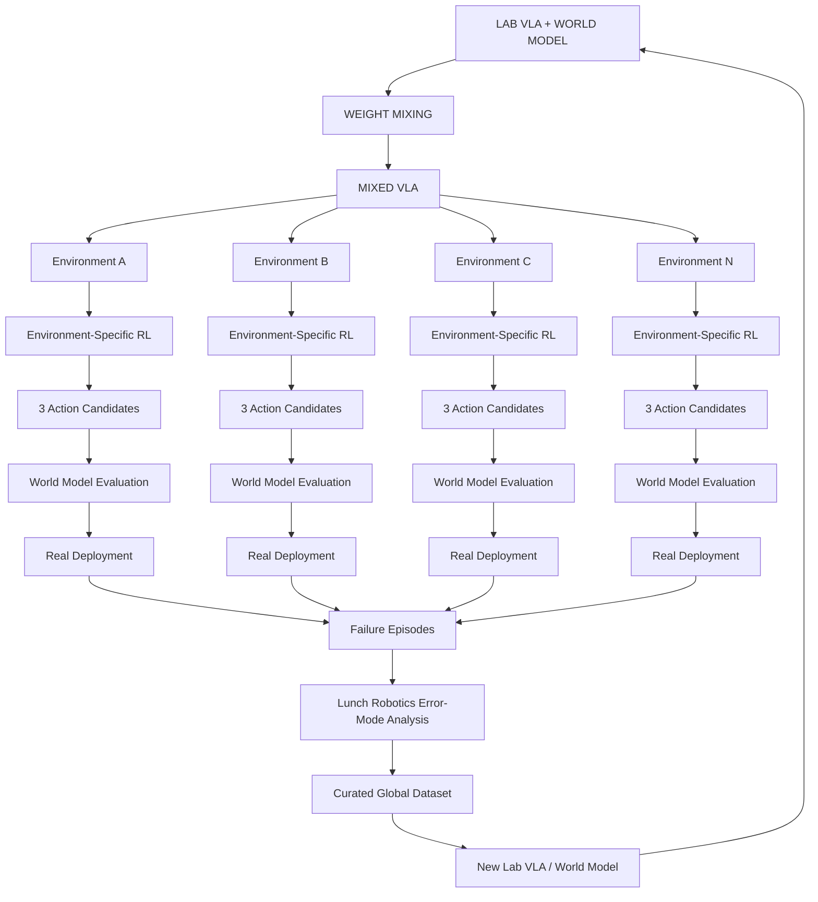

The architecture therefore separates **local specialization from global generalization**.

A deployment is free to discover local solutions without automatically contaminating the global model, while recurring failures that reveal general capability, prediction, or reasoning gaps can be deliberately promoted into the shared brain.

---

# 21. Safety

Safety is implemented at multiple levels because no single model should be trusted to guarantee safe operation.

At the foundation level, the models are exposed to safety-oriented and adversarial training examples so that broad behavioral constraints are established before deployment.

At the environment level, the calibrated digital twin allows the policy to experience dangerous scenarios without putting the real robot or environment at risk.

At runtime, the World Model provides another safety mechanism.

Because the robot generates three candidate actions, dangerous or implausible futures can be rejected before execution.

```math
\{a_t^{(1)}, a_t^{(2)}, a_t^{(3)}\}
\rightarrow
\text{World Model Futures}
\rightarrow
\text{Safety Evaluation}
\rightarrow
\text{Selection}
```

A high-level 3D VLM planner evaluates user intent before execution and can reject clearly unsafe or inappropriate tasks.

During execution, uncertain or high-risk candidate actions can be evaluated in the surrogate and, when necessary, the high-fidelity digital twin before being passed to the robot.

Reasoning itself can become another safety mechanism.

Tasks involving high uncertainty or high consequence can automatically receive a larger reasoning budget, allowing the VLA to generate better alternatives and the system to perform more extensive counterfactual evaluation.

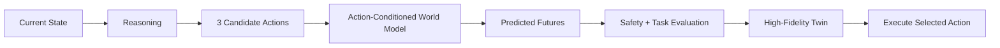

Runtime monitoring provides another safety layer by continuously observing execution and detecting unexpected or dangerous outcomes.

---

# 22. Robot SDK

The Robot SDK is the final hardware abstraction layer between the policy and the physical robot.

The robot should interact with the user through natural language while the underlying system translates those instructions into task specifications, retrieves the appropriate skill context, determines the required reasoning budget, generates VLA candidate actions, evaluates those candidates through the World Model, and converts the selected action into a hardware-safe trajectory.

```mermaid
flowchart LR
    A["Human Speech"]
    --> B["Speech-to-Text"]

    B --> C["Task Specification"]
    C --> D["Tutorial Skill Retrieval"]

    D --> E["3D VLM Planner"]
    E --> F["Reasoning Budget"]

    F --> G["Environment-Specific VLA"]

    G --> H["3 Candidate Actions"]

    H --> I["Action-Conditioned World Model"]

    I --> J["Future Comparison"]

    J --> K["Selected Action"]

    K --> L["Robot SDK"]
    L --> M["Motion Smoother"]
    M --> N["Hardware Controller"]
    N --> O["Robot"]
```

The neural policy therefore does not need to directly satisfy every low-level hardware constraint.

The SDK provides the final control and safety interface.

---

## 22.1 Motion Smoothing

A neural action policy can produce noisy or abrupt outputs, so the SDK applies online smoothing and jerk-limited trajectory generation.

```math
(q_{t+1}, \dot{q}_{t+1}, \ddot{q}_{t+1})
=
f_{\mathrm{smooth}}
(
a_t,
a_{\lt t},
q_t,
\dot{q}_t,
\ddot{q}_t
)
```

The resulting trajectory is constrained by the robot's hardware limits:

```math
\begin{aligned}
|\dot{q}(t)| &\leq v_{\max} \\
|\ddot{q}(t)| &\leq a_{\max} \\
|\dddot{q}(t)| &\leq j_{\max}
\end{aligned}
```

These constraints are read directly from the robot specification, keeping the policy hardware-agnostic.

For low-latency deployment, a diffusion-based action policy can additionally undergo **Consistency Distillation**, allowing an iterative diffusion policy to be transformed into a much faster inference process.

---

# 23. Runtime Task Execution

At runtime, the experience should be intentionally simple.

The user can say:

> **"Clean the table."**

The system converts the request into a task specification, retrieves the relevant tutorial, uses the planner to determine the task structure and difficulty, selects an appropriate reasoning budget, and passes the execution problem to the environment-specific VLA.

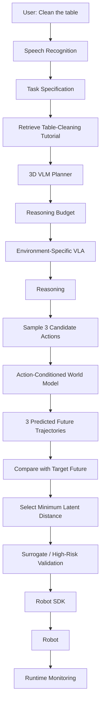

The tutorial supplies task-specific contextual knowledge.

The planner determines the task structure.

The VLA determines how much reasoning is required and generates three plausible actions.

The World Model predicts what would happen after each candidate.

The target imagined future describes where the system should be going.

The latent comparison selects the candidate whose predicted outcome is closest to that target.

The SDK ensures hardware-safe execution, while runtime monitoring determines whether the execution succeeded or entered a failure state.

The user therefore experiences a simple conversational interface even though the underlying system is performing substantial perception, planning, reasoning, simulation, candidate evaluation, and control.

---

# 24. End-to-End System

The full architecture is a continuous pipeline from foundation-model training to deployment and back again.

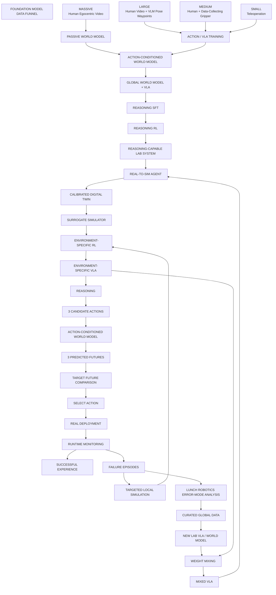

The local environment lifecycle is:

```math
\text{Mixed VLA}
\rightarrow
\text{Environment Reconstruction}
\rightarrow
\text{System Identification}
\rightarrow
\text{Calibrated Simulation}
\rightarrow
\text{Environment RL}
\rightarrow
\text{Environment-Specific VLA}
\rightarrow
\text{Reasoning}
\rightarrow
\text{3 Candidate Actions}
\rightarrow
\text{World Model Evaluation}
\rightarrow
\text{Action Selection}
\rightarrow
\text{Real Deployment}
\rightarrow
\text{Failure}
\rightarrow
\text{Targeted Local Learning}
```

The global fleet lifecycle is:

```math
\text{Many Deployment Failures}
\rightarrow
\text{Lunch Robotics Error-Mode Analysis}
\rightarrow
\text{Curated Global Dataset}
\rightarrow
\text{New Lab VLA / World Model}
\rightarrow
\text{Weight Mixing}
\rightarrow
\text{Mixed VLA}
\rightarrow
\text{All Deployments}
```

The resulting architecture is not a one-way pipeline.

It is a **closed learning system** in which the foundation model creates capable initial policies, the action-conditioned World Model provides learned simulation, reasoning training teaches the model how to allocate cognition, candidate generation provides multiple possible behaviors, latent future matching selects among those behaviors, environments provide the physical context required for specialization, deployments expose the weaknesses of those policies, and the company converts the most generalizable weaknesses into improvements to the shared brain.

---

# 25. What the User Actually Does

From the user's perspective, the system should be almost trivial.

They provide the environment information, task descriptions, tactile probing, task demonstrations, and robot interface required to initialize the system.

```math
\text{Environment}
+
\text{Tasks}
+
\text{Tactile Probing}
+
\text{Task Videos}
+
\text{Robot SDK}
```

They do not manually build a simulator, model the environment's physics, perform system identification, create RL environments, engineer the training curriculum, generate synthetic datasets, train the policy, or tune low-level control.

They also do not need to manually choose the action that best matches the task.

The system automatically:

```text
Understand Task
      ↓
Reason
      ↓
Generate 3 Candidate Actions
      ↓
Imagine Consequences
      ↓
Compare Future Trajectories
      ↓
Select Best Action
      ↓
Execute Safely
```

They also do not need to decide how much reasoning the robot should perform for every individual action.

The system learns to scale reasoning with the task, uncertainty, and available inference budget.

More demanding tasks can receive more deliberation, while simple tasks can remain fast.

After deployment, the user simply uses the robot.

When the robot makes a mistake, the user can point it out, while environmental cameras and VLM monitoring can independently detect many failures.

The resulting event is automatically recorded and becomes part of the local learning loop and, when appropriate, the global error-analysis pipeline.

The user therefore does not need to become a robotics engineer in order to operate and improve the system.

---

# 26. The Core Research Thesis

The central thesis of Lunch Robotics is that universal robot intelligence should be built from five complementary components:

```math
\boxed{
\text{Foundation Model Data Funnel}
+
\text{Action-Conditioned World Model}
+
\text{Reasoning SFT + RL}
+
\text{Agentic Real-to-Sim}
+
\text{Curated Fleet Learning}
}
```

The Foundation Model Data Funnel solves the first problem:

> **How do we learn broad physical and manipulation intelligence without requiring enormous quantities of expensive robot data?**

The answer is to combine data sources with radically different scale and fidelity inside one continuously co-trained foundation model:

```math
\text{Massive Human Video}
+
\text{Human Action Learning}
+
\text{Robot-Relevant Manipulation}
+
\text{Teleoperation}
\rightarrow
\text{Global World Model + VLA}
```

The Action-Conditioned World Model solves the next problem:

> **How does the robot predict the consequences of an action before committing to it?**

The answer is to fine-tune the World Model with action data as an explicit input:

```math
\text{Current State}
+
\text{Action}
\rightarrow
\text{Predicted Future Trajectory}
```

This turns the World Model into a learned simulator that can be queried with hypothetical robot actions.

Reasoning SFT and RL solve the next problem:

> **How do we teach the model to use all of this knowledge intelligently rather than simply map observations directly to actions?**

The answer is to train the VLA on successful reasoning trajectories and optimize reasoning through RL while allowing reasoning depth to scale at inference time.

```math
\text{Observation}
+
\text{Task}
+
\text{World Model}
\rightarrow
\text{Adaptive Reasoning}
\rightarrow
\text{Candidate Actions}
```

The candidate-action mechanism solves the next problem:

> **How do we avoid relying on a single VLA prediction to make every decision perfectly?**

The answer is to sample three candidate actions and use the World Model to evaluate their consequences:

```math
\{a_t^{(1)}, a_t^{(2)}, a_t^{(3)}\}
\rightarrow
\{z_{\mathrm{pred}}^{(1)}, z_{\mathrm{pred}}^{(2)}, z_{\mathrm{pred}}^{(3)}\}
\rightarrow
\text{Latent Comparison}
\rightarrow
a_t^*
```

The action whose predicted future is closest to the World Model's imagined target future is selected:

```math
a_t^*
=
a_t^{\left(
\arg\min_i
\left\|
z_{\mathrm{pred}}^{(i)}
-
z_{\mathrm{target}}
\right\|_2
\right)}
```

The Real-to-Sim system solves the next problem:

> **How do we adapt that general intelligence to an arbitrary robot operating in an arbitrary physical environment?**

By transforming:

```math
\text{Real Environment}
\rightarrow
\text{Digital Twin}
\rightarrow
\text{System Identification}
\rightarrow
\text{Calibrated Simulation}
\rightarrow
\text{Massive RL}
\rightarrow
\text{Environment-Specific VLA}
```

The deployment learning system solves the final problem:

> **How do we continue improving after the robot is operating in the real world?**

The answer is to let each deployment learn locally while sending rich failure data back to the central lab.

The Lunch Robotics team analyzes those failures across environments, identifies generalizable error modes, and curates the datasets required to teach those capabilities to the global model:

```math
\text{Deployment Failures}
\rightarrow
\text{Team Error-Mode Analysis}
\rightarrow
\text{Curated Data}
\rightarrow
\text{New Lab VLA / World Model}
```

Finally, the global and local models are combined and redistributed:

```math
\text{Lab VLA}
+
\text{Environment-Specific VLAs}
\rightarrow
\text{Mixed VLA}
\rightarrow
\text{All Deployments}
\rightarrow
\text{Environment-Specific RL}
```

The most important architectural principle is therefore:

> **The robots specialize locally, while Lunch Robotics learns globally.**

A deployed robot is not merely a consumer of a fixed model.

It is an autonomous learning agent operating inside a particular physical environment and a sensor collecting valuable evidence about what the shared brain still does not understand.

The centralized Lunch Robotics team then acts as the intelligence filter that determines which discoveries should become part of the universal model and which should remain local.

This creates a compounding learning flywheel:

```math
\boxed{
\text{More Deployments}
\rightarrow
\text{More Real-World Experience}
\rightarrow
\text{More Error Modes Discovered}
\rightarrow
\text{Better Curated Data}
\rightarrow
\text{Better Lab VLA}
\rightarrow
\text{Better World Model}
\rightarrow
\text{Better Reasoning}
\rightarrow
\text{Better Action Selection}
\rightarrow
\text{Better Initialization}
\rightarrow
\text{Better Environment Adaptation}
\rightarrow
\text{Better Robots}
\rightarrow
\text{More Deployments}
}
```

The fundamental insight is that **deployment is not merely inference at the edge**.

Deployment is where the system discovers what intelligence, prediction, and reasoning are still missing.

---

# 27. The Product Vision

The end state is **zero-to-hero robot autonomy**.

The user provides a robot, an environment, the tasks it needs to perform, a small amount of tactile probing, and task demonstrations.

The rest of the system operates behind the scenes.

```math
\begin{aligned}
&
\text{Massive Human Video}
+
\text{Human Action Data}
+
\text{Robot-Relevant Data}
+
\text{Teleoperation}
\\
&\qquad\qquad\downarrow
\\
&
\text{Global World Model + VLA}
\\
&\qquad\qquad\downarrow
\\
&
\text{Action-Conditioned World Model}
\\
&\qquad\qquad\downarrow
\\
&
\text{Reasoning SFT + RL}
\\
&\qquad\qquad\downarrow
\\
&
\text{Reasoning-Capable Global VLA}
\\
&\qquad\qquad\downarrow
\\
&
\text{Real-to-Sim Agent}
\\
&\qquad\qquad\downarrow
\\
&
\text{Calibrated Digital Twin}
\\
&\qquad\qquad\downarrow
\\
&
\text{Massive Simulation RL}
\\
&\qquad\qquad\downarrow
\\
&
\text{Environment-Specific VLA}
\\
&\qquad\qquad\downarrow
\\
&
\text{Reasoning}
\\
&\qquad\qquad\downarrow
\\
&
\text{Three Candidate Actions}
\\
&\qquad\qquad\downarrow
\\
&
\text{World Model Future Prediction}
\\
&\qquad\qquad\downarrow
\\
&
\text{Latent Future Matching}
\\
&\qquad\qquad\downarrow
\\
&
\text{Selected Action}
\\
&\qquad\qquad\downarrow
\\
&
\text{Real Deployment}
\\
&\qquad\qquad\downarrow
\\
&
\text{Failure Discovery}
\\
&\qquad\qquad\downarrow
\\
&
\text{Targeted Local Learning}
\end{aligned}
```

Across the fleet, deployment failures are converted into curated improvements to the global model:

```math
\begin{aligned}
&
\text{Deployment Failures}
\\
&\qquad\qquad\downarrow
\\
&
\text{Lunch Robotics Error-Mode Analysis}
\\
&\qquad\qquad\downarrow
\\
&
\text{Curated Global Training Data}
\\
&\qquad\qquad\downarrow
\\
&
\text{New Lab VLA + World Model}
\\
&\qquad\qquad\downarrow
\\
&
\text{Weight Mixing}
\\
&\qquad\qquad\downarrow
\\
&
\text{Mixed VLA}
\\
&\qquad\qquad\downarrow
\\
&
\text{Every Deployment}
\end{aligned}
```

At deployment, the user can simply say:

> **"Clean the table."**

The robot understands the task, retrieves the relevant skill, determines how much reasoning is required, generates three plausible actions, uses the World Model to imagine the consequence of each action, compares those future trajectories against the desired imagined future, selects the best action, executes it through a hardware-safe control stack, and monitors the result.

When the robot encounters something it does not understand, the system does not simply record a failure and move on.

It captures the entire event, learns locally from the failure, and sends the information back to the Lunch Robotics lab.

The team determines whether the failure reveals a broader capability, reasoning, prediction, or action-selection gap, curates the appropriate training data, improves the global VLA and/or World Model, mixes the new global knowledge with the knowledge accumulated by specialized deployments, and redistributes the resulting system across the fleet.

The long-term objective is therefore not to build another robot-specific policy.

It is to build a **universal brain that can be installed into any robot, adapted to any physical environment, reason at the appropriate level for any task, simulate the consequences of its candidate actions, select the action most likely to lead toward the desired future, and continuously improve through the collective experience of every robot running it.**
