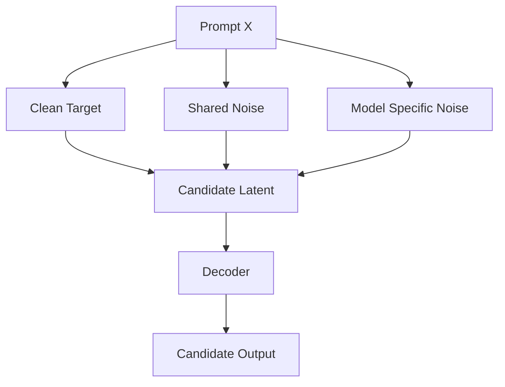
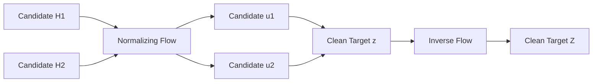
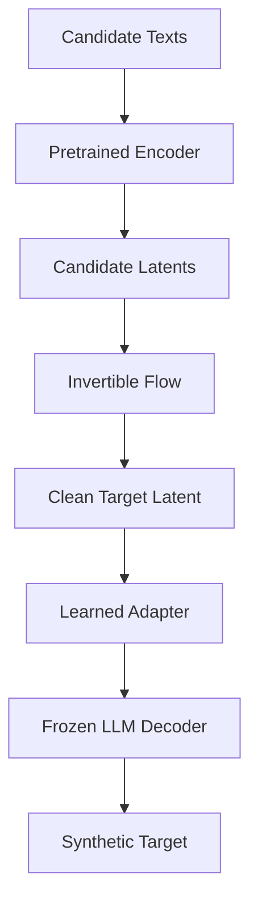
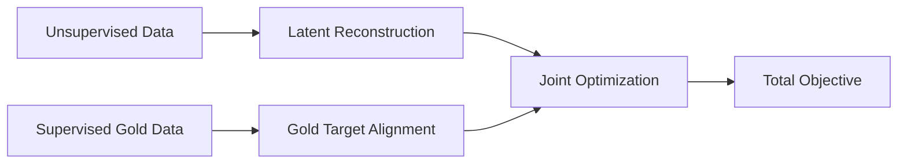
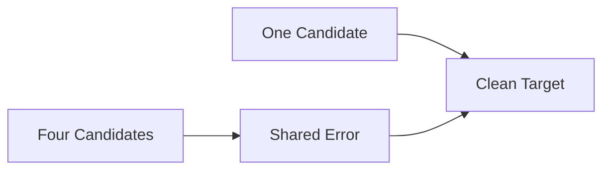
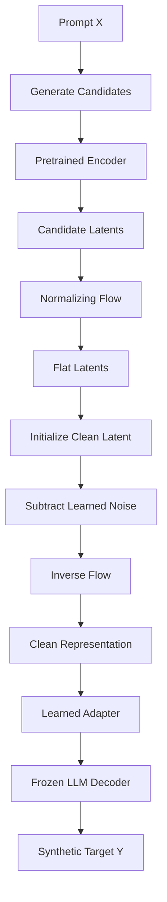

# 🚀 Generative Latent De-Noising (GLD)

> **Data-Efficient Synthetic Data Generation via Invertible Latent Error Disentanglement**

---

## 1. Core Concept and Data Requirements

GLD generates high-quality synthetic training data by modeling multi-LLM synthesis as a **generative latent de-noising problem**.

Instead of treating candidate responses as competing text outputs to be selected or rewritten, GLD assumes that for any prompt `X`, there exists an unobserved clean target latent representation `Z*`.

Candidate responses `R_1, ..., R_k`, generated by diverse open models, are treated as noisy observations of `Z*`.

A pretrained text encoder `E_theta` maps each candidate into a unified latent space.

```math
H_i = E_\theta(X, R_i)
```

The generative model is:

```math
H_i
=
Z^*
+
\sum_{m=1}^{M} w_{i,m} \epsilon_m(X)
+
\eta_i(X)
```

where:

* `Z*` is the clean target representation.
* `epsilon_m(X)` is shared error mode `m`.
* `w_i,m` determines how strongly candidate `i` inherits shared error mode `m`.
* `eta_i(X)` is candidate-specific noise.

### Dataset Scale Requirements

* **Unlabeled Data (`M approximately 10^6`):** approximately 1M prompts paired with candidate responses generated automatically by open-weight models.
* **Supervised Data (`N approximately 10^2`):** approximately 100 prompts where a human constructs a gold target `Y`.

The human targets provide an anchor for the otherwise unobserved clean representation `Z*`.

> **Central Research Question**
>
> Can Expectation-Maximization over millions of unlabeled candidate sets learn to isolate and subtract candidate noise vectors in a flattened latent space, using a tiny human dataset to anchor the noise models against degenerate solutions?

---

## 2. Generative Model and Noise Architecture

Each candidate latent `H_i` is decomposed into three components:

1. **Clean Target Latent (`Z*`)**
   An unobserved, per-datapoint latent variable representing the ideal output.

2. **Shared Noise Sources**
   A global bank of input-conditioned neural noise networks capturing common failure modes across models, such as:

   * shared hallucinations,
   * domain-specific biases,
   * common reasoning mistakes.

3. **Model-Specific Noise**
   Candidate-specific error functions capturing individual model weaknesses, such as:

   * style quirks,
   * formatting errors,
   * model-specific hallucinations.

### Generative Structure



The key assumption is that different candidate models can share systematic errors while also having independent weaknesses.

GLD attempts to disentangle these two sources of variation.

---

## 3. Normalizing Flow Mapping

LLM representation spaces may have complicated geometry, making direct Euclidean operations potentially semantically invalid.

For example, directly computing the midpoint between two representations may not correspond to a meaningful semantic midpoint in the original representation space.

GLD therefore introduces an invertible **Normalizing Flow** `f_psi` that maps the representation space `H` into a flatter latent space `Z_flat`.

```math
f_\psi : H \rightarrow Z_{flat}
```

For each candidate:

```math
u_i = f_\psi(H_i)
```

### Latent-Space Transformation



In `Z_flat`, GLD assumes that Euclidean vector operations provide a useful approximation for semantic operations.

### Key Operations

#### 1. Semantic Mean Initialization

The initial clean latent is the mean of the candidate representations:

```math
z^{*(0)}
=
\frac{1}{k}
\sum_{i=1}^{k}
u_i
```

#### 2. Linear Noise Subtraction

Noise components are estimated and subtracted directly in `Z_flat`.

#### 3. Invertible Reconstruction

The clean flat-space representation is mapped back into the original representation space:

```math
Z^*
=
f_\psi^{-1}(z^*)
```

---

## 4. Encoder and Decoder Alignment

GLD separates:

1. feature extraction,
2. latent de-noising,
3. autoregressive generation.

The architecture uses a pretrained encoder, an invertible flow, a learned adapter, and a frozen decoder.



### Pretrained Feature Encoder

The pretrained encoder `E_theta` maps heterogeneous candidate outputs into a common representation space:

```math
H_i = E_\theta(X, R_i)
```

The encoder does **not** need to be invertible.

### Learned Latent Adapter

A lightweight adapter `g_phi` maps the de-noised target representation into a representation that can condition a frozen pretrained LLM decoder.

Conceptually:

```math
Z^* \rightarrow g_\phi(Z^*) \rightarrow Decoder \rightarrow Y
```

The adapter may operate on:

* input embeddings,
* prefix embeddings,
* key-value states,
* or another decoder-conditioning interface.

---

## 5. Latent Noise Routing Matrix

To determine which candidates inherit which shared noise sources, GLD introduces a learned routing matrix `W`.

```math
W \in [0,1]^{k \times M}
```

The candidate model in flat space becomes:

```math
u_i
=
z^*
+
\sum_{m=1}^{M}
w_{i,m} \epsilon_m(X)
+
\eta_i(X)
```

### Interpretation

The coefficient `w_i,m` acts as a gate indicating how strongly candidate `i` suffers from shared error source `m`.

For example:

* `w_i,m` close to `1` means candidate `i` strongly exhibits error mode `m`.
* `w_i,m` close to `0` means candidate `i` is largely unaffected by error mode `m`.

### Sparsity

An L1 penalty encourages sparse routing:

```math
L_{sparse}
=
\lambda_{sparse}
\sum_{i=1}^{k}
\sum_{m=1}^{M}
|w_{i,m}|
```

This encourages the model to explain candidate correlations using a small number of shared noise channels.

---

# 6. Step-by-Step Optimization Mechanics

GLD uses an alternating **Expectation-Maximization (EM)** procedure.

For each prompt `X_j`, there is a local latent variable `z_j*`.

The global parameters are:

```math
Theta
=
{
theta_m,
phi_i,
w_{i,m},
psi,
phi
}
```

The optimization alternates between:

1. **E-Step:** infer the clean latent.
2. **M-Step:** update the global noise and transformation parameters.

---

## Step A — E-Step

### Infer the Clean Latent

For each prompt `X_j`, candidates are mapped into flat space:

```math
u_{i,j}
=
f_\psi(
E_\theta(X_j, R_{i,j})
)
```

Define the predicted noise for candidate `i`:

```math
n_{i,j}
=
\sum_{m=1}^{M}
w_{i,m} \epsilon_m(X_j)
+
\eta_i(X_j)
```

Holding the global parameters fixed, GLD solves for the clean latent `z_j*`.

Rather than using the unsupported `operatorname` macro, the optimization is written using standard `argmin` notation:

```math
z_j^*
=
\arg\min_z
\frac{1}{2}
\sum_{i=1}^{k}
||u_{i,j} - z - n_{i,j}||_2^2
```

### Analytical Solution

The optimal clean latent is:

```math
z_j^*
=
\frac{1}{k}
\sum_{i=1}^{k}
u_{i,j}
-
\frac{1}{k}
\sum_{i=1}^{k}
n_{i,j}
```

In words:

> **Clean Target = Candidate Mean - Average Predicted Noise**

### Iteration 0

Initially, the noise networks are close to zero:

```math
\epsilon_m \approx 0
```

and:

```math
\eta_i \approx 0
```

Therefore:

```math
z_j^{*(0)}
=
\frac{1}{k}
\sum_{i=1}^{k}
u_{i,j}
```

So the initial clean latent is simply the candidate mean.

### Later Iterations

As the noise models learn systematic error patterns, the estimated clean latent moves away from the simple candidate mean.

Conceptually:

```math
CandidateMean - LearnedNoise = EstimatedCleanTarget
```

---

## Step B — M-Step

### Update the Global Parameters

With the clean latents `z_j*` fixed, GLD updates the global parameters.

The total objective is:

```math
L_{total}
=
L_{unsup}
+
\lambda L_{sup}
+
L_{sparse}
```

The optimization combines information from millions of unlabeled candidate sets with a small number of human-verified examples.

### Data Contributions



---

### 1. Unsupervised Latent Loss

The unsupervised loss operates directly in flat latent space:

```math
L_{unsup}
=
\frac{1}{N k}
\sum_{j=1}^{N}
\sum_{i=1}^{k}
||u_{i,j} - z_j^* - n_{i,j}||_2^2
```

This objective does not require autoregressive decoding.

It teaches the model to explain each candidate as:

```math
Candidate
=
CleanTarget
+
SharedErrors
+
IndividualErrors
```

The unsupervised data therefore provides information about:

* candidate correlations,
* recurring error patterns,
* candidate-specific error patterns,
* noise magnitudes,
* noise routing.

---

### 2. Supervised Anchoring Loss

For each human-verified example `(X_j, Y_j)`, the gold latent is obtained from the human target:

```math
z_{j,gold}^*
=
f_\psi(
E_\theta(X_j, Y_j)
)
```

The supervised objective trains the latent representation to generate the human target through the adapter and frozen decoder.

```math
L_{sup}
=
-\frac{1}{N}
\sum_{j=1}^{N}
\sum_{t=1}^{T_j}
\log P(
y_{j,t}
\mid
y_{j,1:t-1},
g_phi(z_{j,gold})
)
```

The small supervised dataset therefore acts primarily as an **anchor** that constrains the latent decomposition.

---

# 7. Recovering Minority Signals vs. Missing Information

## Minority Signal Recovery

Consider five candidate models where four share the same incorrect answer and one contains the correct answer.

A purely unsupervised model could incorrectly interpret the minority signal as noise because it is statistically less common.

The supervised anchoring mechanism provides an external constraint.



The intended behavior is:

1. Human gold examples establish the direction of the clean latent.
2. Repeated errors across candidates become explainable as shared noise.
3. The minority signal can remain part of the clean latent.
4. The inferred `z*` can therefore recover information that is statistically in the minority.

This is one of the key reasons for introducing the supervised anchoring objective.

---

## Missing Information

GLD cannot recover information that is absent from every candidate.

If all candidate models fail to contain some required information, there is no observation from which the latent de-noising system can recover it.

> **GLD can denoise, disentangle, and recombine information present in the candidate set. It cannot create completely missing information.**

---

# 8. End-to-End Synthetic Data Generation Pipeline

Once trained, GLD generates synthetic data for a new prompt without iterative autoregressive rewriting of candidate responses.



### Inference Steps

For a new prompt `X`:

1. Generate candidate responses `R_1, ..., R_k`.
2. Encode each candidate using `E_theta`.
3. Map the candidate representations into `Z_flat` using `f_psi`.
4. Initialize `z*` using the candidate mean.
5. Estimate and subtract learned shared and candidate-specific noise.
6. Map the clean latent back using `f_psi^-1`.
7. Apply the learned adapter `g_phi`.
8. Generate the final synthetic target using the frozen LLM decoder.

---

# 9. One-Sentence Pitch

> **GLD uses Normalizing Flows to map pretrained candidate representations into a flat latent space where clean target representations are initialized as candidate means and progressively de-noised through EM over `10^6` unlabeled candidate sets and `10^2` human anchors, enabling synthetic data generation through a frozen LLM without autoregressive candidate rewriting.**
