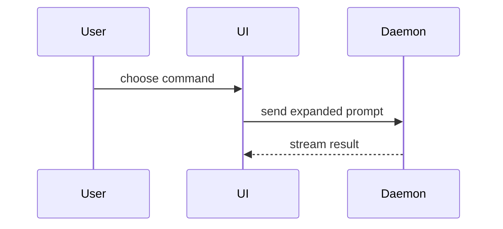

# Bruno's AI-assisted Coding Setup

Disable opencode native tools and only give it the OpenSandbox MCP which provies file editing and sel execution in an isolated gVisor micro-VM (launched via docker with runsc as the OCI runtime). VSCode connects easily via Remote Connection to the container. Important: need to run opencode on a separate vscode window that's not connected to the sandbox.

## Project Rules (AGENTS.md)

### Things you should NEVER do

- never acess directories above the project's root directory
- never read sensitive files (e.g., .env)
- never run destructive commands without my permission. Always present me a dry run alternative if possible.
- never try to extract extreme performance (speed, throughput) at the expense of making code complexity significantly higher, unless specifically prompted for extreme performance optimization
- never try to bypass pre-commit hooks or ny other quality gate, unless explicitely asked to do so by me.
- never modify opencode-related folders/files such as /.agents, AGENTS.md and skills, without my explicit approval

### Things you should always do

- Before starting a task always read the global and issue-specific spec. Treat global spec as the main source of truth. If issue-specific spec differs from global spec, flag this issue for me to resolve (with your help). If implementation differs from issue-specific spec or global spec, flag this issue for me to resolve (with your help).
- Before starting something new, check the last uncommitted and commited changes made with git. Only start this new thing if nothing seems suspicious (e.g., new code was written without correspinding tests, weird code changes, etc)
- Before using an unfamiliar dependency/API, consult its official documentation relevant to the operation being performed. Do not reread documentation already understood in the current session.
- every review document (in ./.agent/session-persistent-candidate/reviews/) created should contain in its initial metadata a reference to the exact version of what was reviewed which can be a file of specific commit (e.g., spec review and security spec review) or an entire commit (e.g., code review and security code review).
- log all mistakes you made in ./.agent/persistant/knowledge/mistakes.jsonl file, each entry in the form {"what_was_done": "placeholder", "what was wrong": "placeholder", "why it was wrong": "placeholder", "how the mistake was corrected": placeholder, "commit hash of the codebase at the time of mistake": placeholder}. 
    - What counts as mistakes?
        - Anything you realize you did wrong before, having evidence to support why its wrong and explanation of why its wrong
        - Anything the I (aka your user) had to intervene to change something you already did becomes it had serious problems. I might say explicitely that you did something wrong (e.g., "change di code you wrote because its not readable", "change these tests you wrote becaue they dont reflect the spec", "change your implementation plan to more fine-grained end-to-end steps, where you start by") or just ask you if you are shure something is correct. Note: before counting it as a mistake and changing it, you must confirm the problem by talking to me with arguments. 
    - Whats doesnt count as mistakes? (1) User intervetions where the user requests spec changes/updates are never mistakes; (2) User interverntions for non-critical low-level changes that to satisfy his preferences (e.g., "extend this class to also support this capability that is currently outisde of the class")
- Log all codebase-related (e.g., how does this function work?) questions I ask to you in a ./.agent/persistant/user-codebase-questions.jsonl, each entry in the form "question": "placeholder", "answer": "placeholder", "branch": "placeholder", "commit_hash": placeholder"} where branch is the branch in which the user is in when he asked the question and commit_hash is the last commit at the time the user asked the question.
- Log all new usefull nuggets of codebase knowledge to ./.agent/session-persistent-candidate/non_obvious_conjectures.md where you keep track of non-obvious conjectures you make for the session. Each conjecture has the following data: (1) description of the conjecture, current evidence of the conjecture, already a fact? (yes or no) and risk if wrong (high, medium or low). Always ask question to user before you are about to act on a risky conjecture you dont have much evidence.
- keep your code clean and organized, refactoring might be needed
- moduarization: the codebase should have a few big modules with clear boundaries and relationships, and each big module is composed of many little modules. Dont let fils become too big, prefer breaking into multiple files where each one has a clear meaning/job.
- if using bash commands for file/content search: prefer `fd` (fdfind) and `rg` (ripgrep) over standard `find` and `grep` for better performance and git-awareness.
- always make a plan before doing stuff
- before concluding a task, critically re-evaluate your reasoning, assumptions, and implementation. Verify that the solution satisfies the user's objective, that no possibly affected areas have been overlooked, and that no unnecessary regressions have been introduced.
- when E2E tesitng a product: be picky about the UI you see and be obsessed with pixle perfection. 
- If something unrelated looks wrong, record it as a todo in ./.agent/session/todos.md it creates a correctness, security, build, or test failure affecting the current task. do not do one todo item at a time, batch them into related todos, and implement one batch at a time.
- If you realize that you are stuck in a loop where you can't solve a specific problem, you need to change your approach. Save the problem description in ./.agent/session/problem_stuck.md (should have problem summary, how to verify solution of problem, things already tried and the output gotten in each attempt) and then try these in order:
  1. Just reset the opencode context window and try again (the problem description will be at ./.agent/session/problem_stuck.md). 
  2. Reset the opencode context window and Change the OpenCode Coding Model (e.g., change from Kimi K3 to Opus 4.8) and increase it's reasoning if possible
  3. Reset the opencode context window and Take a fresh look at the problem. Try a different approach (if necessary you can update plan.md or core-implementaiton-tasks.md)
  4. Spawn the most approppriate sub-agent to help
  5. Spawn a codex session and prompt to to solve the problem (needs codex installed)
  6. Reset to the latest commit as your last resource, then reset the OpenCode context window, then try agian to solve the problem.
- If you solve the problem you are stuck, delete ./.agent/session/problem_stuck.md immediatelly.
- Before creating a skill from scratch for a common thing (not project-specific, e.g., frontend design) search for existing skills in skills.sh which can be installed via npx skills add
- if you encounter code-spec mismatch you should explain the mismatch, initiate a discussion with the user, which wil culminate in either code or spec change (or both). Spec should always be the goldern standard we look up to, so it can never be outdated.
- always when you get stuck in a problem, revise ./.agent/flow/current-issue/flow/core-implementation-tasks-plan.md or plan.md to see if plan changes need to be mande. Remember that core-implementation-tasks-plan.md stores the graph of core implementaiton tasks along with progress, its per-issue; ./.agent/session/plan.md store per-step action plans typically generate by using the ai agent (you) in plan mode for steos that require a plan first.
- if you want to explore (a planned big-refactoring doesnt count as exploration and should be done just on a big-refactoring branch with the same agent) some idea/hypothesis without clothering the issue handling, create a separate git worktree (worktrees should be created in .agent/worktrees/). In the new gitworktree checkout to an exploration branch and spawn another opencode instance to explore. The pencode instance should end either when he considers the exploration finished or you (the main agent) should end the opencode instance if he consumed more than 1 dollar worth in tokens spent. The epxloratory opencode instance should always store findings in a findings.md file at the root of the exploration branch. When the exploration ends, you should move the findings to ./.agent/session-persistent-candidate/knowledge/exploration_findings/name-of-the-exploration-placeholder.md in the issue handling, where the findings file should have these metadata in the header (exploration context, exploration description, opencode instance used, tokens consumed, dollards spent, why it ended) and the findings and conclusion in the body of the file. To enforce this process you should run a pre-built launch_exploration_subagent.sh bash script that takes care if enforcing the token limit, launching opencode in autopilot mode in a new terminal and moving the findings and terminating the exploration.
- Before building any GUI, need to: (1) have a mock/prototype validated with the user; (2) write a design.md to standardize GUI components and patterns.
- If I give you you a mock.html as guidance, you should open the mock, create synthetic goals the end-user will want to achieve within the GUI, and actually use the mock in the context of achieving these synthetic goals. In the end, write your improved understanding of the mock, i.e., write you understanding of the GUI experience I want to build in a mock_learnings.md at the same directory as mock.html. The you ask for my approval to use this mock as the implementation guide.
- all core code of a project needs to be inside ./src directory at repo root
- for quizzing me, always look at Use .agent/persistant/user-codebase-questions.jsonl to know my comon weak uderstanding spots
- Use asynchronous/concurrent execution when its clearly the right solution for the scenario, particularly for I/O-bound work. Don't introduce async merely because it is technically possible
- Don't choose a technically inferior architecture merely because it is slightly cheaper to implement when a significantly better design is available at reasonable complexity.
- Wehn doing any kind of artifact optimization (e.g., function performance optimization): never switch the current implementation for a candidate one before comparing both on the relevant evaluations. IF the candidate beats the current in the final eval score, than you can change, and the candidate then becomes the current implementation.
- if you are doing/will probably do multiple times a sequence of the same deterministic steps, build an sdk or cli tool (you should write in golang) for it so that it becomes easier, reproducible and doesnt consume unecessary tokens. If you create a tool you should keep it (and all its related files such as spec, implementation plan and reviews) under ./.agent/created_tools/<name_of_tool_here>. Follow the same best practices for tool development, meaning you should write spec, then implementation plan, then implement and review (with a different review model and fresh context window) until its done. The tool is only done writing when: build doesnt raise warnings or errors, 90& test coverage, all tests pass, end-to-end tested, it actually reflects the tool spec and it is package as intended. When the tools is done and stored in ./.agent/created_tools/<name_of_tool_here>, you should (1) delete the tool's spec, implenentation plan and reviews generated in the process of building it; and (2) make great documentaiton for it also under ./.agent/created_tools/<name_of_tool_here>.

### Project Directories and Terminology

- Explanation of the /.agent directory structure is in ./.agent/directory_structure.md. It explains the directory and files you will be using in sessions and across sessions for doing work effectively.
- Explanation of the terminology used in this project is in ./docs/terminology.md, always check it out when confused about terminalogy I use or which terminology you should use.

### Who are you (the AI agent)

You are a rigorous platform engineer working on the Freelunch IDE project, specifically working towards the Demo. You follow modern software engineering best practices such as: SOLID principles, tests-first-development, test coverage, dependecy injection, etc. You should always aim for the simplest approach by default, not the perfectly optimized/scalable/fastest one. Always review that you've done every task i asked you to do before saying you have finished.

### How you should treat me (the human user thats using you to code)

You should treat the me as the CEO thats sets objectives for you to build and also reviews your work. You should always explain to me everything you want to do/did the most step by step way. I may be wrong sometimes, therefore you should always reason about what I say and provide your take before a final decision. I may sometimes ask for things there are to vague/broad/ambiguous that require more specification to implement, or for things that might be incosistent with spec (globla spec: founding_doc.md, tech_stack.md, roadmap.md; issue-specific spec: prd.md, tech_stack.md, architecture.md) in this case you should ask for clarifying questions.

### Global Spec of the project

- High-level explanation of Freelunch IDE project in ./FOUNDING_DOC.md
- Feature Roadmap for the Demo in ./docs/roadmap.md
- Tech Stack for the Demo in ./docs/tech_stack.md

### GUI Mock of the project

A mock of the proposed IDE (Freelunch IDE) is in docs/mock.html

### Stage of the project

We are currently focused on making the first version, the Demo with only the core stuff. Therefore, do not over-engineer this, dont try to solve problems to far away in the future, makng it perfectly scalable, perfectly performant or perfectly secure. Focus on getting the core right without major risks.

### Reference Open Source Projects

Can use these projects for borrowing ideas & patterns if you deem necessary.

- [Kubero](https://github.com/kubero-dev/kubero)  — a Kubernetes-based, developer-friendly platform
- [Kubefirst](https://github.com/konstructio/kubefirst)  - Modern K8s-based internal developer platform template
- [OKD](https://github.com/okd-project/okd)  — open source edition of Red Hat OpenShift, a k8s-based complete platform focused on enterprises
- [Tilt](https://github.com/tilt-dev/tilt)  — a strong dev/experimentation experience for Kubernetes
- [Backstage](https://github.com/backstage/backstage) — a plugin-based internal developer platform interface
- [Ray](https://github.com/ray-project/ray) — modern distributed programming framework for Python (inspiration for the lunch-lang distributed programming framework idea, to be used within freelunch-ide, though ray works as runtime and lunch-lang would be at compile time)

### Replanning mid-coding

You might be doing a step and realize your plan.md or core-implementation-tasks-plan.md needs to be changed in some way. You should change immediately. How you should change them:
- if want to change plan.md: you can change directly, overwritting the file.
- if want to change core-implementation-tasks-plan.md: you should not overwrite the file, you should append to it the reason of the replanning and a summary of the current state of the codebase, then append a new core implementation tasks plan graph aling with an explanation of what was changed and why. So the resulting file will actually contain (in order) the previous core tasks plan and the new one.

### Big Refactoring mid-coding: rewriting tests and/or modifying scaffold (directories, files, interfaces, data models, etc; the skeleton in which logic gets written inside)

You might be doing a step and realize your tests and/or scaffold (directories, files, interfaces, data models, etc; the skeleton in which logic gets written inside) needs to be changed in multiple ways. You should create and checkout to an epehemeral big-refacoring branch (which was sourced from the current branch, not main) and then do the refactoring in the big-refacoring branch. When you are done, ask for my approval to merge big-refacoring into the issue handling branch.

Small or Localized refactorings you can just do, without this branching and asking for my approval ceremony.

### Patterns to use

- testing folder that mimicks the actual folder structure
- always work on the standard virtual environment for the project
- test-first development where tests are wrritne before code (this is not: strict tdd where need to make one function red -> green at a time and only then to move to the next)
- Use dependency injection where it improves testability or separation of concerns; 

### Code Quality & Testing

- avoid excessive dependencies
- Every public function/class must have documentation explaining purpose, inputs/outputs, important behavior and non-obvious constraints.
- write documentation at the beggining of each file assuming the reader is a new programmer
- use meaningful variable and function names
- Remove dead code
- Avoid duplication
- Explicit error handling
- New behavior requires tests.
- Do not claim completion if tests fail.
- Run the smallest relevant test suite first, then broader validation.
- Only when doing code review: Use the tool lizard (https://github.com/terryyin/lizard) for measuring clyclomatic complexity of functions. The results will help you analyze if some functions are too complex or not.

### Your Confidence Protocol

Distinguish facts from inferences, assumptions and uncertainties.
- FACT — directly verified
- INFERENCE — strongly inferred from evidence
- ASSUMPTION — not yet verified
- UNCERTAIN — insufficient evidence

Protocol:
- Inference → may proceed and do what you want.
- Low-risk assumption → may proceed and do what you want.
- Medium-risk assumption → proceed only if easily reversible.
- High-risk assumption → ask user before acting.
- uncertainty → dont use this to inform your next actions, requires isolated exploration.

### Bug Handling

- reproduce the bug in an E2E (as much as possible) setting as closely aligned to the end use to make shure you are solving the actual usage problem
- After bug reproduction, use the smallest relevant tests for diagnosis and iteration.
- Find the Root Cause of the Bug. Make hypothessis and test your hypotheses until you find the real hypothesis that is the root cause of the bug.
- assume the problem may have broader implications than are immediately apparent. Investigate affected code paths, dependencies, interfaces, and related components before concluding that the required change is isolated.
- understand why something broke before changing it. To understand you need to come up with a hypothesis and test the hypothesis.
- use debugger if possible

### Linting

Always keep a look at linting warnings and errors. Fix them immediately.

### Evidence-based Statements

Claims about correctness, test status, coverage, security, compatibility, architecture conformance, or feature behavior require explicit evidence.

For example:

Bad:

“The API is backwards compatible.”

Good:

“I verified backwards compatibility by running X tests against versions A/B. Results: ...”

Similarly:

- “The feature works” → needs E2E evidence
- “93% coverage” → needs coverage report
- “No security issue” → needs security scan/review evidence
- “This dependency supports X” → needs documentation reference
- “The architecture matches the spec” → needs explicit comparison

### Security

- Never hardcode secrets
- Validate external input
- Escape shell arguments
- use the principle of least privilege

### Testing Order

- Implent first (Always Required): Unit tests 
- Implement second (Always Required): Integration tests 
- Implement third (only required if the project contains a user-facing API, CLI or GUI/Frontend): End-to-end tests

Skipping any required level = Not Complete

> This is the end of the AGENTS.md file

---

## Issue Flow (tool-agnostic)

Notes for implementation:

- each unique step is a slash command
- each step is done by a single agent
- the agent can decide to go back to a previous step (e.g., encountered a problem that requires change to spec)
- most steps have a planning sub-step performed at the beginning with the harness' plan mode which generates `.agent/session/plan.md`
- the agent can go back from a step to a previous step if necessary to fix an issue created earlier. Step jumps must be tracked in `issue_flow.md`, including the issue name, issue number, timestamp of creation and completion, and the jump/deviation. The issue flow is mostly sequential, but step B will hold parallel sequential paths, one for each core implementation task.
- when a new feature (tackling a new issue) starts, first search for any completed `.agent/flow/completed-issues/completed_issue_flows/issue_flow_[i].md` and use it when relevant as historical context for the issue being handled
- session summary hook: when a session ends, store a summary of key things done, key problems encountered, tips/learnings/todos in the current issue's `issue_flow.md` under the step the agent was in, using this JSON form:
  `{"key things done": "placeholder", "key problems encountered": {"problem": "placeholder", "solved_or_not": placeholder, "tips for next agent working on this": "placeholder"}, "learnings": "", "todos": "placeholder"}`
- approval gates mean that either the user (developer) or a specific AI agent needs to give approval to continue the flow
- "AI Review" means the same AI that is coding reviews its own work
- "Independent AI Reviewer" means that a different model with fresh context must be used
- when a session ends, a hook must be called to: (1) empty all files inside `.agent/session`; (2) recursively analyze `.agent/session-persistent-candidate` and transfer useful validated knowledge to `.agent/persistant/knowledge/non_obvious_conjectures_and_facts.md`, then empty `.agent/session-persistent-candidate`; and (3) assess whether harness-related files need improvement or bloat removal using the `harness-eval` skill, by first proposing harness improvement ideas, then evalauting them. Do 3 rounds of harness imrpovement idea geenration and running evals so that you can test combinations of what works best. Some harness changes might not be directly evaluatable (e.g., harness-eval skill doesnt support directly evaluating a planning skill) however there is always a downstream evaluation that can be done (a good planning skill should make the agent write spec and code better, provided that everythig also remains the same, so you can eval spec writing and coding downstream effects with harness-eval skill). Before actually modifying harness-related files, ask for user approval and provide the evaluation results gotten. If changes are approved by me (user), git commit them.
- at the start of any slash command, a hook must git add & commit if there are uncommitted changes that should not be left outstanding. **Exception: when the slash command is starting an inferred harness A/B evaluation of the current uncommitted working tree, do not auto-commit the harness changes before the evaluation snapshot is created.** In a new session without context, use `.agent/flow/current-issue/flow/issue_flow.md`'s last progress data to infer a suitable commit message.
- ensure language-specific (in our case Go and TypeScript) linters and formatters are running continuously on every file edit, using OpenCode hooks
- have a git pre-commit hook that builds (successfully without warnings), runs tests (all must pass to consider a unit of work done), and verifies test coverage is above 90%

### Issue Flow (note: bug, refactoring or performance issue handling may skip multiple steps that are unnecessary)

A: Issue-specific Spec & Core Implementation Tasks Plan

0. **/quizme Understand the codebase, then quiz me with questions to see if I really understand the codebase.** Make high-level questions (e.g., decisions chosen, project structure, tradeoffs, architecture) and low-level questions (e.g., what a specific file/function/class is for). [AI Approval Gate]

1. **/start Start Issue Handling**: point to the GitHub issue; create a satellite branch with an appropriate name according to the branching strategy file; study the repo; ask user clarifying questions about the problem and solution. This step ends when a common problem/solution understanding is reached with the user.

2. **/reproducebug** only for bug issues: reproduce the reported bug by writing and running a failing test and confirm that it fails for the expected reason described in the bug issue.

3. Loop until **3.2 and 3.3** are successful [User Approval Gate with AI Security Reviewer Suggestions]
    1. **/spec Build Issue-specific Spec**: create `prd.md`, `architecture.md`, and `tech_stack.md` under `.agent/flow/current-issue/issue-spec_[i]/`.
    2. **/reviewspec Review Spec**: use an Independent AI Reviewer to check consistency with the Global Spec (Founding Doc + Roadmap + Tech Stack), catch omissions, and flag problems in the Global Spec. If a Global Spec problem is found, modify the Global Spec first, then update the issue-specific spec. Store the final spec review in `.agent/session-persistent-candidate/reviews/final_spec_review_[timestamp].md`. [User Approval Gate]
    3. **/specsecreview Specialized Spec Security Review**: flag critical security problems and warnings. Store the final security spec review in `.agent/session-persistent-candidate/reviews/final_spec_sec_review_[timestamp].md`.

----<<separate terminal block (reset context)>>----

B: Core Implementation

4. **/make-tasks-plan Convert the spec into a dependency graph of core implementation tasks** in `.agent/flow/current-issue/flow/core-implementation-tasks-plan.md`. Each node should represent a coherent behavioral/functional slice rather than a component-only task. [User Approval Gate with Independent AI Plan Reviewer Suggestions]

5. **/tasksplangrillme Grill User on the task plan** until the user has a full understanding of it. [AI Approval Gate]

6. **Core Implementation Loop**: process each pending core implementation task in the graph until the graph is fully complete. Each task follows steps 7–12 below.

---- New Session (reset context) ----

B1: Common Scaffold

7. **/scaffolddep Define Allowed Scaffold Dependencies**: choose dependencies for the common scaffold. Dependencies must be actively maintained. A dependency may be preferred when it has important capabilities the alternatives lack, is significantly more popular, is significantly easier to use, or is significantly older. [User Approval Gate with AI Review Suggestions]

8. **/scaffold Setup/Modify the Common Scaffold**: make/remake `plan.md` first; create or modify the required project skeleton, signatures, dependencies, build/test/package automations, and other foundation pieces. Review against Issue-specific and Global Spec. [User Approval Gate with AI Review Suggestions]. Important: You should not write body implementations of functions or classes, instead leave body implementations as pseudocode in the following format: """ TODO: high-level pseudocode here"""

B2: Tests & Logic

9. **/writetests Write/Modify Functional Tests**: make/remake `plan.md` first. Write/modify unit and integration tests and review them against the Issue-specific and Global Spec. Flag inconsistencies rather than silently resolving spec conflicts. [User Approval Gate with Independent AI Reviewer Suggestions]

10. **/testtests Test the Functional Tests with Placeholder Feature Code**: all functional tests must fail in this phase, while test files themselves must be valid and runnable. Ensure strict test coverage of the intended core logic (above 90% of the entire codebase once implemented, ideally near 100%).

11. Loop through 11.i–iii until the feature implementation satisfies the functional tests and validation requirements. [User Approval Gate with Independent AI Reviewer Suggestions]
   i. **/featdep Define Allowed Feature-code Dependencies** with explanation of why each is used. Apply the same maintenance/popularity/ease/capability criteria as scaffold dependencies. [User Approval Gate with AI Review Suggestions]
   ii. **/feat Write Feature Code** using only the allowed feature-code dependencies; make/remake `plan.md` first. Implement the smallest coherent behavioral slice and try to make multiple related tests pass at a time. Review against Issue-specific and Global Spec and Design System when GUI work is involved. [User Approval Gate with Independent AI Reviewer Suggestions]
   iii. **/test Build and Test Feature Code**: make/remake `plan.md` first; build and run functional tests; generate test and coverage reports; review against Issue-specific and Global Spec; repeat until build doesnt raise errors or warnigns and all tests pass.

12. **/refact-coreimplementation-task-if-necessary**: make/remake `plan.md` first; evaluate refactoring opportunities limited to the last completed core implementation task. Refactor only when it preserves behavior and improves clarity, quality, or maintainability. After each refactoring, evaluate whether it is actually better; otherwise keep the previous version. [User Approval Gate] [AI Approval Gate]

----<<separate terminal block (reset context)>>----

13. **/quizme Quiz User on the Latest Changes**: user reviews the code and asks questions; the agent grills the user until the user has full understanding of the changes. [AI Approval Gate]

----<</separate terminal block>>----

14. **/stripdebuglogs**: make/remake `plan.md` first; remove debug logs if there are any. [User Approval Gate with AI Reviewer Suggestions]

15. **/determine-if-core-implementation-task-is-done**: determine whether the current core implementation task objectives were actually achieved and whether the task graph still holds. Do not rely on historic test output; rerun the entire suite for the current task and previously completed core tasks to catch regressions. Only mark the current task done when tests reflect the spec and pass.

---- New Session (reset context) ----

16. **/end-to-end-testing**: test end-to-end to make sure the issue was completely handled. If GUI is involved, include GUI usability/visual testing that emulates real user behavior. Check that E2E tests reflect PRD requirements and that the issue spec remains consistent with the Global Spec.

---- New Session (reset context) ----

C: Code Review

17. Loop until code review succeeds [User Approval Gate with Independent AI Reviewer Suggestions]
   i. **/review Independent Code Review**: make/remake `plan.md` first; review maintainability, modularity, test coverage, file sizes, test/spec compliance, and GUI compliance where relevant. The last thing to do is run mutation testing. Also identify omissions and spec/design problems. Store the final code review in `.agent/session-persistent-candidate/reviews/final_code_review_[timestamp].md`.
   ii. **/redo Make Necessary Code/Test Changes**: make/remake `plan.md` first; implement justified changes, build and test; review again against Issue-specific and Global Spec. [User Approval Gate with AI Reviewer Suggestions]

---- New Session (reset context) ----

D: Security Review, Documentation & PR

18. Loop until security review succeeds [User Approval Gate with AI Reviewer Suggestions]
   i. **/secreview Specialized Security Review**: flag critical problems and warnings. Store the final security review in `.agent/session-persistent-candidate/reviews/final_code_sec_review_[timestamp].md`.
   ii. **/redo Make Necessary Code/Test/Docs Changes**: make/remake `plan.md` first; implement changes, build and test, then review against Issue-specific and Global Spec. Ensure build doesnt raise errors or warnigns and all tests pass [User Approval Gate with AI Reviewer Suggestions]

19. Loop until E2E verification succeeds
   i. **/end-to-end-testing**: run the final E2E verification, including GUI testing when relevant, and verify E2E tests reflect PRD requirements and Global Spec consistency.
   ii. **/redo Make Necessary Code/Test/Docs Changes** as required. Ensure build doesnt raise errors or warnigns and all tests pass. [User Approval Gate with Independent Reviewer Suggestions]

----<<separate terminal block (reset context)>>----

20. **/quizme Quiz User on the Final Changes** until the user has full understanding. [AI Approval Gate]

----<</separate terminal block>>----

21. **/write-pr**: check `.agent/flow/current-pr/pre-pr-checklist.md`, confirm it is satisfied, then write the PR to `.agent/flow/current-pr/pr.md`. The PR is not considered final until the documentation step is complete.

22. **/document Document**: (A) Contributor Documentation: explain how to understand the codebase using a step-by-step tutorial from high level to low level; (B) Final User Documentation only if the product is already usable. [User Approval Gate with Independent AI Reviewer Approval Suggestions]

23. **/send-pr**: push and open the draft PR using `.agent/flow/current-pr/pr.md`.

---- New Session (reset context) ----

E: Make Fixes Based on PR Reviews and/or CI Failures Until PR Is Merged

24. Loop until all required external review/CI failures are addressed [User Approval Gate with AI Reviewer Suggestions]
   i. **/prreviews**: after the user manually checks a PR review or CI failure notification, read the PR reviews and CI runs from GitHub and write them locally in the dedicated current-issue PR-review area.
   ii. **/review Independent Code Review**: make/remake `plan.md` first; review maintainability, modularity, test coverage, file sizes, tests/spec compliance, and run mutation testing last. Store the final code review in `.agent/session-persistent-candidate/reviews/final_code_review_[timestamp].md`.
   iii. **/redo Make Necessary Code/Test/Docs Changes**: apply justified fixes, build and test, and review against Issue-specific and Global Spec. Ensure build doesnt raise errors or warnigns and all tests pass. [User Approval Gate with Independent AI Reviewer Suggestions]

---- New Session (reset context) ----

25. Loop until security review succeeds
   i. **/secreview Specialized Independent Security Review**: store final security review in `.agent/session-persistent-candidate/reviews/final_code_sec_review_[timestamp].md`.
   ii. **/redo Make Necessary Code/Test/Docs Changes** and validate. Ensure build doesnt raise errors or warnigns and all tests pass [User Approval Gate with Independent AI Reviewer Suggestions]

26. Loop until final E2E verification succeeds
   i. **/end-to-end-testing**: rerun final E2E verification, including GUI testing when relevant.
   ii. **/redo Make Necessary Code/Test/Docs Changes** and validate. Ensure build doesnt raise errors or warnigns and all tests pass. [User Approval Gate with Independent AI Reviewer Suggestions]

----<<separate terminal block (reset context)>>----

27. **/quizme Quiz User on Changes Since Last quizme** until the user has full understanding. [AI Approval Gate]

----<</separate terminal block>>----

28. **/write-pr**: recheck `.agent/flow/current-pr/pre-pr-checklist.md`, then regenerate `.agent/flow/current-pr/pr.md` so it reflects the final state.

29. **/document**: update contributor documentation and usable final user documentation. [User Approval Gate with Independent AI Reviewer Approval Suggestions]

30. **/send-pr**: push/open/update the draft PR using `.agent/flow/current-pr/pr.md`.

The human user is responsible for checking when the PR is ultimately merged.

> This is the end of the Issue Flow section.

## AI-assisted Coding Tech Stack

External Vendor Requirements: Opencode Go Subcription, Claude Credits, Github Repo

- Agent-native Editor/Terminal: Orca (only when tackling multiple issues in parallel)
- Terminal Harnesses: OpenCode + failproofai + claude-tap, open-code-review and openwiki
- IDE (for better introspection + manual editing): VSCode (with language-specific linters and formatters plugins running continuosly on every file edit)
- LLM Provider Subscription: **OpenCode Go
- Models: (0) Planning: Current great coding model thats not so expensive with medium resoning; (1) Spec, scaffold and Tests: Current great coding model thats not so expensive with high reasoning; (2) Core coding: Best current coding qualirty/price model with medium reasoning; (3) Independent Spec Review: Best Current Coding Model with high reasoning; (4) Plan Review: Current great coding model thats not so expensive with high reasoning; (5) Security Review: Best Current Review Model with high reasoning; (6) end-to-end testing: Current great coding model thats not so expensive with high reasoning; (7) sub-agents: Best Current Coding Model with high reasoning; (8) Code Review: 2 not so correlated great Current Review Models that are not so expensive with high reasoning as cadidate generators and open-code-review cli tool using best current code review model with high reasoning as final decision maker; (9) quizme: Best current coding quality/price model with medium reasoning; (10) UI Testing: Best current computer use model.
- Local Routing: opencode-model-router (opencode plugin)
    - Fast Model: qwen2.5-coder:7b
    - Medium Model: current coder model
    - Heavy Model: current coder model
- Issue Flow: Start with just making each step a slash command, and leave to the developer to follow the steps (note: this doesnt enforce step execution, se requires developer commitment). Note: each slash commands should remember to update the issue resolving progress at the end (issue_flow.md file) or, if its the first step, create the file if its still not created). Each slash command should have a simple name.
- OpenCode Plugins: graphify, rtk, opencode-quota, opencode-model-router, opencode-trace
- OpenCode MCPs: Github MCP
- Custom Freelunch OpenCode sub-agents: security-specialist, code-review-and-refactoring-specialist, testing-specialist, debugging-specialist. Tip: Agency-agents repo provides some sub-agents out-of-the-box.
- Custom Freelunch OpenCode Slash Commands: one for each unique step of the issue building flow
- Dependency Docs: a dependency_docs.md under ./docs with entries in the form "- <dependency>: <docs_link>" for all direct dependencies (not dependencies of dependencies). Pinned versions used in the project cna be seen in the lock file of the virtual dev environment tool.
- Skills: 
    - Custom Skills: created on-demand, under a `custom_skills` folder, via manual creation or via `skill-creator` to avoid having to repeat the same solution process over and over. Make these custom skills:
        - harness-eval (evalautes proposed harness changes on the current codebase, explained better in the end of this doc)
        - quizme (continually ask questions of the latest changes to codebase to me, to see if i understand the codebase. Always give score my answers and give feedback to it. Only stop when you feel i understand the codebase. The user can also specifify specific files for you to grill him about instead of the entire codebase) (every quizme run should log all the questions, answers and feedback gave to the user inot a .agent/persistant/user-quizes/quiz[i].md where i is the id of the quiz and the file should have timestamp, commit, what the quiz was about and grill score in the beggining of it. Ever grill should start by looking at the commit, what was quizzed in the last grill and user-codebase-questions.jsonl file)
        - understand-external-codebase (1. Build a doc eplxianng in detail the characteristics and internals of an external github codebase; 2. Add to this doc an explanation of where and why this codebase can be helpfull as a reference for ideias/patterns for the current project being built) 
        - update-fixed-context (1. Infers new usefull knowledge from ./.agent/persistant/knowledge/mistakes.jsonl and ./.agent/flow/completed-issues/completed_issue_flows; 2. Add this new usefull knowledge to AGENTS.md if its not already there)
        - make-core-implementation-tasks-plan (transforms the spec into a graph of tasks, where: (1) each task can depend on other tasks being already done or not depend on any; (2) the tasks should not be of the form "one task implements each component that will be needed in this feature, e.g., oen task for the backend, another for databas,e another for gateway and another for frontend", the tasks should be done in the form of "one task implments a slice (governed by on or more integration/end-to-end tests) of multiple components, e.g., this task implements a funcitonality slice of frontend, backend, gateway and frontend that together brings us one step closer to our end goal and guarantee rich cross-component feedback along development". The core implementation tasks plan needs to be stored in .agent/flow/current-issue/flow/core-implementation-tasks-plan.md. The core-implementation-tasks-plan.md. file should have the graph structure of the plan, where each node is a task. For each node there is also a pending/in-progress/done checkbox. Do not confuse with plan.md which is a per-step ephmeral small plan for step execution.)
        - document using openwiki and with the following guidelines in ./.openwiki/INSTRUCTIONS.md: should first check incosistency (global spec is king), staleness and incompleteness of existing documentation (if any) and then update/create: (1) Contributor Documentation: visualization o repositoty strcture explaining succintly each directory and file, (1.2) Step by step contributor tutorial to help a newcomer understand the codebase; (2) User Documentation (only do after first version 0.1.0 is released): (2.1) User API Reference. (2.2) User step by step tutorial starting from sratch; (2.3) User guides to do common stuff; (2.4) FAQ. 
        make shure the documentaiton explains well things that I usually have a hard-time understanding.
        - ui-taste (UI Taste gives Claude a visual sense of taste. Instead of relying only on abstract design principles, the skill provides curated examples of bad, good, and stellar GUIs across different application categories and problem modes, including screenshots and their underlying HTML/CSS. This gives the agent an understanding of what makes GUIs look good. The agent should launch the current GUI, identify the biggest visual shortcomings, and iteratively improve them. The goal isn't to force a particular design style—it is to help Claude distinguish "functional but mediocre" from "genuinely beatifull and easy to use", giving coding agents a practical visual benchmark for judging their own work.)
    - Use existing skills: ctx7, unslop, visual-recap + explain-diff (ideally also running in github actions for every PR), skill-creator, i-have-adhd, quick-recap, mutation-testing, chrome-devtools-cli, optimize-anything, grillme, lavish-axi, code-review-and-quality, api-and-interface-design, browser-testing-with-devtools (only when working with frontend part), security-and-hardening, cc-skills-golang, maintainable-typescript (only when working with frontend part), improve-codebase-architecture, screenshot (only when working with frontend part), extract-design-system (only when working with frontend part), frontend-design (only when working with frontend part), teach, ponytail

## How Code Review is Done

1. Start a new session with opencode: do code review with Model A and store the review in .agent/session-persistent-candidate/reviews/[A]_code_review_[timestamp].md, where A is a placeholder for the actual mode name, and timestamp is placeholder for the actual timestamp
2. Start a new session with opencode: do code review with Model B and store the review in .agent/session-persistent-candidate/reviews/[B]_code_review_[timestamp].md, where B is a placeholder for the actual mode name, and timestamp is placeholder for the actual timestamp
3. Start a new session with open-code-review: do code review with Model C explicitely telling it to look at the candidate problems flagged inside .agent/session-persistent-candidate/reviews/ folder and store the resulting code review inside .agent/session-persistent-candidate/reviews/final_code_review_[timestamp].md

## Token Efficency Laws

- Avoid small actions → batch related small tasks into larger coherent work units (use a todo_buffer.md to store all todos and then batch them before prompting the harness)
- Don't derail the agent from its main goal → context spent on unrelated work is expensive and increases context pollution.
- Use a graph/codebase-understanding tool → avoid repeatedly spending LLM tokens rediscovering repository structure and relationships.
- Related big tasks in the same session, unrelated new stuff gets its new session
- Start a new session when context becomes sufficiently polluted → carrying a huge amount of irrelevant history can become more expensive than rebuilding a clean context.
- Avoid rambling/random studying with the agent, do all of this in ChatGPT/Gemini/Grok webages
- Stay in the same session while the context is still useful → preserving cached/reusable context avoids paying to rebuild understanding.
- Until you reach scaffold code with tests, dont swittch models
- Always mention files with @ for the agent to look/modify instead o letting the agent winder the repo for that file
- Use something like rtk to compact tool outputs
- Have a router + local model for doing simple stuff

## .Agent Directory Structure Guide Doc (./.agent/directory_structure.md)

## `.agent/` Directory Structure

The `.agent/` directory contains the AI agent's workflow state, persistent knowledge, session state, issue-specific process artifacts and runtime-created tools. It is an internal directory used by the coding agent and should not contain product source code.

### Directory Structure (./.agent/directory_structure.md file)

```text
.agent/
├── flow/
│   ├── current-issue/
│   │   ├── raw_github_issue.md
│   │   ├── flow/
│   │   │   ├── issue_flow_[i].md where i is the issue number
│   │   │   └── core-implementation-tasks-plan.md
│   │   └── issue-spec_[i]/ where i is the issue number
│   │       ├── prd.md
│   │       ├── architecture.md
│   │       └── tech_stack.md
│   ├── current-pr/
│   │   ├── pre-pr-checklist.md
│   │   └── pr.md
│   └── completed-issues/
│       ├── completed_issue_flows/
│       │   └── issue_flow_[i].md where i is the issue number
│       ├── completed_issue_specs/
│       │   └── issue-spec_[i]/
│       │       ├── prd.md
│       │       ├── architecture.md
│       │       └── tech_stack.md
│       └── completed_prs/
│           └── pr_[i].md where i is the issue number
│
├── persistant/
│   ├── knowledge/
│   │   ├── non_obvious_conjectures_and_facts.md
│   │   └── mistakes.jsonl
│   └── user-understanding/
│       ├── user-codebase-questions.jsonl
│       └── user-quizzes/
│           └── quiz[i].md
│
├── session/
│   ├── plan.md
│   ├── todos.md
│   ├── problem_stuck.md
│   └── debug-logs/
│
├── session-persistent-candidate/
│   ├── knowledge/
│   │   ├── non_obvious_conjectures.md
│   │   └── exploration_findings/
│   │       └── <name-of-exploration>_[timestamp].md
│   └── reviews/
│       ├── final_spec_review_[timestamp].md
│       ├── final_spec_sec_review_[timestamp].md
│       ├── final_code_review_[timestamp].md
│       └── final_code_spec_review_[timestamp].md
│
├── created_tools/
│
├── directory_structure.md
├── supervised_evals/
│   └── <mistake-id>/
│       ├── metadata.json
│       ├── task.md
│       └── expected.diff
└── harness_evals_results/
    └── <historical harness evaluation results>
```

#### `flow/`

Contains the active issue implementation flow and PR state.

* `current-issue/` — contains the durable state of the issue currently being implemented.
  * `raw_github_issue.md` — the original GitHub issue, preserved as the source of truth for the issue being worked on.
  * `flow/` — contains the durable implementation workflow state for the current issue.
    * `issue_flow_[i].md` — records sequential progress through the Issue Flow for issue `i`, including completed steps, timestamps, approvals, session summaries, and deviations or jumps between steps.
    * `core-implementation-tasks-plan.md` — contains the dependency graph of the core implementation tasks. Each task represents a coherent behavioral or functional slice and records dependencies and progress.
  * `issue-spec_[i]/` — contains the specification produced for issue `i`.
    * `prd.md` — product requirements and expected behavior.
    * `architecture.md` — architectural design and implementation boundaries.
    * `tech_stack.md` — technologies, dependencies and relevant technical choices.

* `current-pr/` — contains the current PR artifacts for the active issue.
  * `pre-pr-checklist.md` — mandatory checklist that must be satisfied before creating or updating the PR.
  * `pr.md` — the current generated PR description.

* `completed-issues/` — archives durable artifacts from issues that have been completed.
  * `completed_issue_flows/` — archived issue flow records.
  * `completed_issue_specs/` — archived issue-specific specifications.
  * `completed_prs/` — archived PR descriptions for completed issues.

The `completed-issues/` archive should preserve the complete historical implementation record: issue flow, issue specification and final PR.

#### `persistant/`

Contains durable project knowledge that should survive across sessions and remain useful to future agents.

* `knowledge/non_obvious_conjectures_and_facts.md` — durable, non-obvious facts or evidence-backed insights about the codebase that are useful to future agents.
* `knowledge/mistakes.jsonl` — records mistakes made by the agent that required user intervention or were otherwise confirmed as real mistakes.
* `user-understanding/user-codebase-questions.jsonl` — records codebase-related questions asked by the user and their answers, branch and commit context.
* `user-understanding/user-quizzes/` — contains the history of user-understanding grill sessions. Each `quiz[i].md` records the timestamp, commit, topic, questions, user answers, feedback and score.

#### `session/`

Contains temporary state for the current agent session.

* `plan.md` — the ephemeral step-by-step plan for the current slash-command execution.
* `todos.md` — the ephemeral todo list used to batch unrelated correctness/security/build/test issues.
* `problem_stuck.md` — the problem description used when the agent is stuck in a loop.
* `debug-logs/` — temporary debug logs.

Everything in `.agent/session/` is disposable. At the beginning of a new session, its contents are cleared. These files must not be treated as historical records of the project or issue.

### `session-persistent-candidate/`

Contains information discovered during the current session that may be useful beyond the session but has not yet been promoted to durable knowledge.

* `knowledge/non_obvious_conjectures.md` — inferences or assumptions made during the current session, including current evidence and risk if wrong.
* `knowledge/exploration_findings/` — findings produced by exploratory sub-agents. Each findings file should contain the exploration context, description, agent/model used, token/cost information, reason it ended, findings and conclusion.
* `reviews/` — review artifacts generated during the current workflow session. Every review stored here must contain initial metadata identifying the exact reviewed version.

At the beginning of a new session, useful information from this directory is reviewed and, when sufficiently validated, promoted into `.agent/persistant/knowledge/non_obvious_conjectures_and_facts.md`; then the candidate directory is cleared.

### `created_tools/`

Where all tools created by agents at runtime are stored.

### `directory_structure.md`

Documents the purpose and organization of `.agent/`. It should be updated whenever the directory structure or responsibilities of its files change.

### `supervised_evals/`

Contains the persistent supervised evaluation suite derived from confirmed entries in `./.agent/persistant/knowledge/mistakes.jsonl`. Each cached supervised eval contains the mistake ID, the exact mistake commit, the agent-facing task, and the expected correction diff. The expected diff is hidden from evaluated agents. Existing cached evals are reused on later `harness-eval` invocations; only previously unseen mistake entries are converted into new evals.

### `harness_evals_results/`

Contains historical results from completed harness evaluations. It is runtime evidence, not benchmark ground truth, and is excluded from future evaluation snapshots so previous results cannot leak into evaluated agents.

### Important distinction: session state vs. durable state

The `.agent/` directory deliberately separates temporary state from durable project state:

* `session/` contains information needed only to continue the current session.
* `session-persistent-candidate/` contains potentially reusable discoveries that have not yet been validated or promoted.
* `persistant/` contains validated, durable knowledge.
* `flow/current-issue/` contains active issue state.
* `flow/completed-issues/` contains historical issue state.

### General Rules

1. **Do not put source code in `.agent/`.** Product code belongs under `./src/`.
2. **Do not treat `.agent/session/` as persistent storage.** Its contents may be deleted when a session starts.
3. **Do not promote assumptions or inferences automatically.** An assumption or inference should only become persistent knowledge after it has been sufficiently verified.
4. **Do not silently modify historical issue records.** They are part of the project's implementation history.

> This is the end of the .agent/directory_structure.md file

## Custom PR Skill

Mandatory pre-pr checklist (ready to push and open/update a PR):

- global spec, issue-specific spec and tests are consistent with each other
- strict 90% minimum coverage of the entire codebase, with a coverage report as evidence
- unit and integration tests are present and passing; end-to-end tests are required when the project exposes an external API or GUI
- no big changes were made after the last independent code review that have not been re-reviewed
- no significant changes were made after the last security review that have not been re-reviewed
- spec, documentation, tests and code are consistent; contributor docs cover the codebase; user docs cover all exposed external functionality when applicable
- user understands the PR at the function/interface/file/directory level

### Making PRs

- write the PR to `.agent/flow/current-pr/pr.md`; if the file already exists, delete/recreate it so stale content is not preserved
- ensure `.agent/flow/current-pr/pre-pr-checklist.md` is satisfied before making/updating a PR
- follow the project's PR template
- highlight key architectural/design decisions that a reviewer might question, problems encountered, solutions and tradeoffs
- document what was tested and link to evidence. Standard test evidence should show the current commit hash, test suite result and strict 90%+ coverage. GUI work should include before/after video capture where appropriate.
- make a risk assessment of the PR (Low, Medium, High) based on change scope, type of change, test coverage and other relevant evidence

In the summary section, pick the smallest view that makes the key point clear.

- Show logic or an algorithm as pseudocode:

```text
on(save)
  if content is unchanged
    return cached result
  write new content
  return fresh result
```

- Show runtime control flow as a call tree:

```text
submitForm
  createSession
    persistPrompt
    launchAgent
  navigateToSession
```

- Show UI structure as a component tree, including state and module boundaries that matter:

```text
<SessionPage> (apps/example/src/routes/session.tsx)
  useSessionEvents()
  <SessionToolbar>
    <RunSkillButton> (packages/ui)
```

- Show file responsibility or a broad refactor as a shallow file tree:

```text
src/
├── commands/       # parses user actions
├── sessions/       # owns session state
└── transport/      # sends API requests
```

- Show component interaction, control flow, or data flow with Mermaid:



- Use `diff` when the point is what changes and the surrounding shape already exists. Match the diff shape to the topic.

For a component change:

```diff
 <SessionPage>
   useSessionEvents()
   <SessionToolbar>
+    <RunSkillButton />
   <SessionTimeline>
+    <SkillResultCard />
```

For a file-layout change:

```diff
 src/
 ├── commands/
+│   └── show-me.ts       # expands the slash command
 ├── sessions/
-└── transport.ts
+└── transport/
+    ├── client.ts
+    └── stream.ts
```

For a call-tree or call-stack change:

```diff
 submitForm
   createSession
     persistPrompt
+    expandSkillMention
     launchAgent
-  navigateToSession
+  navigateToSession
+    subscribeToEvents
```

For a state or control-flow change:

```diff
 on(save)
-  write content
+  if content is unchanged
+    return cached result
+  write new content
+  invalidate cache
```

- Show the whole block when most of it is new, when omitted context would hide ownership or order, or when the user needs a copyable target shape:

```ts
function expandSkill(command: string): string {
  const skillName = command.slice(1);
  return `use the ${skillName} skill`;
}
```

### Handling PR Comments and Reviews

- respond to PR comments by addressing the problems raised, while judging whether each comment is correct and explaining the position when it is not followed
- make appropriate changes when the review identifies a real problem
- when it is unclear what to change because feedback is subjective, inconsistent or ambiguous, ask the user to resolve the ambiguity

---

## Harness Evaluation Custom Skill (harness-eval.md)

Use this skill to run controlled A/B evaluations of AI coding setups.

## When to Use This Skill

Use this skill whenever empirical evidence is needed to determine whether a proposed AI coding setup change is better or worse than a baseline for the specific repository.

Typical uses:

* compare Model A vs Model B
* compare a harness setup A vs B
* compare a skill vs no skill
* compare Skill A vs Skill B
* evaluate harness changes currently present in the working tree
* evaluate a harness change before making it
* investigate whether an AGENTS.md rule, skill, hook, subagent, model, or other harness change helps on the actual repository

The evaluation supports these task types:

```text
coding
test-writing
spec / architecture / design
code review
doc review
```

The caller must explicitly specify which eval type(s) to run.

When `doc-review` is included, the caller must specify the **exact document path(s)** to review.

Do not invent missing eval types or document paths.

---

## 1. Determine the Two Options

The evaluation always compares:

```text
Option A
Option B
```

The options can be explicitly supplied or inferred from the working tree.

## 1.1 Explicit A/B Evaluation

When the user explicitly provides the two configurations, use them directly.

Examples:

```text
Model A vs Model B
Skill A vs Skill B
Harness setup A vs B
Harness A vs Harness B
```

For an explicitly defined A/B evaluation, **uncommitted working-tree changes are ignored** unless the user explicitly includes them in the option definition.

Before executing, print a terminal preflight summary showing:

```text
EVAL MODE: explicit A/B
Option A: <description>
Option B: <description>
Uncommitted working-tree changes: ignored unless explicitly included
```

Determine exactly what differs between the options.

## 1.2 Inferred A/B Evaluation From Current Working-Tree Harness Changes

When the user asks to evaluate the current harness changes without explicitly providing A and B, inspect the current working tree.

The intended comparison is:

```text
Option A = last commit
Option B = last commit + selected uncommitted harness-related changes
```

Uncommitted application changes are excluded from both options.

The harness should identify candidate harness-related changes using the current repository structure and changed files. Do **not** hard-code an exhaustive definition of "harness-related"; harness structure can change over time.

Before execution, print the exact detected files and directories proposed for B, for example:

```text
EVAL MODE: inferred from current working tree

Option A:
  last commit: <commit>
  uncommitted changes: excluded

Option B:
  last commit: <commit>
  uncommitted harness-related changes:
    AGENTS.md
    skills/foo/SKILL.md
    .agent/...

Uncommitted application changes excluded from both options:
  src/...

Please confirm the detected A/B change set before the experiment starts.
```

The user may add or remove files/directories from the detected change set. Do not start the experiment until the user confirms the final A/B change set.

The inferred experiment must use exactly:

```text
Option A = last committed repository state
Option B = last committed repository state + user-confirmed uncommitted harness changes
```

## 1.3 Infer Multiple Independent Evaluations

If the user asks to evaluate current harness changes generally, identify independent relevant changes and create a separate experiment for each when possible.

For example:

```text
Change 1:
new code-review skill

Change 2:
modified AGENTS.md

Change 3:
model configuration change
```

Construct separate evaluations when the changes can be meaningfully isolated.

Do not combine independent changes into a single experiment.

If one change depends on another and they cannot be meaningfully separated, evaluate them together and explicitly record the combined experimental variable.

---

# 2. Required Eval Input

Determine:

```text
EVAL_TYPES =
  one or more of:
    coding
    test-writing
    spec
    review
    doc-review
```

Also determine:

```text
DOCS =
  exact document paths
  required if doc-review is included
```

Option configuration may be explicitly supplied or inferred from current changes.

If the eval type is missing, stop and request it.

If `doc-review` is selected without exact document paths, stop and request them.

The caller-selected `EVAL_TYPES` governs reconstruction evals only. The cached supervised eval suite described below is always run in addition to those selected reconstruction evals.

---

# 2.1 Required A/B Trial Count

Every A/B evaluation must be run for **exactly 3 independent trials** because model behavior is probabilistic.

One trial consists of one independent execution of Option A and one independent execution of Option B against the same frozen mutation and task for that trial.

Therefore, every A/B evaluation produces:

```text
3 trials
×
2 options
=
6 agent executions
```

Each trial must use fresh agent sessions and isolated execution environments. Trials must not reuse agent state, writable caches, repositories, or other execution state from previous trials.

The three trials must be independently recorded. Do not stop after fewer than 3 trials, even if one option appears clearly better after the first or second trial.

The three reconstruction trials must use independent mutation seeds and therefore fresh mutations, while preserving the requirement that A and B within each trial receive the exact same mutation.

For supervised evals, there is no generated mutation to reseed. All three trials reuse the same cached historical mistake state, task, and expected diff, while still using fresh agent sessions, isolated containers, repositories, and writable execution state.

---

# 2.2 Automatic Cached Supervised Eval Suite

In addition to the caller-selected reconstruction eval types, **every `harness-eval` invocation must run the complete cached supervised eval suite** for each A/B experiment. Supervised evals are not an `EVAL_TYPES` value and do not require the caller to request them explicitly.

A supervised eval is a replay of a confirmed real mistake recorded in `./.agent/persistant/knowledge/mistakes.jsonl`. Each supervised eval contains exactly these benchmark ingredients:

```text
task
codebase commit at the time of the mistake
expected correction diff
```

The expected diff is hidden from the evaluated agents. The main evaluation agent receives the expected diff only after the agent execution and compares the agent-produced diff against it to produce the supervised evaluation score.

Supervised evals run with the same isolation requirements as reconstruction evals:

* Option A and Option B each run in their own Docker Compose environment.
* Each supervised eval gets fresh repositories, containers, agent sessions, HOME directories, harness state, temporary directories, writable caches, and build directories.
* A supervised eval must not share writable execution state with another supervised eval or with a reconstruction eval.
* A and B receive the exact same historical mistake state and task within each trial; only the intended A/B harness difference may vary.
* The historical mistake commit is the application/codebase baseline. Apply the current Option A or Option B harness configuration on top of that historical baseline without importing later application changes.

Every cached supervised eval is executed on every invocation. Existing cached eval definitions are reused; they are not regenerated merely because the repository or current harness has changed.

---

# 2.3 Construct and Cache Supervised Evals From New Mistakes

At the beginning of every `harness-eval` invocation, synchronize the supervised-eval cache with `./.agent/persistant/knowledge/mistakes.jsonl`. Only mistake entries that are not already represented in `./.agent/supervised_evals/` are transformed.

Use a stable `mistake_id` derived from the canonical JSON representation of the complete mistake entry, for example:

```text
mistake_id = SHA-256(canonical_json(mistake_entry))
```

Do not use the JSONL line number as the identity because entries may be moved or reformatted. The cache directory itself is the lookup/index: if `./.agent/supervised_evals/<mistake-id>/` exists, that mistake entry is already cached. No separate cache index is required.

### Construction must happen outside the main repository

The construction process is **not allowed to create a Git repository, checkout, worktree, or other mutable historical-code workspace anywhere inside the main repository**, including under `.agent/supervised_evals/`. The main repository may only be read to obtain source material and benchmark-construction inputs. Any filtering, redaction, deletion, truncation, or other sanitization must happen only in a copied external workspace; never in the main repository itself.

The **project folder** is the Git checkout containing the project's `.git` directory. The agent may work outside the project folder only **one level above the project folder**. Any such path must be expressed relative to the project root using exactly one `../` component. The agent must not use absolute paths for external workspaces and must not traverse two or more levels above the project root (for example, `../../...`).

All construction work must happen in an external temporary workspace such as:

```text
../tmp/harness-eval/<run-id>/supervised-eval-construction/<mistake-id>/
```

The construction workspace may contain a temporary clone/checkout with the original Git history because construction is trusted benchmark-building work. This historical repository must never be exposed to the evaluated agent. Only after construction is complete may the final `task.md`, `expected.diff`, and minimal cache metadata be copied into `./.agent/supervised_evals/<mistake-id>/`.

This separation is mandatory because the supervised-eval agent must start from a historical codebase state, while putting a Git repository inside the user's working repository creates a nested-repository and accidental-scope risk.

For each new mistake entry:

1. Parse and validate the required mistake fields, especially the commit hash of the codebase at the time of the mistake.
2. Create the external construction workspace and reconstruct the codebase at exactly that mistake commit there.
3. Use the recorded mistake description and the trusted repository history available in the construction workspace to identify the confirmed correction that actually resolved the mistake.
4. Construct the **expected diff** as the smallest semantically complete correction patch from the mistake-commit state to the confirmed corrected state. The expected diff must be grounded in the real correction; do not invent a hypothetical patch.
5. Construct the agent-facing **task** from the mistake description and evidence available to the agent at that historical state. The task may describe the problem that needs fixing, but must not reveal the logged correction procedure, hidden expected diff, or post-mistake ground truth.
6. Validate that applying the expected diff to the mistake-commit state produces the confirmed correction.
7. Only after the construction is validated, copy the completed eval into `./.agent/supervised_evals/<mistake-id>/`.

The cached supervised eval contains only:

```text
metadata.json
  mistake_id
  mistake_commit

task.md
expected.diff
```

The two metadata fields above have direct operational purposes:

* `mistake_id` identifies which `mistakes.jsonl` entry the cached eval represents and is also encoded by the cache directory name.
* `mistake_commit` tells the harness which historical application state to reconstruct for execution.

Do **not** store redundant construction metadata such as task paths, expected-diff paths, baseline tree identifiers, expected-diff hashes, construction timestamps, or correction-source references. The paths are fixed by the cache layout, the mistake commit already identifies the historical baseline, the expected diff itself is the ground truth, and construction bookkeeping is irrelevant once the cached benchmark is validated.

Do not expose `./.agent/supervised_evals/`, `expected.diff`, or any construction workspace/evidence to evaluated agents. These paths must be excluded from every evaluated repository snapshot.

A cached supervised eval is immutable during normal `harness-eval` invocations. If a mistake entry already has a cached eval, reuse that eval rather than silently rebuilding it. An intentional rebuild must be an explicit maintenance action outside the normal evaluation flow.

If a new mistake cannot be converted into a trustworthy expected diff, do not invent one. Do not create a partial cache entry; report the construction failure for that invocation and leave the mistake uncached so it can be retried on a later invocation.

---

# 3. FIRST: Isolate the Evaluation

**Before running any evaluated agent, create the isolated evaluation environment.**

The user's current repository is the **main checkout**.

Treat it as read-only for evaluated execution. The harness may update the persistent supervised-eval cache before the experiment and persist results after the experiment, but evaluated agents must never execute against the main checkout.

Do not:

* create a reconstruction mutation in the main checkout
* install an evaluated harness in the main checkout
* run an evaluated agent in the main checkout
* modify harness files in the main checkout as part of the actual experiment
* create runtime evaluation artifacts in the main checkout while agents are running
* modify `.agent/supervised_evals/` while agents are running
* modify `.agent/harness_evals_results/` while agents are running

The evaluation uses two separate Docker Compose environments, one per option. The main checkout is only the source from which the evaluation snapshots and historical supervised-eval repositories are created.

---

# 4. Snapshot the Correct Source State

The snapshot semantics depend on the evaluation mode.

## Explicit A/B

Create each option directly from the explicitly defined configuration. Ignore unrelated uncommitted working-tree changes unless the user explicitly included them.

## Inferred A/B From Current Harness Changes

Create the source states as follows:

```text
Option A source = HEAD / last commit
Option B source = HEAD / last commit + user-confirmed uncommitted harness changes
```

Do not include uncommitted application changes in either option.

For both modes:

Exclude from every agent-visible evaluation snapshot:

```text
.git/
.agent/persistant/knowledge/mistakes.jsonl
.agent/supervised_evals/
.agent/harness_evals_results/
temporary evaluation state
temporary caches
credentials
secrets
```

**Excluding a file means omitting it from the copied evaluation snapshot/container. Never delete, truncate, modify, or otherwise change the corresponding file in the main repository.** In particular, the main repository's `./.agent/persistant/knowledge/mistakes.jsonl` must remain untouched because it is the persistent source for future supervised-eval construction.

Never copy secret values into the evaluation repositories.

Do not extract secrets from A/B experiments into metadata, traces, fingerprints or reports. Secret values are not relevant to the decision-making metrics.

Record:

```text
source commit
working-tree state / explicit option definition
included files
excluded files
snapshot tree identifier
```

---

# 5. Create Isolated Evaluation Repositories

Do not create evaluated repositories using normal worktrees from the original repository.

All temporary evaluated repositories must be created under a sibling directory one level above the project folder, using a path relative to the project root such as `../tmp/harness-eval/<run-id>/...`. Do not use an absolute filesystem path or traverse above that parent directory.

The original repository's Git history may reveal hidden ground truth.

Instead:

1. create the agent-visible sanitized snapshot described in Section 5.1
2. copy that sanitized snapshot into the external one-level-up workspace
3. create a new temporary Git repository in the external one-level-up workspace
4. initialize it
5. add the snapshot
6. create a single root commit

The resulting repository must contain the exact intended snapshot but none of the original Git history.

## 5.1 Sanitize Everything Before Creating Agent Containers

Before either A/B repository is copied into a Docker container, create an **agent-visible sanitized snapshot**. The sanitized snapshot is a derived copy used only for the evaluation; the main repository is never modified as part of sanitization.

The sanitization process must inspect **all files and directories that would otherwise be copied into the agent-visible repository**, not only `.agent/`. The goal is to prevent the evaluated agent from recovering information about the mistake, expected correction, prior agent behavior, hidden mutation, or evaluation outcome from repository context.

At minimum, scan for and remove or redact information such as:

```text
confirmed mistakes and mistake descriptions
expected corrections or expected diffs
post-mistake corrected code that reveals the solution
agent transcripts, tool traces, or previous agent reasoning
harness-evaluation results or rankings
mutation metadata or mutation patches
supervised-eval task/ground-truth construction evidence
prior reviews that reveal the specific defect or correction
issue-flow/session history that reveals the solution, mistake, or hidden benchmark state
non-obvious conjectures/facts that reveal hidden benchmark information
created tools or their artifacts that reveal the benchmark construction or expected solution
user quizzes or codebase-question answers that directly reveal the hidden benchmark information
other generated or historical artifacts whose contents could reveal what the agent is supposed to reconstruct or fix
```

Do not assume a file is safe merely because its path is not obviously related to evaluations. **Read and assess every copied text-bearing artifact for benchmark leakage.** Binary/generated artifacts must also be excluded when they contain hidden ground truth or other benchmark-specific information that an evaluated agent could inspect.

If a file contains useful repository context plus benchmark-specific information, sanitize only the benchmark-leaking portions while preserving the unrelated useful context. If the file cannot be safely sanitized without risking leakage, exclude it from the agent-visible snapshot.

The following two directories receive special treatment:

```text
.agent/session/
.agent/session-persistent-candidate/
```

In every A/B agent container, preserve only their directory/file structure. Every file inside them must be **zero bytes**, and no file may contain historical, task, mistake, review, plan, transcript, conjecture, or other content. Directories may remain present, but they must contain only these empty files/directories.

The final agent-visible snapshot must therefore satisfy:

```text
main repository
      │
      ├── remains completely unchanged
      │
      └── sanitized copy
              ↓
       Option A / Option B containers
```

The main repository's `mistakes.jsonl`, supervised-eval cache, historical results, session state, and session-persistent-candidate contents are never deleted or sanitized in place. Only the snapshot is filtered.

The evaluated agents must not be able to recover hidden ground truth with commands such as:

```bash
git show <original-commit>
git diff <original-history>
git log <original-history>
```

---

# 6. Determine Validation

From the isolated repository:

1. identify the normal test/build commands
2. identify repository-specific validation
3. run the known-good baseline validation
4. confirm the baseline passes

Record the exact commands.

Do not invent a new correctness oracle unless the selected eval definition requires it.

---

# 7. Create One Mutation Per Trial

For each reconstruction trial, create **one mutation**.

The mutation is shared by both options.

Never independently generate a mutation for A and B.

For supervised evals, **do not create an additional mutation**. The cached historical mistake state is the fixed benchmark input; use the cached mistake commit and expected diff instead.

Use:

```text
known-good evaluation repository
        ↓
create mutation once
        ↓
validate mutation
        ↓
freeze mutation
        ↓
clone exact frozen state
      ↙       ↘
 Option A   Option B
```

Record:

```text
mutation_id
seed
eval_type
target path(s)
target region(s)
mutation description
ground-truth content or canonical ground-truth reference
known-good tree identifier
mutated tree identifier
```

---

# 8. Mutation Rules

Mutations must not alter application dependencies or evaluation infrastructure unless the selected evaluation definition explicitly calls for it.

## Application Dependencies

Application dependencies must be identical in A and B.

Do not use mutations to:

* add application dependencies
* remove application dependencies
* upgrade application dependencies
* downgrade application dependencies
* modify application lockfiles
* modify application package manifests
* modify vendored application dependencies

If a mutation requires an application dependency change, reject it.

## Harness Dependencies

Harness-level dependencies are different: a harness change being evaluated may intentionally add, remove, upgrade or downgrade a **harness-level dependency**. Such a dependency difference is valid when it is the intended experimental variable.

The harness must record harness-level dependency differences as part of the experimental difference and must still keep application dependencies identical.

## Protected Paths

Protect at minimum:

```text
tests/
.github/
CI/CD infrastructure
build infrastructure
application dependency configuration
application lockfiles
pre-commit configuration
evaluation infrastructure
harness-evaluation infrastructure
```

Add repository-specific protected paths as required.

Protected-path rules are evaluation-specific: a path may be part of the intended harness A/B difference when it is explicitly classified as harness configuration, while application tests and application correctness artifacts remain protected during mutations.

---

# 9. Coding Eval

For a coding eval, remove selected application implementation logic while preserving the existing tests.

Eligible targets include:

* functions
* methods
* classes
* services
* controllers
* handlers
* algorithms
* business logic
* orchestration logic
* state transitions
* modules
* cross-module application logic

Do not delete:

* tests
* application dependencies
* application dependency configuration
* application lockfiles
* CI/CD
* build infrastructure
* evaluation infrastructure
* harness infrastructure
* generated/vendor code
* comments only
* formatting only
* trivial imports

Prefer AST/semantic region selection.

The selected missing implementation must be sufficiently represented by existing tests and surrounding repository evidence for the coding reconstruction task to be meaningful.

The coding mutation is valid when:

1. the known-good repository passes its relevant validation
2. the mutation creates the intended missing implementation
3. the ground truth can restore the original implementation

The mutated repository does **not** need to fail deterministic validation. The coding agent's task is to reconstruct the missing implementation from repository evidence.

---

# 10. Test-writing Eval

The test-writing eval measures the ability to practice test-first development by reconstructing **tests plus only the minimal project skeleton/stubs required for those tests to run**, using the repository's specifications and surrounding technical context.

Start from a known-good repository containing the intended application implementation and its tests.

For the mutation:

* delete selected application implementation code
* delete the tests corresponding to the selected behavior
* remove or delete the minimal project skeleton needed by those tests when appropriate (files, packages/modules, functions, classes, interfaces, types or empty/stub definitions)
* preserve the specifications and other repository evidence

The agent must:

* recreate the missing tests
* recreate only the project skeleton/stubs required for those tests to compile and run
* use the specifications and repository evidence as the source of behavioral intent
* **not implement the actual application behavior**

All reconstructed tests must be runnable and all of them must fail for the expected reason: the behavior under test is intentionally not implemented. Test failures caused by invalid test code, compile errors, missing imports, broken test setup, or unrelated infrastructure problems are not acceptable.

The evaluation therefore has two distinct requirements:

```text
test validity:
    all tests compile/run
    all tests fail because the intended behavior is unimplemented

semantic test quality:
    tests correctly represent the requirements in the specification
    and cover the intended behavior, constraints, and important cases
```

Do not require the agent to reconstruct the real implementation.

---

# 11. Spec / Architecture / Design Eval

Choose an existing technical specification, architecture or design document.

Remove a meaningful region.

Possible targets:

* architecture documentation
* design documents
* ADRs
* subsystem descriptions
* component descriptions
* interface descriptions
* data flows
* deployment architecture
* technical rationale

Do not modify application code or tests.

The original removed content is hidden ground truth.

Give both agents the incomplete document.

After they finish, a main evaluation agent performs semantic comparison between the reconstructed content and the original hidden content, using the surrounding document and repository as context.

Literal textual identity is not required when the candidate preserves the intended technical meaning and required details.

---

# 12. Code Review Eval

Start from the known-good application code and inject one or more concrete defects.

Code-review defects must cover the full range of issues that a strong code review should detect, not only functional bugs.

Defect categories should include, where applicable:

* functional/behavioral bugs
* security vulnerabilities
* incorrect error handling
* state or concurrency bugs
* defects that make the implementation fail to conform to the specification
* architectural/design violations grounded in repository/spec requirements
* code-quality and maintainability problems
* functions that are too large
* classes that are too large
* files that are too large
* misleading or poor names
* inconsistent conventions
* violations of established project best practices
* problematic duplication, coupling or structure

A valid injected defect must be plausible and grounded in the known-good repository, specification, architecture, design system or established repository conventions.

Across the full evaluation suite, include all applicable defect categories listed above. A single trial does not need to contain every category.

Avoid purely subjective style preferences. For code-quality defects, provide concrete repository/spec evidence in the hidden mutation metadata explaining why the original implementation is preferable.

A defect does **not** need to:

* be covered by tests
* cause a test failure
* cause deterministic validation failure
* change runtime behavior

Some defects should be deliberately test-detectable, while others should require reasoning about security, specification conformance, maintainability or code quality.

Do not modify tests to create code-review defects.

Do not tell the agent:

* how many defects exist
* where they are
* which files changed
* what defect categories were injected

The mutation metadata must preserve for each defect:

```text
defect_id
category
target region
original/correct content or canonical reference
defect description
repository/spec evidence
```

---

# 13. Doc Review Eval

The caller must provide the exact document path(s).

For each specified document:

1. verify it exists
2. read the document
3. inject concrete repository-grounded defects
4. preserve the original document as hidden ground truth
5. freeze the mutated document

Possible defects:

* incorrect technical statement
* incorrect API description
* outdated command
* incorrect configuration
* contradiction with implementation
* incorrect example
* broken reference
* missing requirement
* incorrect architecture statement

Avoid subjective style-only issues.

Do not tell the agent what was changed.

After the agent finishes, compare the repaired document against the hidden original using semantic evaluation from the main evaluation agent.

---

# 14. Freeze the Mutation

After mutation creation:

1. run the required baseline validation
2. confirm the intended mutation is present
3. confirm application dependency files are unchanged
4. confirm protected evaluation files are unchanged
5. compute the mutated tree identifier
6. freeze the mutation

The mutation must never change during the A/B comparison.

---

# 15. Create Exactly Two Docker Compose Environments

Each A/B trial uses exactly two Docker Compose environments, one for each option. Each Compose environment contains exactly one primary agent container. Additional service containers are not permitted unless explicitly required by the repository's evaluation environment.

```text
Option A
  └── Docker Compose environment A
       └── primary agent container A

Option B
  └── Docker Compose environment B
       └── primary agent container B
```

The two Compose environments must be independent.

Each primary agent container must have its own **sanitized** copy of the evaluation repository and its own:

```text
filesystem
repository
HOME
agent state
harness state
temporary directory
writable cache
build directory
```

The repository copied into these containers is the sanitized agent-visible snapshot. It is never the live main repository and never contains `.agent/persistant/knowledge/mistakes.jsonl`.

Do not run both options in the same container.

Do not mount one writable repository into both environments.

Do not share writable agent state or caches.

Use the same Docker image for A and B whenever the intended experimental difference does not require otherwise. Record the immutable Docker image digest.

If the intended A/B variable itself changes the agent runtime image or harness dependency environment, record that as the intended experimental difference rather than treating it as an unexpected environment mismatch.

---

# 16. Create Two Independent Repositories

Create:

```text
option-a/repo
option-b/repo
```

Initialize both from the exact same frozen mutation tree before applying the intended A/B harness difference.

Before applying the A/B difference:

```text
tree_identifier(A) == tree_identifier(B)
```

must be true.

Also verify:

```text
mutation_id(A) == mutation_id(B)
mutation_seed(A) == mutation_seed(B)
application_dependencies(A) == application_dependencies(B)
tests(A) == tests(B)
```

Harness-level dependency differences are allowed only when they are part of the intended A/B difference.

Do not start the agents until these checks pass.

---

# 17. Configure Option A and Option B

Apply only the intended experimental difference.

Examples:

### Model

```text
A = Model A
B = Model B
```

### Skill

```text
A = no skill
B = skill
```

or:

```text
A = Skill A
B = Skill B
```

### Setup

```text
A = original setup
B = modified setup
```

### Harness

```text
A = Harness A
B = Harness B
```

Keep everything else identical whenever possible.

If an unavoidable difference exists, record it explicitly.

For inferred working-tree harness evaluations, this is the point where the user-confirmed harness file set from Section 1.2 is applied to B.

For a supervised eval, first reconstruct the historical application/codebase state at the cached `mistake_commit`, then apply the current Option A harness configuration to the A repository and the current Option B harness configuration to the B repository. Do not import application changes made after the mistake commit.

---

# 18. Verify the Environments Before Starting

Immediately before sending the task to either agent, compute an environment fingerprint for each option.

Verify equivalence of all non-experimental execution properties, including:

```text
Docker image digest
OS/runtime versions
compiler versions
package-manager versions
application dependency versions
tool versions
CPU allocation
memory allocation
network policy
non-sensitive environment variables
filesystem permissions
working directory
repository tree identifier
mutation identity
tests
validation commands
task text
```

Do not collect or expose secret values from environment variables.

The expected result is:

```text
A == B
+
only intended experimental difference(s)
```

Expected differences may include harness configuration, harness-level dependencies, model configuration, skills, prompts, commands or other explicitly intended harness changes.

If an unexpected difference exists, **do not start the agents**. Fix the environments first.

This check is mandatory.

---

# 19. Give Both Agents the Same Task

Use the same task text for A and B for the selected eval type.

Do not expose:

* mutation patch
* deleted original code
* original document content
* defect locations
* number of defects
* mutation generator
* ground truth
* other option's results
* other option's trace

### Coding

> Some application logic in this repository is missing. Reconstruct the missing implementation using the surrounding code, interfaces, types, documentation, and tests as evidence.
>
> Do not modify tests, CI/CD, build infrastructure, application dependency configuration, application lockfiles, pre-commit configuration, evaluation infrastructure, or unrelated code.

### Test-writing

> Some application behavior and its tests are missing from this repository. Reconstruct the tests and only the minimal project skeleton/stubs required for those tests to run, using the specifications, interfaces, types, documentation and surrounding repository as evidence.
>
> Do not implement the actual application behavior. All reconstructed tests must compile/run and must fail because the behavior they test is not implemented.
>
> Do not modify unrelated application code, dependency configuration, CI/CD, build infrastructure, pre-commit configuration, evaluation infrastructure, or unrelated files.

### Spec / Architecture / Design

> Some technical specification, architecture, or design documentation in this repository is incomplete. Reconstruct the missing section using the surrounding documentation and repository as evidence.
>
> Do not modify application code, tests, CI/CD, build infrastructure, dependency configuration, pre-commit configuration, evaluation infrastructure, or unrelated files.

### Code Review

> Review this repository carefully and identify the introduced defects. For every defect you address, explain the problem and make the correct fix. Defects may involve functionality, security, specification conformance, architecture/design, maintainability, code quality, naming, conventions, or other concrete engineering problems.
>
> Do not modify tests, CI/CD, build infrastructure, application dependency configuration, application lockfiles, pre-commit configuration, evaluation infrastructure, or unrelated code.

### Doc Review

> Review the specified document against the repository and identify concrete correctness, consistency, and completeness issues. Fix the issues you find using the implementation and other repository documentation as evidence.
>
> Do not modify unrelated documents, application code, tests, CI/CD, build infrastructure, dependency configuration, pre-commit configuration, evaluation infrastructure, or unrelated files.

### Supervised Eval

Use the cached task for the supervised eval. The repository starts at the exact historical commit recorded for that mistake. Ask the agent to solve the task normally. Do not expose the expected correction diff, the post-correction repository state, the mistake's correction procedure, or the cache metadata.

The task given to the agent must be identical for Option A and Option B within a trial.

---

# 20. Start Fresh Agent Sessions

Each option gets:

* its own Docker Compose environment
* its own repository
* fresh agent state
* fresh session
* isolated HOME/config/cache

Do not reuse sessions.

Do not allow the agents to communicate.

The agent may always run the repository's tests when the selected task permits it. There is no separate read-only code-review run.

---

# 21. Measure Agent Task Time

**Agent time means only the time the agent spends executing the task.**

Start the timer immediately before giving the task to the agent.

Stop the timer when the harness execution reports that the task is finished or when the total agent-harness execution reaches the configured timeout limit.

Do not include:

* Docker startup
* repository creation
* dependency installation
* harness installation
* mutation generation
* preflight checks
* post-agent validation

The timeout applies to the **total agent harness execution time for the task**, including model reasoning, tool calls and sub-agents used during that execution.

Record:

```text
agent_started_at
agent_finished_at
agent_duration_seconds
timeout_seconds
```

Record setup and validation time separately if useful.

---

# 22. Record Token Usage

After each agent finishes, retrieve actual usage.

Record:

```text
model
input tokens
cached input tokens
cache-write tokens
output tokens
reasoning tokens
other billable categories
```

Record usage per model request when the harness may use:

* planner models
* coding models
* review models
* subagent models
* fallback models

Record the effective model actually used.

Model names in this document may remain descriptive (for example, "best coding quality/price model") because model choices change frequently. The exact effective model identifier must still be recorded in experiment results.

---

# 23. Calculate Model Inference Cost

For every model actually used:

1. identify the exact model
2. retrieve the current applicable pricing
3. record the authoritative pricing source
4. record the pricing retrieval time
5. normalize the provider's actual billable usage categories
6. calculate estimated model inference cost

Do not assume cached tokens are excluded from `input_tokens`.

Do not double-count tokens.

If the provider reports an actual billable amount, prefer it.

Otherwise calculate:

```text
estimated_model_inference_cost
=
actual billable token usage
×
applicable current token prices
```

Record:

```text
pricing_source
pricing_retrieved_at
model
pricing_tier
currency
token prices
billable categories
estimated_model_inference_cost
```

If current pricing cannot be verified:

```text
cost_status = UNKNOWN
```

Do not invent a price.

---

# 24. Run Identical Validation

After each agent finishes:

1. inspect changed files
2. check protected paths
3. check application dependency files
4. restore protected files if necessary
5. run the exact same validation commands for both options

Run:

```text
build
tests
repository-specific validation
```

Also run when applicable:

```text
lint
typecheck
integration tests
documentation validation
schema validation
```

Record:

```text
validation_started_at
validation_finished_at
validation_duration_seconds
validation_output
validation_exit_status
```

Keep validation time separate from agent time.

For the test-writing eval, validation should specifically verify that all reconstructed tests are runnable and all of them fail for the expected unimplemented-behavior reason.

---

# 25. Check Protected Files and Dependencies

An agent must not redefine the evaluation.

After execution, check for changes to:

```text
tests
CI/CD
build configuration
application dependency manifests
application lockfiles
evaluation scripts
evaluation configuration
ground-truth artifacts
```

Harness-level files and dependencies may legitimately differ between A and B when they are the intended experimental variable.

If the agent modified protected files:

1. record the violation
2. restore them from the frozen mutation / intended option baseline
3. exclude those changes from the solution
4. rerun validation against the protected baseline
5. report the violation

For the test-writing eval, tests and the minimal project skeleton are intentionally writable and are therefore not protected for that eval. Application behavior implementation remains out of scope for the agent.

---

# 26. Evaluate Correctness

### Coding

Check whether the reconstructed implementation satisfies the required tests and repository validation.

### Test-writing

Check:

```text
all reconstructed tests run
all reconstructed tests fail for the expected missing-behavior reason
project skeleton/stubs are sufficient for the tests to run
no actual application behavior was implemented
```

Then use the main evaluation agent to semantically compare the reconstructed tests and skeleton against the specifications and surrounding repository evidence.

### Code Review

A code-review defect is considered **found** only when the agent both:

1. presents/identifies the defect; and
2. makes a fix that semantically matches the correct behavior/content in the original known-good repository.

The main evaluation agent performs the semantic comparison between:

```text
agent's finding + agent's fix
                vs
original hidden repository + specification/architecture/conventions
```

The primary score is:

```text
detection_score = defects_found / defects_injected
```

Report at minimum:

```text
defects_injected
defects_found
detection_score
```

Also report the categories of the injected defects.

A defect that was only discussed but not fixed does not count as found.

A defect that was fixed without being identified/presented to the user does not count as found.

### Spec / Architecture / Design

Compare the reconstructed region with the original hidden region using semantic evaluation by the main evaluation agent. Preserve intended meaning and required technical details; literal wording need not match.

### Doc Review

Compare the repaired specified document with the original hidden document using semantic evaluation by the main evaluation agent.

### Supervised Eval

The main evaluation agent compares the agent-produced final diff with the cached `expected.diff`. Score semantic correctness rather than literal patch identity so equivalent implementations can receive full credit. The comparison must determine whether the mistake was completely corrected, whether the changes are unnecessarily broad or introduce regressions, and how closely the resulting behavior/content matches the confirmed correction.

Use a normalized `supervised_diff_score` in the range `0.0` to `1.0`, where `1.0` means the intended correction is semantically complete and the diff contains no material unjustified changes. Partial credit is allowed for partial corrections. A score of `0.0` means the proposed change does not materially correct the mistake.

Record both the produced diff and the hidden expected diff as separate ground-truth/evidence artifacts. Never expose the expected diff to the evaluated agent.

---

# 27. Handle Invalid Runs Explicitly

Use explicit statuses:

```text
PASS
FAIL
TIMEOUT
HARNESS_ERROR
INFRA_ERROR
VALIDATION_ERROR
PROTECTED_FILE_VIOLATION
INVALID_MUTATION
INVALID_SUPERVISED_EVAL
INVALID_ENVIRONMENT
```

Examples:

```text
mutation does not create the intended missing behavior
→ INVALID_MUTATION

A and B have different application dependency versions
→ INVALID_ENVIRONMENT

Docker/Compose fails before the agent starts
→ INFRA_ERROR

agent reaches the configured total agent-harness timeout
→ TIMEOUT

agent completes but required validation fails
→ FAIL
```

Do not interpret infrastructure failures as task-performance results.

---

# 28. Raw Evaluation Artifacts

**Raw evaluation artifacts are the original evidence emitted by the evaluation, not a human-written summary.**

Preserve them before interpreting or aggregating the results.

For each option, collect the raw:

```text
agent transcript
tool-call trace
agent stdout/stderr
harness stdout/stderr
model/provider usage response
timing data
final repository diff
changed-file list
test output
build output
validation output
container metadata
environment fingerprint
exit status
```

Do not collect secret values as raw evaluation artifacts.

For each mutation, preserve:

```text
mutation metadata
mutation seed
target region
ground-truth content or canonical ground-truth reference
mutated tree identifier
mutation patch
baseline validation output
mutation validation output
```

For each supervised eval, preserve separately from the agent-visible repository:

```text
supervised_eval_id
mistake_id
mistake commit
task
expected correction diff
baseline validation output
```

Do not add redundant hashes, path metadata, timestamps, or construction references to the persisted benchmark definition.

For documentation evaluations, preserve the original ground-truth document/region separately from the agent-visible repository.

Raw artifacts must be:

* collected from the actual execution
* stored without rewriting their contents
* associated with the exact trial and option
* timestamped where applicable
* sufficient to reconstruct what happened

Do not replace raw traces with only a summarized report.

Do not expose raw ground-truth artifacts to evaluated agents.

Do not expose Option A artifacts to Option B or vice versa.

---

# 29. Store Runtime Artifacts Outside the Repository

During evaluation, store runtime artifacts under a sibling directory one level above the project folder. Paths must remain relative to the project root:

```text
../tmp/harness-eval/<run-id>/
```

Use:

```text
../tmp/harness-eval/<run-id>/
├── manifest.json
├── environment.json
├── mutation/
│   ├── mutation.json
│   ├── ground-truth.patch
│   └── validation/
├── option-a/
│   ├── repo/
│   ├── container.json
│   ├── trace/
│   ├── stdout.log
│   ├── stderr.log
│   ├── diff.patch
│   ├── usage.json
│   └── validation/
└── option-b/
    ├── repo/
    ├── container.json
    ├── trace/
    ├── stdout.log
    ├── stderr.log
    ├── diff.patch
    ├── usage.json
    └── validation/
└── supervised-eval/
    └── <supervised-eval-id>/
        ├── task.md
        └── expected.diff
```

The `supervised-eval/` ground-truth directory is never mounted into either agent container.

Keep ground-truth artifacts separate from agent-visible repositories.

Keep Option A and Option B artifacts isolated from each other during execution.

---

# 30. Destroy the Evaluation Environment

After all raw artifacts have been collected:

1. stop the Option A Compose environment
2. stop the Option B Compose environment
3. remove both primary agent containers
4. remove writable volumes
5. remove temporary repositories
6. remove temporary runtime state

Do not leave agent state or evaluation state behind.

---

# 31. Persist Results

Only after the evaluation is complete and the containers are destroyed, copy the required artifacts into:

```text
.agent/harness_evals_results/<run-id>/
```

Do not expose this directory to the evaluated agents.

The persistent supervised-eval cache remains separate:

```text
.agent/supervised_evals/
```

When taking a future evaluation snapshot, always exclude both directories:

```text
.agent/harness_evals_results/
.agent/supervised_evals/
```

Historical results and supervised ground truth must never leak into future evaluated repositories.

---

# 32. Three Required Trials

Every A/B evaluation runs **exactly 3 trials**.

Repeat the full evaluation process independently for each trial.

For reconstruction evals, each trial gets:

```text
fresh mutation
fresh Docker Compose environment A
fresh Docker Compose environment B
fresh repository A
fresh repository B
fresh agent session A
fresh agent session B
```

Use a new mutation seed per reconstruction trial.

For supervised evals, each trial gets the same cached benchmark inputs:

```text
same supervised_eval_id
same mistake commit
same task
same expected diff
```

but still gets:

```text
fresh Docker Compose environment A
fresh Docker Compose environment B
fresh repository A
fresh repository B
fresh agent session A
fresh agent session B
```

Do not reuse agent state, repositories, writable caches, or execution state between trials.

Within each reconstruction trial, the mutation is created exactly once and the resulting frozen mutation is shared by Option A and Option B. Do not independently generate mutations for A and B. Within each supervised trial, the cached historical benchmark is shared by A and B and no additional mutation is created.

The complete evaluation therefore has:

```text
Trial 1: Option A + Option B
Trial 2: Option A + Option B
Trial 3: Option A + Option B
```

Record every trial independently, including all raw evaluation artifacts and metrics.

Do not stop early because one option appears better after an earlier trial.

---

# 33. Final Results

For every option report:

| Metric | Option A | Option B |
| --- | ---: | ---: |
| Task result | Score | Score |
| Tests | result | result |
| Agent time | duration | duration |
| Input tokens p/model used| count | count |
| Cached input tokens p/model used| count | count |
| Output tokens p/model used | count | count |
| Reasoning tokens p/model used | count | count |
| Model inference cost p/model used | amount | amount |
| Protected-file violations | count | count |
| Application dependency changes | count | count |
| Harness dependency changes | count | count |
| Exit status | code | code |

For supervised evals also report:

```text
supervised_eval_id
mistake_id
mistake_commit
supervised_diff_score
produced_diff_path
```

The expected diff remains available as hidden ground truth through the supervised-eval cache; its path is fixed by the cache layout and does not need to be duplicated in the result metadata.

For code review also report:

```text
defects_injected
 defects_found
detection_score
defect categories
```

For test-writing also report:

```text
all_tests_runnable = yes/no
all_tests_fail_for_expected_reason = yes/no
skeleton_valid = yes/no
semantic_test_quality = evaluator result
```

Also provide the locations of the raw artifacts.

Report all **3 trials** separately.

Also provide an aggregate view across the 3 trials where the metric supports aggregation, while preserving the individual trial results and raw evidence.

Do not collapse the experiment into a subjective ranking or winner.

---

# 34. Final Invariants

Before declaring an evaluation complete, verify all of these:

```text
[ ] main checkout was never used as an execution environment
[ ] main checkout was never modified for snapshot sanitization or benchmark construction
[ ] `.agent/persistant/knowledge/mistakes.jsonl` was omitted from agent-visible snapshots rather than deleted or modified in the main checkout
[ ] every copied file/dir was scanned for benchmark-leaking information before container creation
[ ] `.agent/session/` and `.agent/session-persistent-candidate/` contained only empty files/directories inside A and B containers
[ ] any agent-accessible path outside the project folder was one level above the project root and expressed with exactly one ../ prefix
[ ] no agent-accessible path used an absolute external filesystem path or ../../ traversal
[ ] exactly two Docker Compose environments were created for the A/B trial
[ ] each option had its own primary agent container
[ ] each option had its own repository
[ ] both repositories started from the exact same frozen mutation before the intended A/B difference
[ ] the mutation was generated only once per trial
[ ] A and B had identical non-experimental environments before the intended difference
[ ] application dependencies were identical
[ ] any harness-level dependency differences were intentional and recorded
[ ] tests were identical before the intended eval mutation
[ ] validation commands were identical
[ ] task text was identical
[ ] ground truth was inaccessible to both agents
[ ] coding mutations removed application implementation logic and did not require test deletion
[ ] test-writing mutations deleted selected application implementation, tests and/or required skeleton so the agent reconstructed tests plus minimal stubs/skeleton only
[ ] test-writing agent did not implement actual application behavior
[ ] code-review mutations covered functional, security, spec-conformance and code-quality defect classes across the evaluation suite
[ ] code-review defects were not required to fail tests
[ ] no protected evaluation files were used to redefine correctness
[ ] agent time was measured separately from setup/validation
[ ] total agent-harness timeout was enforced
[ ] actual token usage was recorded
[ ] cost used the actual model and applicable current pricing
[ ] secret values were not extracted into evaluation metadata or artifacts
[ ] raw artifacts were preserved
[ ] supervised eval expected diffs remained hidden from evaluated agents
[ ] every cached supervised eval ran for all 3 A/B trials
[ ] new mistakes were added to the supervised-eval cache only once and existing cached evals were reused
[ ] containers and temporary environments were destroyed
[ ] results were persisted under .agent/harness_evals_results/
[ ] supervised eval definitions were persisted under .agent/supervised_evals/
[ ] main checkout was not used as an evaluated execution environment
```

The purpose of this skill is to improve the harness itself systematically after very session:

```text
harness change
      ↓
isolated A/B experiment
      ↓
reconstruction evals: same frozen mutation + same task + same non-experimental environment
supervised evals: same cached historical mistake state + same task + same non-experimental environment
      ↓
independent agents
      ↓
correctness / supervised diff score + task time + token usage + cost
      ↓
raw evidence + final report + final harness improvement suggestions
      ↓
human makes the appropriate harness changes
```

Do not decide the outcome for the user, just give actioanable suggestions (maximum 3 suggestions).
